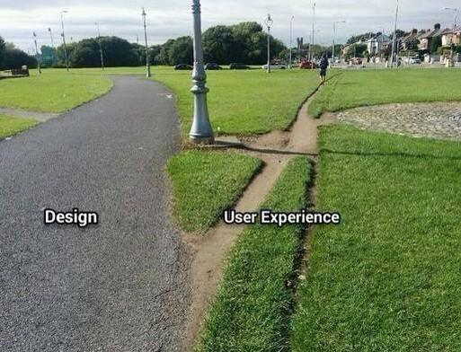
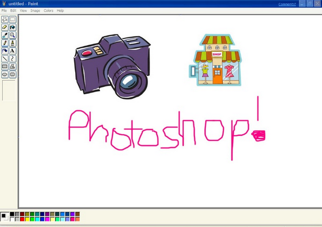

### During this course you will learn how to effectively address the needs and circumstances of **Web users**, to design and prototype interactive products that are comfortable and even joyful to use.

In particular, you will get familiar with:

* **User eXperience** (UX) design principles and patterns  
* Qualitative and quantitative **user research** 
* **Competitor analysis**
* User **personas**, user **stories** and user **journeys**
* **Interface design**: **paper-prototyping** and **wireframing**
* **Rapid prototyping** tools
* **User-testing**: face2face, A/B testing and analytics
* Motivational **copy-writing** for stickiness

### What this course is NOT

1. This course is **NOT about honing your coding skills**.   

	Whilst you are welcome to **prototype** your ideas using HTML+CSS+JS, there are many tools that will get you to similar results without touching code (or very little of it).

* This course is **not about Photoshop or Illustrator wizardry**.   

	You will be introduced to several tools that enable you to **wireframe** and **prototype** user interfaces quickly and effectively.  
  
	

* In this course **[Lorem ipsum](http://en.wikipedia.org/wiki/Lorem_ipsum) is banned**. 

	If a Web product aims to **deliver valuable content and facilitate meaningful interactions**, we should be designing **content-first** for the best possible UX. 
	
	*Lorem ipsum* is gibberish that conveniently fills the available space like an expanding gas. It is inert, meaningless and lacks context, revealing nothing about the relationship between your design and your content.   
  
	Using *Lorem ipsum* is a missed opportunity to do good UX design.

# Plan

When | In class | Homework | Blog 
---- | -------- | -------- | ----
[Thursday 07.01](sessions/01)| Intro to UX  Co-design (for children)  Team project: [**Kidesign**](#kidesign)  Workshop: working with kids  | Competitor analysis | Interviewing humans
[Thursday 14.01](sessions/02)| UX research  Workshop: user interviews  Field interviews at a local primary school | User interviews | Learning to wireframe 
[Thursday 21.01](sessions/03)| Elevator pitch Concept one-pager Paper prototypes | Prep for user-testing  | The secret life of 6 year olds
[Thursday 28.01](sessions/04)| User-testing prep  User-testing at a local primary school  Debrief | Use case | Working with kids 
[Thursday 04.02](sessions/05)| **Formative presentations**  User personas | User personas | Formative feedback action plan
Week 6| | | 
[Thursday 18.02](sessions/07)| User personas review  Workshop: rapid prototyping  Tutorials on *Kidesign* | *Kidesign*: digital prototype | Make it like the PSD 
[Thursday 25.02](sessions/08)| Workshops at a local primary school | *Kidesign*: digital prototype | Teaching kids UX 
[Thursday 03.03](sessions/09)| User-testing at a local primary school | User-testing report | Conversational interfaces
Thursday 10.03| App dev at a local primary school | TBA | 
Easter break| | | 
Thursday 14.04| TBA | TBA | TBA
Thursday 21.04| TBA | TBA | TBA 
Thursday 28.04| TBA | TBA | TBA 
Thursday 05.05| TBA | TBA | TBA 
Thursday 12.05| TBA | TBA | TBA 
Thursday 19.05| TBA | TBA | TBA 
Thursday 26.05| TBA | TBA | TBA 
Thursday 02.06| TBA | TBA | TBA 
Thursday 09.06| **Summative presentations** |  **Summative hand-in** | 

<!--

Peer-learning on Cognitive Lode behavioural patterns session-14.md 

-->

# Projects

### Kidesign

On this **team project** you will learn the methods and tools of *user research* and *iterative design*, by engaging with a challenging user group: primary school children. 

All the project material is [here](projects/kidesign).

### Art experience

Design and prototype a digital archive experience.

<!-- All the project material is [here](projects/art-experience). -->

# Learning goals

By the end of this course, you will be able to:

1. Understand the difference between *qualitative* and *quantitative* **user research** and be familiar with a few techniques to perform both types of research.
* Research and analyse **competitor services** to gain inspiration and insight from them.
* Identify and use **design patterns** effectively in your projects.
* Produce user **personas**, user **stories** and user **journeys** to communicate and validate your design decisions.
* Understand the importance of motivational **copy-writing** in interface design, and write interface copy that is appropriate for your audience and their task(s) at hand.
* Use **paper-prototyping** and **wireframing** techniques to visualise your interface design ideas and explore alternative solutions.
* Use **rapid prototyping** tools to quickly test solutions to specific UX problems.
* Understand the differences between various **user-testing** methods and practice them at a basic level.
* **Document** your design and development process, from the exploration of ideas to their practical implementation. Including *successes* and *failures*.
* **Communicate** your ideas both technically and in an engaging way.
* Use the Git version-control system (through GitHub) to **collaborate** with your team and **back-up** your project files.

# Rules of the road

* **Be present**. If you happen to be late (even by 5 minutes) or absent, make sure you email me about it before a session starts. We'll deduct 2% from your grade for each uncommunicated tardiness or absence (aka the *2% Tardiness Tax*).

* **Participate** in class debates and workshops. We'll make sure that your ideas have space to be heard and that nobody makes you feel uncomfortable about sharing them.

* **Present** your work during formative and summative assessments. If you can't make it those days then you'll record your presentation and upload it to YouTube (or similar).

* **Be responsible** for what happens in class. Organise with your peers to get class information and material that you may have missed.

* **Meet the deadlines**. If you submit your work after a deadline, your grade will be capped at D- (bare pass).

### License

This work is licensed under a [Creative Commons Attribution-NonCommercial-ShareAlike 4.0 International License ](http://creativecommons.org/licenses/by-nc-sa/4.0)