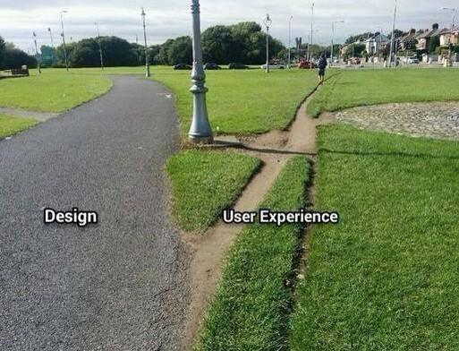

### During this course you will learn how to effectively address the needs and circumstances of **Web users**, to design and prototype Web products that are comfortable and even joyful to use.

In particular, you will get familiar with:

* **User eXperience** (UX) design principles and patterns  
* Qualitative and quantitative **user research** 
* **Competitor analysis**
* User **personas**, user **stories** and user **journeys**
* **Interface design**: **paper-prototyping** and **wireframing**
* **Rapid prototyping** tools
* **User-testing**: face2face, A/B testing and analytics
* Motivational **copy-writing** for stickiness

### What this course is NOT

1. This course is **NOT about honing your coding skills**.   

	Whilst you are welcome to **prototype** your ideas using HTML+CSS+JS, there are many tools that will get you to similar results without touching code (or very little of it).

* This course is **not about Photoshop or Illustrator wizardry**.   

	You will be introduced to several tools that enable you to **wireframe** and **prototype** user interfaces quickly and effectively.  
  
	

* In this course **[Lorem ipsum](http://en.wikipedia.org/wiki/Lorem_ipsum) is banned**. 

	If a Web product aims to **deliver valuable content and facilitate meaningful interactions**, we should be designing **content-first** for the best possible UX. 
	
	*Lorem ipsum* is gibberish that conveniently fills the available space like an expanding gas. It is inert, meaningless and lacks context, revealing nothing about the relationship between your design and your content.   
  
	Using *Lorem ipsum* is a missed opportunity to do good UX design.

# Plan

When | In class | Homework | Blog 
---- | -------- | -------- | ----
Thursday 07.01| <ul><li>Intro to UX <li>Co-design (for children) <li>Brief <li>Competitor analysis  | Competitor analysis | TBA
Thursday 14.01| <ul><li>UX research <li>Workshop on interviews <li>Field research at a local primary school | TBA | TBA 
Thursday 21.01| <ul><li>Wireframes <li>Paper prototypes  | Prep for usertesting  | TBA
Thursday 28.01| Usertesting at a local primary school | Debrief | TBA 
Thursday 04.02| **Formative presentations** | TBA | TBA
Week 6| | | 
Thursday 18.02| UX workshop with primary school teachers | TBA | TBA 
Thursday 25.02| Prototypes with app dev tool | TBA | TBA 
Thursday 03.03| App dev at a local primary school | TBA | TBA
Thursday 10.03| **Formative presentations** | TBA | 
Easter break| | | 
Thursday 14.04| TBA | TBA | TBA
Thursday 21.04| TBA | TBA | TBA 
Thursday 28.04| TBA | TBA | TBA 
Thursday 05.05| TBA | TBA | TBA 
Thursday 12.05| TBA | TBA | TBA 
Thursday 19.05| TBA | TBA | TBA 
Thursday 26.05| TBA | TBA | TBA 
Thursday 02.06| TBA | TBA | TBA 
Thursday 09.06| **Summative presentations** | | 

<!-- 

Thursday 07.01| <ul><li> <li> | <ul><li> <li> | 

Session	| Date	| Topic(s)	| Assignment | Blog
-------	| -----	| --------	| ---------- | ----
[1](sessions/session-01.md)		| Tue Jan 6th 	| Unit intro  What is UX?  | Learning goals
[2](sessions/session-02.md)		| Tue Jan 13th 	| Competitor analysis  | Play-acting Web products
[3](sessions/session-03.md)		| Thu Jan 15th 	| User research | User interview
[4](sessions/session-04.md)		| Tue Jan 20th 	| User personas | User personas
[5](sessions/session-05.md)		| Tue Feb 3rd 	| Interface design  | Wireframing
[6](sessions/session-06.md)		| Tue Feb 17th 	| User journeys	 | User journeys
[7](sessions/session-07.md)		| Tue Feb 24th 	| User-testing  | User-testing
[8](sessions/session-08.md)		| Tue Mar 3rd 	| Tutorials  | Prepping presentation
[9](sessions/session-09.md)		| Tue Mar 10th 	| **Formative Assessment**  | Plan of action
[10](sessions/session-10.md)		| Tue Apr 14th 	| Copywriting Exercises in style  | User-testing Elevator's pitch
[11](sessions/session-11.md)		| Tue Apr 21st 	| Guest: Michael Mentessi  Communities  | Community planning Interviewing humans
[12](sessions/session-12.md)		| Tue Apr 28th 	| Guest: Itamar Ferrer In-depth interviews  | [User-testing: recruiting *guinea pigs*](sessions/session-12.md#2-plan-interviews-and-testing)
[13](sessions/session-13.md)		| Tue May 5th 	| User stories Rapid prototyping | 
[14](sessions/session-14.md)		| Tue May 12th 	| Prototypes critique Behavioural design  | Responsive prototypes
[15](sessions/session-15.md)		| Tue May 19th 	| User-testing  | User-testing
[16](sessions/session-16.md)		| Tue May 26th 	| Prototyping & tutorials  | User-testing
[17](sessions/session-17.md)		| Tue Jun 2nd 	| Tutorials  | Prepping presentation
[18](sessions/session-18.md)		| Thu Jun 4th 	| **Summative Assessment**  | Feedback form 
-->

# Projects

### Kidesign Spring term

On this **team project** you will learn the methods and tools of *user research* and *iterative design*, by engaging with a challenging user group: primary school children and (their) parents. 

All the project material is [here](projects/kidesign).

### Art experience Summer term

Design and prototype a digital archive experience.

<!-- All the project material is [here](projects/art-experience). -->

# Learning goals

* Understand the difference between *qualitative* and *quantitative* **user research** and be familiar with a few techniques to perform both types of research.
 
* Research and analyse **competitor services** to gain inspiration and insight from them.

* Identify and use **design patterns** effectively in your projects.

* Produce user **personas**, user **stories** and user **journeys** to communicate and validate your design decisions.

* Understand the importance of motivational **copy-writing** in interface design, and write interface copy that is appropriate for your audience and their task(s) at hand.

* Use **paper-prototyping** and **wireframing** techniques to visualise your interface design ideas and explore alternative solutions.

* Use **rapid prototyping** tools to quickly test solutions to specific UX problems.

* Understand the differences between various **user-testing** methods and practice them at a basic level.

* **Document** your design and development process, from the exploration of ideas to their practical implementation. Including *successes* and *failures*.

* **Communicate** your ideas both technically and in an engaging way.

* Use the Git version-control system (through GitHub) to **collaborate** with your team and **back-up** your project files.

# Rules of the road

* **Be present**. If you happen to be late (even by 5 minutes) or absent, make sure you email me about it before a session starts. We'll deduct 2% from your grade for each uncommunicated tardiness or absence (aka the *2% Tardiness Tax*).

* **Participate** in class debates and workshops. We'll make sure that your ideas have space to be heard and that nobody makes you feel uncomfortable about sharing them.

* **Present** your work during formative and summative assessments. If you can't make it those days then you'll record your presentation and upload it to YouTube (or similar).

* **Be responsible** for what happens in class. Organise with your peers to get class information and material that you may have missed.

* **Meet the deadlines**. If you submit your work after a deadline, your grade will be capped at D- (bare pass).

### License

This work is licensed under a [Creative Commons Attribution-NonCommercial-ShareAlike 4.0 International License ](http://creativecommons.org/licenses/by-nc-sa/4.0)