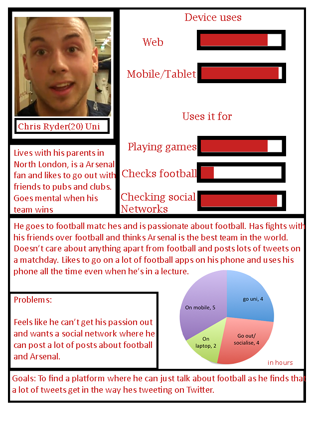
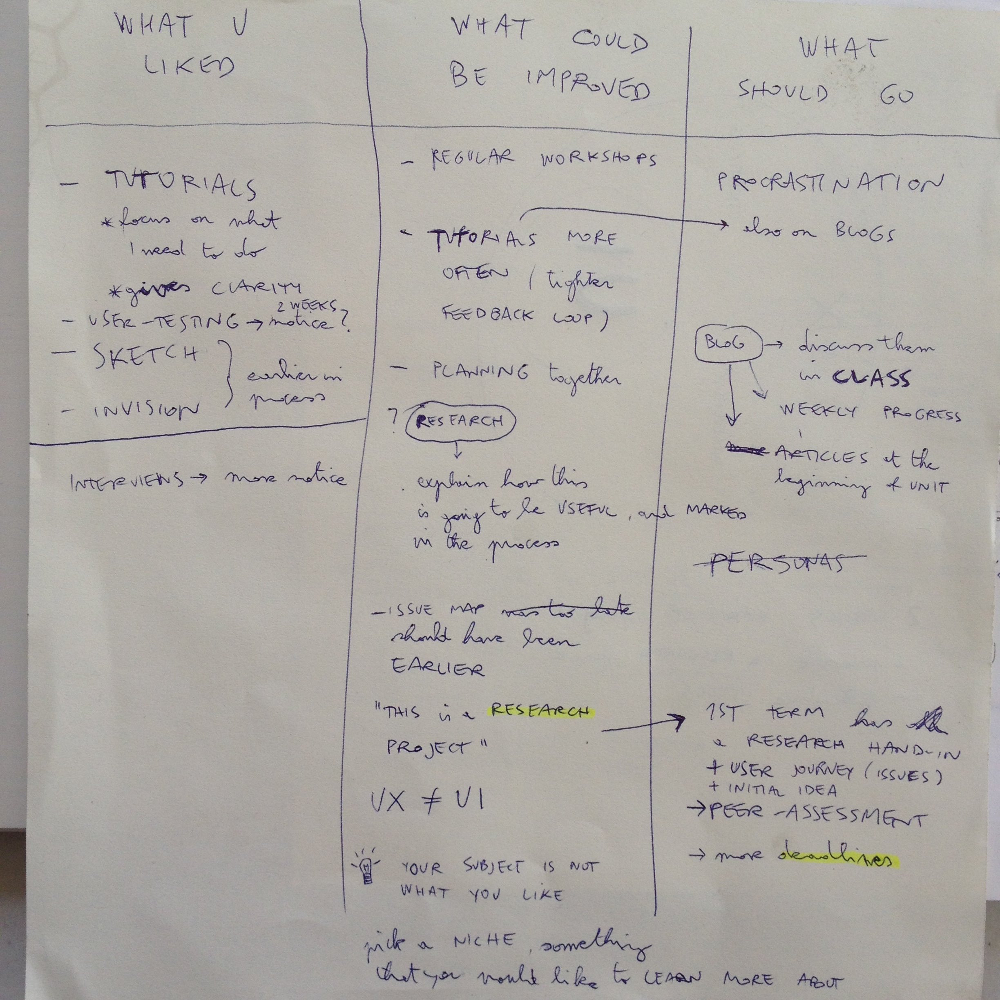

# 2015

## General

### Taking notes

* How many things can you remember from a lecture (or any piece of information)? Later today, tomorrow, in a month's time..

* Filter information. Let it seep through your brain, not just passively absorb it.

* **How to take notes?** Paper vs digital. What to write?

* Being respectful of whoever is talking (you can live without your phones for a short time)

### Attending meetups etc.

- [ ] Make a list of these and encourage students to attend and report (via blog posts).

## [Session 1](../sessions/session-01.md)

A bit too early to ask people to come up with project ideas.

Students suggested we show tools of the trade and inspirations (good and bad projects from previous years) in the first session, and then task everyone to come up with ideas for the next session.

A general [introduction to UX by looking at toilets](http://www.slideshare.net/ChrisHow/ux-bar-campbrighton2013)?

Some [inspirational quotes from VIPz](https://userbrain.net/blog/design-the-user)?

## [Session 2](../sessions/session-02.md)

### Learning goals

It's fairly easy to pin down skills-based learning goals like `I want to get better at HTML`, how about challenging students with goals that are [more speculative or personal](http://goodenoughprofessor.blogspot.co.uk/2014/08/on-civility.html)?

Get them to pin down **3 goals**, one primary and two others.

Make examples of both *hard* and *soft* skills, point out which goals may be more appropriate for this unit (eg, not coding and Photoshop).

Less questions, more focus on *how do you learn*, *why do you think this is important* and *who can you learn from* (make sure they answer these).

Maybe get everyone to write on the same *space* (eg comments on a blog post) rather than separately. Or, work in groups / interview each other and then write down.

Need to **review** these goals with students individually, and go back to them as we do **tutorials** throughout the unit.

Lots of people say *Photoshop* is their first goal for this unit!

> Right now I feel like a know a solid amount about UX design, I’m probably totally wrong, but I’ll stick with my delusions for now. (Matt)

### Passive 

> ..we are asked to create or re-design a social network (Burak)

> We have been tasked to design the UX and build a prototype for a web-based social network.. (Matt)

..is this a symptom of something or just the way things are?

### Competitor analysis

Nobody mentioned *LinkedIn* as a social network..

Maybe should encourage them to analyse one that they use (will likely be the usual suspects) and pick another one that they've never used and that it's not for people like them.

Also, force them to **sign up and use it for at least a week** (evidence required).

### Personifications

Product vs product (eg: Twitter vs Facebook) is fun but not very useful. Get them to imagine a conversation between product and customer / user instead.

Or just tell them that if they do product vs product it'll be graded less?

## [Session 3](../sessions/session-03.md)

Explain difference between interview and survey / questionnaire.

Ask them to read [Interviewing humans]() ahead of the session, practice among us and then go out in the field and interview **strangers**. Use some questions from the summative presentations (eg: how do people socialise around that topic outside of web-mediated interactions?)

Can we use those **datasets** that Rave has access to?

## [Session 4](../sessions/session-04.md)

### Personas

User personas need to be based on **interview data**, not pulled out of your magical hat.

Make a personas **template** with a specific field for connections to interview data (eg: this persona is based on two people I interviewed, and they both stated X and Y).

More impactful if they're illustrated, ie put a face next to a name. 

No need for gimmicky graphs, unless they're based on research data.

## [Session 6](../sessions/session-06.md)

### User journeys

I think it wasn't clear what exactly people were meant to do and how?

Make sure everyone uses [that method with the emoticons](../sessions/session-06.md#method)

Storyboard challenges, not magical solutions!

Dig out user journey for HeadsUp?

### Onboarding

Assign one [onboarding case study](https://www.useronboard.com/onboarding-teardowns/) to each student and get them to present it to everybody, highlighting goodies & baddies + ideas to <del>steal</del> borrow.

## [Session 7](../sessions/session-07.md)

### 5 seconds test

Need to get people to sign up and start collecting points so that they can publish their tests (bloody gamification)

Ask them to pay attention to the questions that they're asked when taking other people's tests and think about what questions they want to ask in their own tests

> What do you want to test?

Remember that when tested, people want to *win* or *get it right*, so make sure you're not asking **leading questions** that may give away what type of response you're expecting.

## [Session 9](../sessions/session-09.md)

### Good stuff

* The most interesting conversations happen when there's real content (eg: tagging only one game or several games)

### Enhancements

* Diagram to show where your product positions itself in relation to competitors
* User personas are a bit disconnected from the other steps of the design process
* I want to see the very first version of your sketches / wireframes (even if it's on toilet paper)
* You should test your competitors (Margot did it), try to figure out why they went for certain features, really immerse yourself in their service and steal their ideas

### Ideas

* Quick *what-if* exercise with *variables* eg: a social network for {football fanatics} to {make friends} and {find soulmates}, calling each other {buddies} (take a look at that Twitter bot that posts game ideas..)

### Next term

* Develop the blank slate and *onboarding* process
* Keep presentations within time slots (which means, rehearse and time yourself)
* Community ranking / reputation
* Content strategy: UGC, editorial control, brands and advertising, spam
* Search and search results
* How to deal with trolls? Self-censoring community, reactive moderation, reporting, down-voting etc
* I forgot my password, again. How do you deal with this problem, without embarrassing people?

## [Session 10](../sessions/session-10.md)

*Content is kebab* went really well: engaging and fun metaphor, sparked a lot of conversation because statements were provoking.

Need to engage some students more. Ask them questions directly:
`What do you think?`
`Do you agree with what s/he just said?`
`In summary, {...}, does it make sense?`

*Exercises in Style*: people found the idea weird and funny, however it felt a bit unstructured and they drifted away (already when choosing competitors). Some ideas:

* make them pick one metaphor and re-dress an interface with that metaphor (remember the Lego workshop?), eg: military context
* make them pick one type of prose, eg: formal language, or report-speech, surprises!
* make them work in pairs
* make them work on the same site and then present (competition)
* give them a strict time frame and don't allow them to get distracted

## [Session 12](../sessions/session-12.md)

> Put your laptops away :)

Ask about their projects and then keep referring to them as examples for concepts introduced.

Students said it would have been even more useful to have this session in the first half of the project.

## [Session 13](../sessions/session-13.md)

### User stories

Students found **user stories** really useful to 

* spec out discrete functionality 
* list them all out
* even come up with new ideas

Good to show them a real-world example and stress that this is a technique used a lot in the industry.

## [Session 15](../sessions/session-15.md)

### User-testing

In Burak's words:

> User testing is **vital**. 

> You need to see how your users behave ie: what they click on when they use the thing. You might see it differently than your users. You may design around how you want it but your customers may want it designed differently. 

## [Session 18](../sessions/session-18.md)

### presentations

Share tips for presentations a few days before (so that students can actually include them in their presentations and delivery)

### Competitors

I want you to *use* their apps and write a detailed report on how they work, what opportunities for enhancement they present. What are the good things about that you could *borrow*?

### Personas

Should be more integrated: 

* Meet `Fred`, he's such and such
* Fred has a problem..
* How is `Fred` learning about and start using your product?

We need more than one persona, someone who is not a 20-something student.

### Blank slate

It should be considered and prototyped. Also, how does the app cope when there's little content. What happens when there are only a few people? Add how will it *scale*?

### Freemium

It's not a sin..

### Tone

How does your product talk? What language does it use? Need to include at least two versions of the same page's copy.

### GoodUI 

Make it a requirement to include examples of which ones you used. Maybe one of the exercises would be to pimp up an existing interface (from another product) using GoodUI tricks

### Name and tagline

Tagline more important actually. Explain the main benefit of your app in one snappy sentence, eg `Find upcoming musicians near you` or `Plan your workouts with friends` or `The Sports Social Network. Interact with passionate fans and some of the biggest names in sport.`

In Callum's words:

> This is the most important issue, making it really clear what the site does and how you can use it.

### Historical research 

Make it mandatory for people to research into how people used to socialise around your chosen topic, before the Web.

### Personification

Imagine that your product is a **person/job**, eg your `personal trainer`. What's the interaction you would have with that person? What kind of personal transactions is s/he facilitating?

Flesh out how that personal interaction works, and then translate it to computer-mediated interaction.

> It was amazing once you put some content in people immediately get it!

# UX chat

See observations above

### Research

Research is so important. All your process will suffer from a lack of research and evidence-based design decisions.

#### Interviews   
	
* Have you interviewed *strangers*, or people that are not in your age group? 

	If you interview people like you (homophily) you'll hear things you already know: Not very useful. 

* How to organise interviews: make them easy to digest (eg: repeat qs, colour-code answers) and write a summary of key take-aways
  
#### Personas

Mostly **delusional** as they mirror your pre-existing idea (instead of challenging it). 

Also, they're generally `students in their early 20s`..

### Documenting your design process

Don't just put a couple of blurry pictures of your paper sketches! Add text notes, thoughts on feedback received, explain your design decisions.

See [this case study](http://fiascodesign.co.uk/case_studies/videoscribe-case-study/) 

It's important to go back to your sketches and reflect on them (which means, write about them), not just plough on..

### Time management

You need to work week by week. Doing a big push before the deadline is not going to produce professional results. 

### Tighter feedback loop

Revisions and tutorials every 2-3 weeks.

In Harry's words

> ..the importance of getting feedback at frequent timely intervals to make sure that everything is continuing to stay on course

### Organisation

Make it easier for anyone reviewing your work to see the merit of what you've done, rather than getting frustrated at searching through a mess.

Don't dump all your stuff into a folder and then say `go find it`.

After all, how you organise and present your work is user experience design too: you're designing the experience for someone (re)viewing your work.

<!--This is not just about uni submissions. What would a potential employer, client or collaborator think of someone applying with a disorganised portfolio? -->

Check out a [neatly organised repository](https://github.com/MatthewStarr/WEB14204/tree/master/students/Matt)

### Submissions

Presentation ≠ submission 

Your presentations are no substitute for evidence of research, concept development or any other project-related material.

Your presentations are only one part of your submission. Their goal is to help you present your project to an audience, not to collect evidence for grading.

### MISC

* Found user stories useful, why? At what stage of the process?
* Export presentations as `.pdf`. No `.ppt` or `.key` please.
* *Freemium* is not a sin: businesses have to be sustainable (who's paying bills and salaries otherwise?) [If you’re not paying for it, you are the product](http://www.forbes.com/sites/marketshare/2012/03/05/if-youre-not-paying-for-it-you-become-the-product/)  
  

# 2016

## Session 1

Group discussion around UX definitions with post-its went really well.

Peer learning: to stimulate higher quality research, and have all that shared, we could have tried using a collaborative Google Slides. 

## Session 2

Itamar's presentation:

* Maybe start with case studies and then draw out the principles / guidelines

# 2017

## Session 1