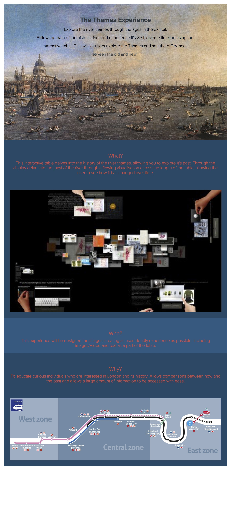

The brief: Take a body of work or archived material from the [Maritime Museum](http://www.rmg.co.uk/national-maritime-museum) and prototype a digital experience that opens this up to the public.

Read the whole brief [here](README.md).




## Team 2

* Ade
* Kieran

### Week 1

Interactive mobile - look at artefact and it gives you more information - augmented reality - Wham by Roy Liechtenstein - look at artwork and get more artworks by the artist.
Play the game - QR code and you get a pdf to take away at the end.

### Week 2

[ ] Concept one-pager

### Week 3

AR apps for ships.

Each ship model can trigger an animation/video or quiz, your choice.

Look into Blippar and Aurasma.

Encourage visitors to *collect* something from every item by *completing* a series (eg: collect one point from each ship) so that they stay in the room, rather than see one ship and then move on.





## Team 3

* Alex
* Johan
* Zac

### Week 1

*Art in a new dimension* - a platform - virtual reality and google cardboard - sitting in any environment and get transported to the Louvre - be anywhere in the work - seeing different things - images triggering whole **VR** experiences - give artists a way of adding layers to their artworks?

### Week 2

[ ] Concept one-pager

### Week 3

VR Experience for children who cannot visit the museum.

GO-Pro style 

Quiz > competition > leaderboard.

Google Cardboard?

#### Assumptions

* Schools have VR?
* Lo-fi option, eg: [Now>Press>Play](http://nowpressplay.co.uk/)




## Team 4

* Rana
* Luke
* Sanj

### Week 1

Wall paper - draw your own idea - go to a museum - collect art works into a collection and then collage them together into a new artwork - then you could view your collage through a URL given to you in the gallery. Share and then you can remix someone else remix.

### Week 2

Concept one-pager

### Week 3

Navigation experience and tour customiser. Bit like a sat-nav for museums.

Questions:

* Individual tour or group tour?
* How long do you want to spend at the museum?
* Anything you're interested in?

Teachers could create tours and then kids could join in.

Based on your time preferences, the content provided would change.

Augmented arrows




## Team 5

* Harry
* Jonny

### Week 1

Increase engagement with children.
Interactive game - captain of a ship - stock a ship and see how long you can sail for without starving, getting scurvy or the ship sinking.
Local area change over time - London museum - could you make something to visually see how London has changed over time through a camera phone - as you are walking around the city.

### Week 2

Concept one-pager

### Week 3

Geolocation prompt, bonus levels if you're at the museum.

Maritime strategy management game for kids.

Prepare voyage, choose resources like hull, food, cannons, vitamin C, crew members, soldiers (to protect from pirates), then run simulation.

Funny failure scenario

Success > get facts


Retry level





## Team 6

* Aidan
* Ollie
* Ryder



### Week 1

<!--Fun interactive game - hide and seek around the gallery for children.-->
Unexpected adventure game - you could go around a certain part of a city or ship and see what it would be like in the past - share your experience of being on the ship in the past.

### Week 2

One-pager

### Week 3

Interactive table. Thames connecting history and geography.

Clock (another Greenwich reference) interface allows you travel in time.

Points of interests are interactive, can be dragged closed to you and explored in more depth.

At each location you can then change the time yourself.

Inspiring [New York history timelapse](https://www.youtube.com/watch?v=22oJwUJQQkI)

## Team 7

* Joe
* Tom
* Jack

### Week 1

Educate local people - timeline touch screen on a wall - input postcode and Maritime Museum says how maritime history has impacted your area - you can share on social media.
3D aspect - walk around exhibition and deconstruct artefact - can you see how everything is being built?

### Week 3

*My Maritime*: digital scrapbook with sharing features

Option to share to Storify


Feed of news and facts curated by NMM, with UGC

