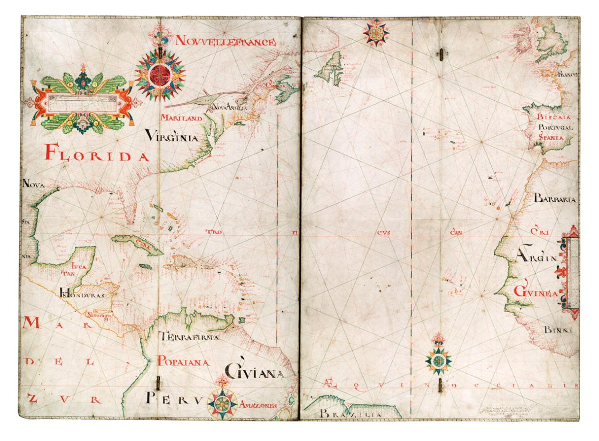
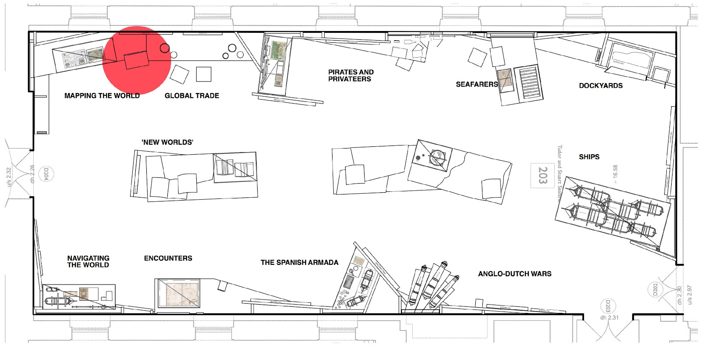
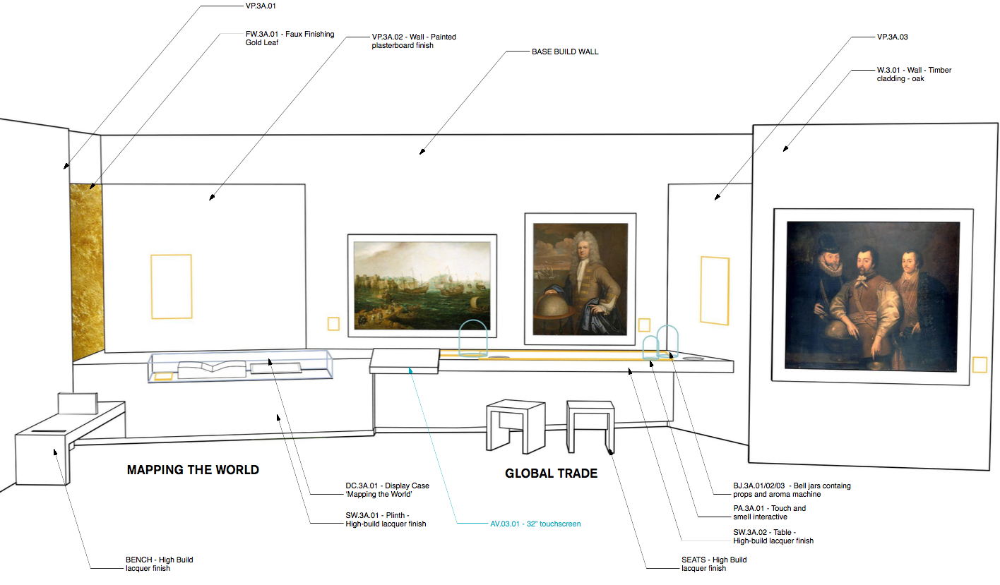
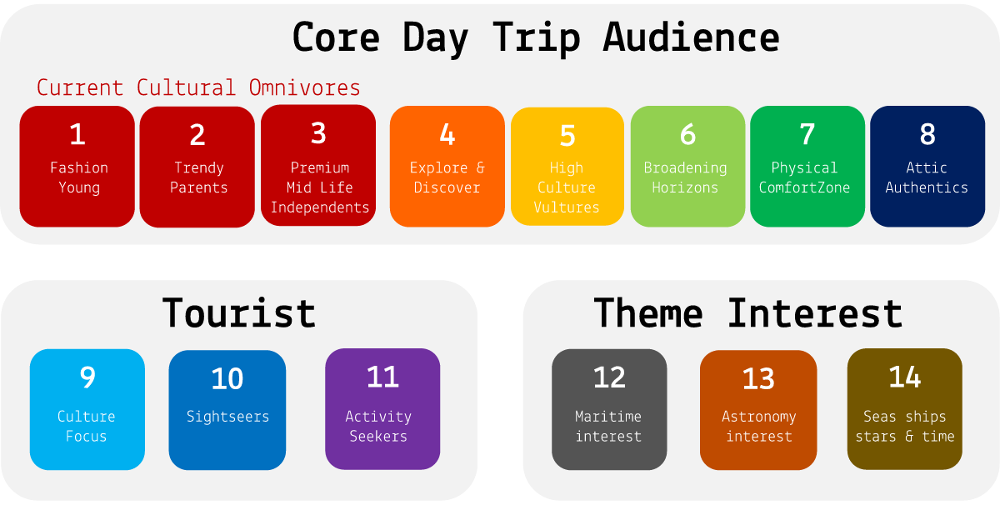
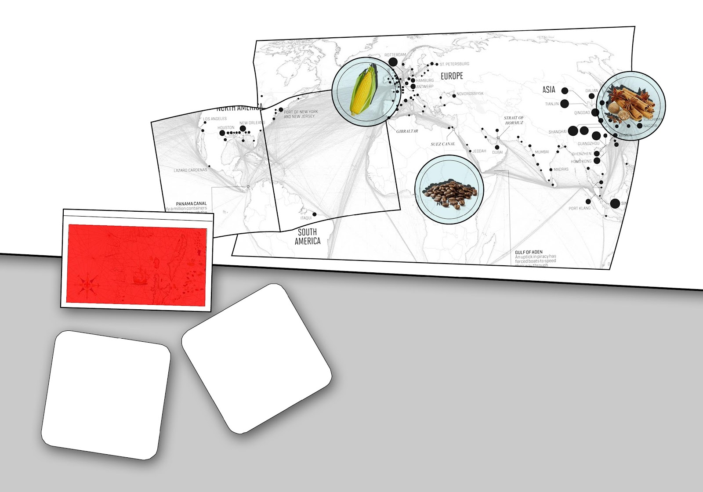
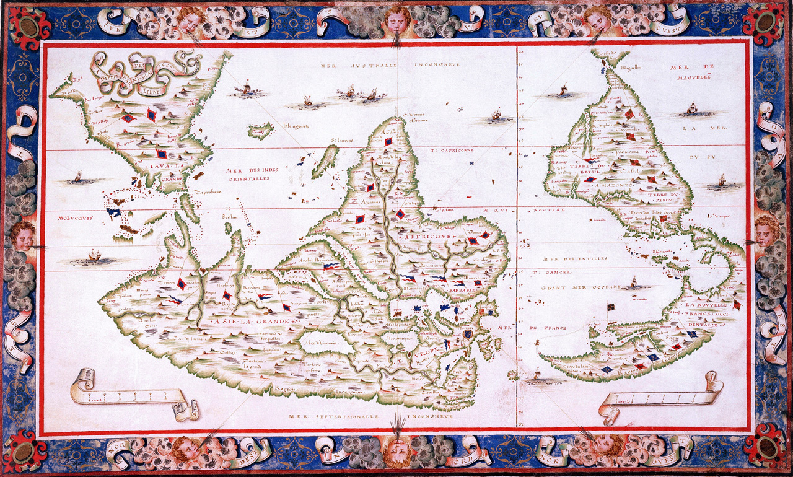

# NMM Hidden Histories

Detail of this project will be posted after the National Maritime Museum briefing on Monday 8th January. 

<!--

#### Table of contents

1. [Context](#context)
* [Key message](#key-message)
* [Audience](#audience)
* [Technology](#technology) 
* [Constraints](#constraints)
* [Deliverables](#deliverables), aka hand-in checklist
* [Timeline](#timeline) and deadlines
* [Inspirations](#inspiring-projects)

#### TL;DR

The [National Maritime Museum](http://www.rmg.co.uk/national-maritime-museum) (NMM) in Greenwich wants you to design the UX of an interactive exhibit about the Museum's vast **collection of maps and charts from the 16th and 17th centuries** and deliver your proposal by the 6th of March 2017! 

### Context

The NMM will open four new [Endeavour Galleries](https://www.hlf.org.uk/about-us/news-features/endeavour-galleries-national-lottery-success-ahoy) in 2018.

The interactive exhibit you will design will be part of the **Tudor and Stuart Seafarers** gallery, which is about Britain's emergence as a maritime power in the 16th and 17th centuries.

In the early modern period explorers like Colombo, Vespucci and Da Gama opened up new maritime routes, changing European and World history for ever. At the time, Britain was a small nation at the periphery of Europe. By the end of the 17th century its colonies were stretching over the entire World.

In those two centuries there was a boom in *map-making*, as maps were both indispensable *tools* to navigate the sees, and precious *propaganda objects* for those in powers to show off their dominions. Your interactive exhibit will be part of the **Mapping the World** section, at the entrance of the gallery.

### Key message

The interactive exhibit should have **one** key message, one thing that visitors will come away with.

A couple of (bad) examples:

* Visitors will appreciate the Museum’s unrivalled collection of charts and maps from the Tudor and Stuart periods (but showing all the maps in the collection may be a terrible idea...)

* Visitors will become aware that maps and charts were made and used for a variety of purposes (but which purposes specifically?)

You're encouraged to develop your own key message, along the lines of: 

> Within `X amount of time` and through `Y content` presented via `Z technology`, visitors will learn `key message`

Depending on your key message, your exhibit could present a **broad** collection of archived materials, or a **focused** collection of particular objects (or anything in between). The purpose of your exhibit could span from **learning** to **making**.

### Audience

**Pick one** of the 14 museum visitor segments (see below) and make sure that your design choices are appropriate for their interests, needs, cultural reference and skills.

1. Fashion Young
* Trendy Parents
* Premium Mid Life Independents
* Explore and Discover
* High Culture Vultures
* Broadening Horizons
* Physical Comfort Zone
* Attic Authentics
* Culture Focus (tourist)
* Sightseers (tourist)
* Activity Seekers (tourist)
* Maritime interest
* Astronomy interest
* Seas, ships, stars and time

[Learn more about these segments](https://docs.google.com/presentation/d/1Soipi5y7EXkTpo5TzV1g0G6gs21_MGves83PrxwdB1M/edit?usp=sharing). 

#### Dos :+1:

* Asking visitors to collect items / complete tasks
* Use characters / stories to convey factual information
* Make sure that you **explain the interface** to your visitors (don't force it on everyone, but make it available if someone is lost)
* How can you let people experience the same piece without creating bottle-necks? **Non-linear narratives** and experience that don't rely on a single entry point can help manage the *traffic* in the gallery space.
* **Randomisation** of content, so that visitors are not exposed to the same content.

#### Dont's :-1: 

* Avoid dry paragraphs
* Do visitors understand that the piece can be interacted with, and is it clear how they can interact with it?  
  
	If something looks like a poster, then people will treat it like a poster, and not interact with it.  
  
	If visitors don't understand the interface (*does this look like a button?* and *how am I meant to tap this?* kind of questions) then they won't interact with the piece.

### Technology

Your starting point is a 32" touch screen (red rectangle in the image below) with audio output and internet connection. 

Your proposal can add extra technology on top of that, as long as it fits with your [key message](#key-message). 

### Constraints

**Time**: the duration of the interactive experience should be max 5 minutes

**Accessibility**: all interactive objects will be set at an accessible height for visitors in wheelchairs. There should be a row of easy to reach navigation icons for visitors with restricted reach.

Learn more about the specifics of this interactive exhibit from the [NMM's official Exhibition Design Sheet (EDS)](https://docs.google.com/document/d/1ZV_rdbyZbnu4Ir0sPeR4DyWPsCuopbWpSqZvNZhoecU/edit?usp=sharing).

Here's a [sample of maps and charts](https://docs.google.com/presentation/d/1tEg72Z_1cyxSUN1VfkW8Oke9gOZtmok0DRQ3odi61_4/edit?usp=sharing) from the NMM collection. 

### Deliverables

In other words, what the client wants you to deliver:

* What's the **key message** of the interactive exhibit?
* **Audience**: who is it for, and why should they care? How have you catered to their needs, interests and skills
* **Narrative**: how do you present the collection's content so that it's interesting for you chosen audience and fits with your key message? What stories will your exhibit tell?  
* What the visitor will see/experience on approaching it, aka **onboarding**?
* How do visitors **interact** with the exhibit?
* What **reward(s)** will the exhibit offer to visitors?
* How does the exhibit re-sets itself on **conclusion** of the interaction? 
* Interactive **prototypes** of your idea 
* **User-testing report**

### Timeline

When | What
---- | ----
Monday 9th of January | Project kickstart and customer discovery interviews @ NMM
January | Come up with ideas, prototype and test them
Monday 30th of January | Formative presentations @ NMM 
February | Iterative prototyping and user-testing @ NMM, tutorials
Monday 6th of March | Summative presentations @ NMM 

### Inspiring projects

[Learn more about the projects below in Amy's presentation](https://docs.google.com/presentation/d/1vTxxRo03hyqhA3zjIf48S2npBAu4DEDTbVITadu7r9Y/edit?usp=sharing)

* [Maps and the 20th Century](http://www.bl.uk/events/maps-and-the-20th-century-drawing-the-line) at the British Library in London
* [InformForm Maps](http://informform.com/maps/) (online collection)
* *Espionage Timeline* and *Password Hacker* at the [Spy Museum](http://www.spymuseum.org) in Berlin
* [Interactive Modern Art Timeline](http://www.framestore.com/work/tate-timeline-modern-art) by Framestore Labs for the Tate Modern in London
* The [Google Art Project](https://www.google.com/culturalinstitute/u/0/project/art-project), an online platform showcasing artworks from lots of galleries and cultural institutions from around the world. Added bonus: you can use Google Street view to explore inside the buildings.
* [Immersion Room](http://www.cooperhewitt.org/events/current-exhibitions/immersion-room/) and the [Interactive Collection Table](http://www.cooperhewitt.org/new-experience/) at the Smithsonian Design Museum in New York
* The [Hello Cube](http://www.hellicarandlewis.com/tate-modern) by Hellicar & Lewis for the Tate Modern in London. Based on [Yayoi Kusama](http://www.tate.org.uk/whats-on/tate-modern/exhibition/yayoi-kusama) exhibition
* [Pocket Art Gallery](http://www.allofus.com/work/tate-britain/pocket-gallery-app/) by All Of Us for the Tate Modern in London
* [Dreams Of Dalì](https://www.youtube.com/watch?v=f1eleiocacu) at the Dali Museum, Florida. Made to commemorate the [collaboration between Dalì and Disney](https://www.youtube.com/watch?v=aOUwlLhLpSY)
* [London Street Museum](https://www.youtube.com/watch?v=f1eleiocacu) for the Museum of London is a mobile app that allows history lovers to hold their phone up to different parts of London’s landscape and see a historical photograph of that scene superimposed onto into their camera view. 
* [Buckingham Palace Virtual Tour](https://www.youtube.com/watch?v=gen0ngjjry4) by Google Expeditions
* [Collection Wall](http://www.clevelandart.org/gallery-one/collection-wall) at the Cleveland Museum of Art, allows you to pre-select the pieces you're interested in from a touch-screen near the entrance, then transfer these on an iPad to take with you as you visit the museum
* [Records of Rights Interactive Table](https://www.hetscheepvaartmuseum.nl/) by Second Story for the David M Rubenstein Gallery
* [William Blake's London](http://www.tate.org.uk/context-comment/apps/william-blakes-london) for the Tate Britain in London
* [Interactive Table on Civil Rights Leaders](http://secondstory.com/project/browse/featured-work/ncrm) by Second Story for the National Civil Rights Museum in Memphis (Tennessee), the place where Martin Luther King was assassinated
* [Ultimate Dinosaurs](https://www.youtube.com/watch?v=2zkz3kw5cim), an augmented reality (AR) app for the Royal Ontario Museum in Toronto, using posters from the exhibition to trigger 3D animations (dinosaur skeleton coming to life and roaring at you)
* [The Invisible Museum](http://nexusproductions.com/interactive-arts) by Nexus Interactive for Qualcomm at Ces
* [Futureville](http://nexusproductions.com/work/futureville) by Nexus for the Science Museum in London
* [Virtual Orchestra](https://www.mendelssohn-stiftung.de/r-museum-en.html) at the Mendelssohn-Bartholdy Museum in Leipzig 
* [Istanbul-o-Matic](http://www.pattu.net/project/detail/id/9/) at the Istanbul Modern Museum

These two websites may also give you insights into digital projects in museums:

* [museumscomputergroup.org.uk](http://museumscomputergroup.org.uk/)
* [museumsassociation.org](http://www.museumsassociation.org/search/results?q=digital&section=)

Soundscapes at the NPG
ChristineBot, by students from the MA Culture, Criticism and Curation at CSM. Started from historical material to give Christine (a lady who was a curator at Southbank many years ago) a new life on the Web, making the archive truly accessible. Both because it's online, and because it’s been re-formatted it so that it's relatable to how we consume culture these days.
Creative Journeys at the V&A, a (dead) project Matteo worked on many years ago.
Magic Tate Ball - A Project Amy Jackson-Bruce (Web Media alumna) worked on at Tate, allowing users to shake their mobile phone and receive a Tate artwork that relates to the user’s surroundings. 
Race Against Time - a Tate mobile game where you race through art histories chapters to collect the worlds colour particles (which have been stolen by the evil DR. Greyscale). 
Pocket Art Gallery - An augmented reality app built to allow art lovers to place artworks virtually in their surroundings. 
The Google Art Project (or Art Project by Google) - An online platform showcasing artworks from lots of galleries and cultural institutions from around the world. Added bonus - you can use Google Street view to explore inside the buildings.
Tate Kids 
The Museum of London’s Street Museum - A mobile app that allows history lover to hold their phone up to different parts of London’s landscape and see a historical photograph of that scene superimposed onto into their camera view. 
William Blake Audio Tour of London (Tate) - 
Bloomberg Connects Timeline of Modern Art (In Gallery Interactive Display - Tate Modern). 

-->

