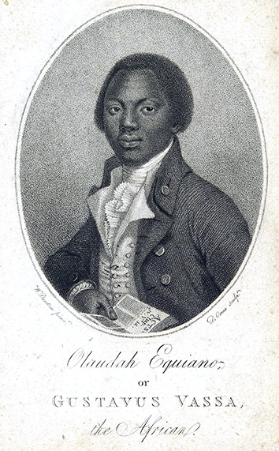

# NMM Hidden Histories

#### Table of contents

* [Context](#context)
* [Technology](#technology) 
* [Key message](#key-message)
* [Audience](#audience)
* [Deliverables](#deliverables), aka hand-in checklist
* [Timeline](#timeline) and deadlines
* [Inspirations](#inspiring-projects)

The [National Maritime Museum](http://www.rmg.co.uk/national-maritime-museum) (NMM) in Greenwich in Greenwich wants you to design the UX of a **digital intervention** that will help visitors **discover, explore and/or share** hidden histories in the collection by the **5th of March 2018.**

### Context

The histories that we see reflected in Museums and Galleries have often been heavily influenced by the people who were given the opportunity to record their stories and versions of events. As a result, most artworks and writing that you will see in public displays are by white, wealthy, heterosexual men. 

As part of this project you will be invited to consider and unearth the lives and stories of people who lived differently to the status quo. Where are the women, people of colour and gay, lesbian and transgender people within the gallery? What about people with disabilities? 

#### Why focus on Hidden Histories? 

1. Galleries and Museums are often partially publicly funded by the government through taxation. These taxes come from everyone in the UK and so exhibitions should be for everyone.
2. History is a valuable resource for reflection and learning. If we hide things from history, then we can’t learn from history correctly.
3. Diluted history has been used to subjugate and oppress people in the past. Galleries and museums want to make sure they don’t contribute to this.

#### Hidden Histories: An Example

Take a look at this painting, The Fall of Nelson, Battle of Trafalgar, 21 October 1805 painted by Denis Dighton.

Within this picture there is only one representation of a Black man. On a normal day, museum visitors may not see this man or stop to consider the story of how and why he was on this ship. 

Bringing this story into the consciousness of NMM visitors would be an example of unearthing a hidden history. 

#### Points to consider:

One of the National Maritime Museums functions is to be critical of colonial pasts in British history and you have been welcomed to explore this avenue if you would like but consider a) how to tell stories that will engage your audience, b) the language and time that you use when presenting points. 

Along the same lines, the Museum has welcomed a critical eye to be passed over their current approaches to interactives in the gallery. If this approach is taken you must consider that the NMM is a briefing client. Benefits and considerations for improvements must be presented OR positive ways to move forwards. Be factual in your analysis rather than emotional.

### Technology

You will be designing an experience for the museum that uses mobile devices as the mechanism for delivery as there is no specific installation space that can be designated at present. The museum would be able to dedicate a number of iPads to the experience or experience users could their own device. 

Your experience should be for everyone to use within your target audience, are therefore if you are delivering to users devices, the experience should be OS agnostic. ie - Your experience should work on all devices, mobile and tablet.

The museum would be open to the use of hotspots, proximity sensors, pattern recognition, AR, VR and QR codes within your projects but expensive hardware builds will not be considered. 

Wifi within the NMM buildings is not always reliable but does cover most of the galleries and cafe area. This will be a core consideration for your experience. 

And finally, a quote from Hans to bear in mind. “I don’t like digital unless it serves a specific purpose and unless it works.” Experiences should be frictionless and instinctual.

### Key message

The interactive exhibit should have **one** key message, one thing that visitors will come away with.

A couple of (bad) examples:

* Visitors will appreciate the Museum’s unrivalled collection of charts and maps from the Tudor and Stuart periods (but showing all the maps in the collection may be a terrible idea...)

* Visitors will become aware that maps and charts were made and used for a variety of purposes (but which purposes specifically?)

You're encouraged to develop your own key message, along the lines of: 

> Within `X amount of time` and through `Y content` presented via `Z technology`, visitors will learn `key message`

Depending on your key message, your exhibit could present a **broad** collection of archived materials, or a **focused** collection of particular objects (or anything in between). The purpose of your exhibit could span from **learning** to **making** / **sharing**.

 

### Audience

We have been given a range of audiences by the Museum below. **Pick one** of the audiences (or a segment of an audience group) and make sure that your design choices are appropriate for their interests, needs, cultural references and skills.

* Low Income Local Residents
* Black Asian Minority Ethnic (BAME)
* Lesbian Gay Bisexual Transgender Queer (LGBTQ+)
* Women
* Visitors with special needs and learning difficulties (Including SEND and ASL)

#### Dos :+1:

* Asking visitors to collect items / complete tasks
* Reference and name the audience you are designing for correctly. 
* Think sensitively about how you are describing other peoples stories and think: Are you taking ownership of someone else’s identity or culture? Is there a danger of misrepresentation or causing offence?
* Use characters / stories to convey factual information
* Make sure that you **explain the interface** to your visitors (don't force it on everyone, but make it available if someone is lost)
* How can you let people experience the same piece without creating bottle-necks? **Non-linear narratives** and experience that don't rely on a single entry point can help manage the *traffic* in the gallery space.
* **Randomisation** of content, so that visitors are not exposed to the same content.

#### Dont's :-1: 

* Avoid dry paragraphs
* Avoid playing audio out load on a loop within the gallery space.
* Avoid describing your chosen audience with an acronyms or in shorthand. 
* Do visitors understand that the piece can be interacted with, and is it clear how they can interact with it? If something looks like a poster, then people will treat it like a poster, and not interact with it.  If visitors don't understand the interface (*does this look like a button?* and *how am I meant to tap this?* kind of questions) then they won't interact with the piece.

### Deliverables

In other words, what the client wants you to deliver:

* What's the **key message** of the interactive exhibit?
* **Audience**: who is it for, and why should they care? How have you catered to their needs, interests and skills
* **Narrative**: how do you present the collection's content so that it's interesting for you chosen audience and fits with your key message? What stories will your exhibit tell?  
* What the visitor will see/experience on approaching it, aka **onboarding**?
* How do visitors **interact** with the exhibit?
* What **reward(s)** will the exhibit offer to visitors?
* How does the exhibit re-sets itself on **conclusion** of the interaction? 
* An graphical representation of how the interactive will be signposted within the gallery space. 
* Interactive **prototypes** of your idea 
* **User-testing report**

### Timeline

When | What
---- | ----
Monday 9th of January | Project kickstart and customer discovery interviews @ NMM
January | Come up with ideas, prototype and test them
Monday 5th of February | Formative presentations @ NMM 
February | Iterative prototyping and user-testing @ NMM, tutorials
Monday 5th of March | Summative presentations @ NMM 

### Inspiring projects

[Learn more about the projects below in Amy's presentation](https://docs.google.com/presentation/d/1vTxxRo03hyqhA3zjIf48S2npBAu4DEDTbVITadu7r9Y/edit?usp=sharing)

* [Maps and the 20th Century](http://www.bl.uk/events/maps-and-the-20th-century-drawing-the-line) at the British Library in London
* [InformForm Maps](http://informform.com/maps/) (online collection)
* *Espionage Timeline* and *Password Hacker* at the [Spy Museum](http://www.spymuseum.org) in Berlin
* [Interactive Modern Art Timeline](http://www.framestore.com/work/tate-timeline-modern-art) by Framestore Labs for the Tate Modern in London
* The [Google Art Project](https://www.google.com/culturalinstitute/u/0/project/art-project), an online platform showcasing artworks from lots of galleries and cultural institutions from around the world. Added bonus: you can use Google Street view to explore inside the buildings.
* [Immersion Room](http://www.cooperhewitt.org/events/current-exhibitions/immersion-room/) and the [Interactive Collection Table](http://www.cooperhewitt.org/new-experience/) at the Smithsonian Design Museum in New York
* The [Hello Cube](http://www.hellicarandlewis.com/tate-modern) by Hellicar & Lewis for the Tate Modern in London. Based on [Yayoi Kusama](http://www.tate.org.uk/whats-on/tate-modern/exhibition/yayoi-kusama) exhibition
* [Pocket Art Gallery](http://www.allofus.com/work/tate-britain/pocket-gallery-app/) by All Of Us for the Tate Modern in London
* [Dreams Of Dalì](https://www.youtube.com/watch?v=f1eleiocacu) at the Dali Museum, Florida. Made to commemorate the [collaboration between Dalì and Disney](https://www.youtube.com/watch?v=aOUwlLhLpSY)
* [London Street Museum](https://www.youtube.com/watch?v=f1eleiocacu) for the Museum of London is a mobile app that allows history lovers to hold their phone up to different parts of London’s landscape and see a historical photograph of that scene superimposed onto into their camera view. 
* [Buckingham Palace Virtual Tour](https://www.youtube.com/watch?v=gen0ngjjry4) by Google Expeditions
* [Collection Wall](http://www.clevelandart.org/gallery-one/collection-wall) at the Cleveland Museum of Art, allows you to pre-select the pieces you're interested in from a touch-screen near the entrance, then transfer these on an iPad to take with you as you visit the museum
* [Records of Rights Interactive Table](https://www.hetscheepvaartmuseum.nl/) by Second Story for the David M Rubenstein Gallery
* [William Blake's London](http://www.tate.org.uk/context-comment/apps/william-blakes-london) for the Tate Britain in London
* [Interactive Table on Civil Rights Leaders](http://secondstory.com/project/browse/featured-work/ncrm) by Second Story for the National Civil Rights Museum in Memphis (Tennessee), the place where Martin Luther King was assassinated
* [Ultimate Dinosaurs](https://www.youtube.com/watch?v=2zkz3kw5cim), an augmented reality (AR) app for the Royal Ontario Museum in Toronto, using posters from the exhibition to trigger 3D animations (dinosaur skeleton coming to life and roaring at you)
* [The Invisible Museum](http://nexusproductions.com/interactive-arts) by Nexus Interactive for Qualcomm at Ces
* [Futureville](http://nexusproductions.com/work/futureville) by Nexus for the Science Museum in London
* [Virtual Orchestra](https://www.mendelssohn-stiftung.de/r-museum-en.html) at the Mendelssohn-Bartholdy Museum in Leipzig 
* [Istanbul-o-Matic](http://www.pattu.net/project/detail/id/9/) at the Istanbul Modern Museum

These two websites may also give you insights into digital projects in museums:

* [museumscomputergroup.org.uk](http://museumscomputergroup.org.uk/)
* [museumsassociation.org](http://www.museumsassociation.org/search/results?q=digital&section=)

