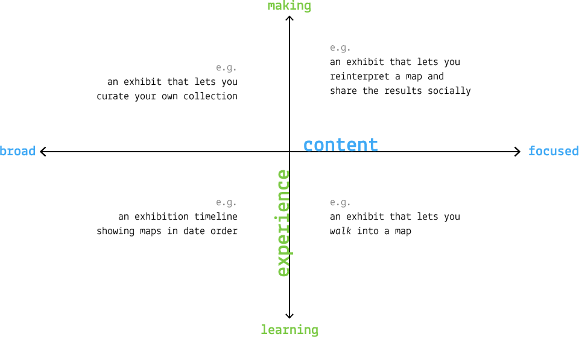

# NMMaps

The [National Maritime Museum](http://www.rmg.co.uk/national-maritime-museum) (NMM) in Greenwich wants you to design the UX of an interactive exhibit about the Museum's vast **collection of maps and charts**. 

### Context

The interactive exhibit will be part of the [Endeavour Galleries - Tudor and Stuart Seafarers](https://www.hlf.org.uk/about-us/news-features/endeavour-galleries-national-lottery-success-ahoy), which will open in 2018.

Through the interactive exhibit visitors will be able to: 

* Explore the Museum’s unrivalled collection of charts and maps from the Tudor and Stuart periods
* Become aware that maps and charts were made and used for a variety of purposes. 

<!--
Digital experiences can vary from presenting a **broad** collection of archived materials to a **focused** collection of particular objects, for the purpose of **learning** or **making**.

For example:

-->

### Deliverables

In other words, what the client wants you to deliver:

* A statement of the exhibit’s *context* in the gallery 
* A description of the exhibit *narrative* 
* What the visitor will see/experience on approaching it (*onboarding*)
* The nature of the visitor’s *interaction* with the exhibit
* A description of the interaction and the *reward* at the conclusion of the interaction
* A description of how the exhibit re-sets itself on *conclusion* of the interaction 
* Interactive *prototypes* of your idea 
* *User-testing report*

### Timeline

When | What
---- | ----
Monday 9th of January | Project kickstart and customer discovery interviews @ NMM
January | Come up with ideas, prototype and test them
Monday 30th of January | Formative presentations @ NMM 
February | Iterative prototyping and user-testing @ NMM, tutorials
Monday 6th of March | Summative presentations @ NMM 

### Inspiring projects

* [Maps and the 20th Century](http://www.bl.uk/events/maps-and-the-20th-century-drawing-the-line) at the British Library in London
* [InformForm Maps](http://informform.com/maps/) (online collection)
* *Espionage Timeline* and *Password Hacker* at the [Spy Museum](http://www.spymuseum.org) in Berlin
* [Interactive Modern Art Timeline](http://www.framestore.com/work/tate-timeline-modern-art) by Framestore Labs for the Tate Modern in London
* The [Google Art Project](https://www.google.com/culturalinstitute/u/0/project/art-project), an online platform showcasing artworks from lots of galleries and cultural institutions from around the world. Added bonus: you can use Google Street view to explore inside the buildings.
* [Immersion Room](http://www.cooperhewitt.org/events/current-exhibitions/immersion-room/) and the [Interactive Collection Table](http://www.cooperhewitt.org/new-experience/) at the Smithsonian Design Museum in New York
* The [Hello Cube](http://www.hellicarandlewis.com/tate-modern) by Hellicar & Lewis for the Tate Modern in London. Based on [Yayoi Kusama](http://www.tate.org.uk/whats-on/tate-modern/exhibition/yayoi-kusama) exhibition
* [Pocket Art Gallery](http://www.allofus.com/work/tate-britain/pocket-gallery-app/) by All Of Us for the Tate Modern in London
* [Dreams Of Dalì](https://www.youtube.com/watch?v=f1eleiocacu) at the Dali Museum, Florida. Made to commemorate the [collaboration between Dalì and Disney](https://www.youtube.com/watch?v=aOUwlLhLpSY)
* [London Street Museum](https://www.youtube.com/watch?v=f1eleiocacu) for the Museum of London is a mobile app that allows history lovers to hold their phone up to different parts of London’s landscape and see a historical photograph of that scene superimposed onto into their camera view. 
* [Buckingham Palace Virtual Tour](https://www.youtube.com/watch?v=gen0ngjjry4) by Google Expeditions
* [Collection Wall](http://www.clevelandart.org/gallery-one/collection-wall) at the Cleveland Museum of Art, allows you to pre-select the pieces you're interested in from a touch-screen near the entrance, then transfer these on an iPad to take with you as you visit the museum
* [Records of Rights Interactive Table](https://www.hetscheepvaartmuseum.nl/) by Second Story for the David M Rubenstein Gallery
* [William Blake's London](http://www.tate.org.uk/context-comment/apps/william-blakes-london) for the Tate Britain in London
* [Interactive Table on Civil Rights Leaders](http://secondstory.com/project/browse/featured-work/ncrm) by Second Story for the National Civil Rights Museum in Memphis (Tennessee), the place where Martin Luther King was assassinated
* [Ultimate Dinosaurs](https://www.youtube.com/watch?v=2zkz3kw5cim), an augmented reality (AR) app for the Royal Ontario Museum in Toronto, using posters from the exhibition to trigger 3D animations (dinosaur skeleton coming to life and roaring at you)
* [The Invisible Museum](http://nexusproductions.com/interactive-arts) by Nexus Interactive for Qualcomm at Ces
* [Futureville](http://nexusproductions.com/work/futureville) by Nexus for the Science Museum in London
* [Virtual Orchestra](https://www.mendelssohn-stiftung.de/r-museum-en.html) at the Mendelssohn-Bartholdy Museum in Leipzig 
* [Istanbul-o-Matic](http://www.pattu.net/project/detail/id/9/) at the Istanbul Modern Museum


<!--

Soundscapes at the NPG
ChristineBot, by students from the MA Culture, Criticism and Curation at CSM. Started from historical material to give Christine (a lady who was a curator at Southbank many years ago) a new life on the Web, making the archive truly accessible. Both because it's online, and because it’s been re-formatted it so that it's relatable to how we consume culture these days.
Creative Journeys at the V&A, a (dead) project Matteo worked on many years ago.
Magic Tate Ball - A Project Amy Jackson-Bruce (Web Media alumna) worked on at Tate, allowing users to shake their mobile phone and receive a Tate artwork that relates to the user’s surroundings. 
Race Against Time - a Tate mobile game where you race through art histories chapters to collect the worlds colour particles (which have been stolen by the evil DR. Greyscale). 
Pocket Art Gallery - An augmented reality app built to allow art lovers to place artworks virtually in their surroundings. 
The Google Art Project (or Art Project by Google) - An online platform showcasing artworks from lots of galleries and cultural institutions from around the world. Added bonus - you can use Google Street view to explore inside the buildings.
Tate Kids 
The Museum of London’s Street Museum - A mobile app that allows history lover to hold their phone up to different parts of London’s landscape and see a historical photograph of that scene superimposed onto into their camera view. 
William Blake Audio Tour of London (Tate) - 
Bloomberg Connects Timeline of Modern Art (In Gallery Interactive Display - Tate Modern). 

-->