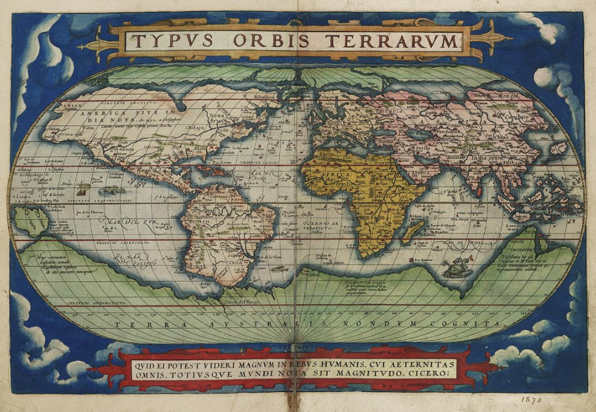
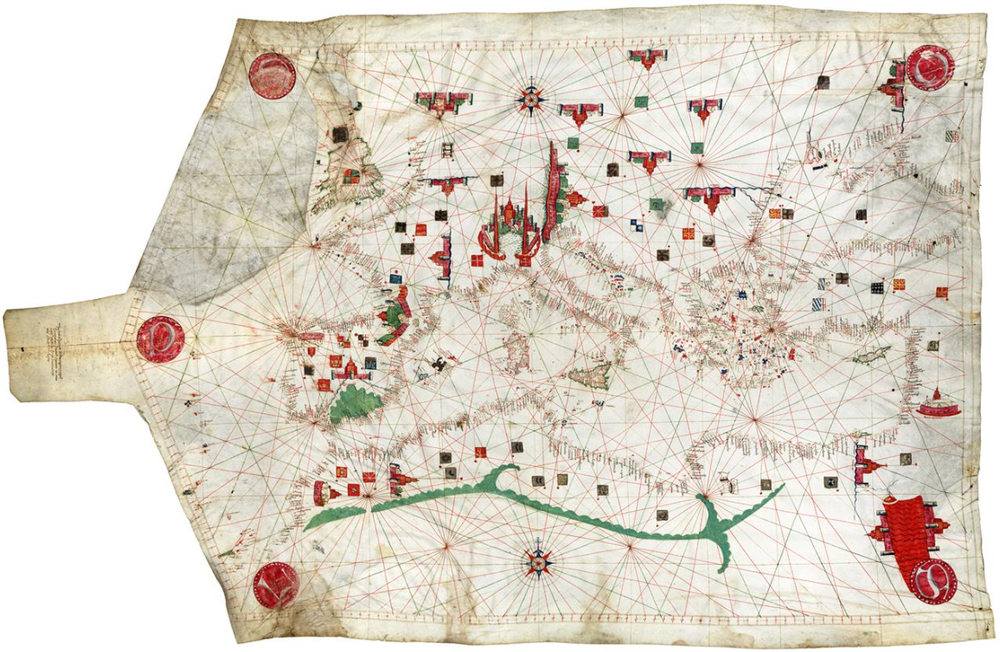
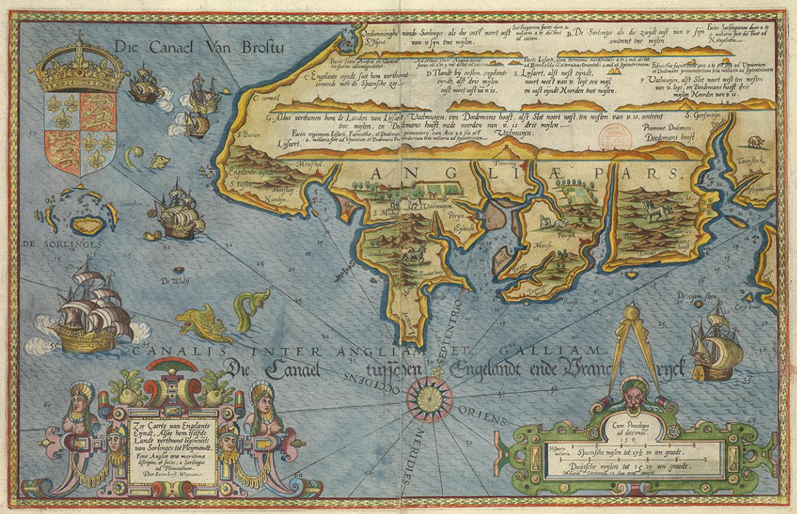
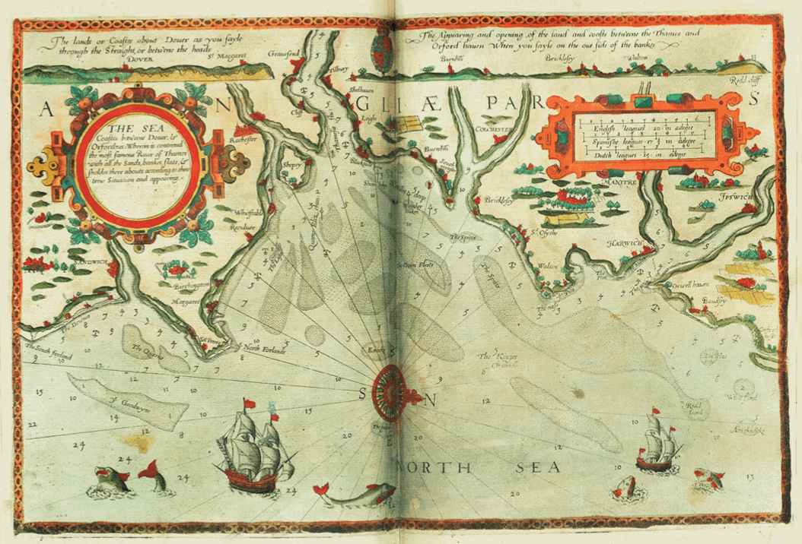
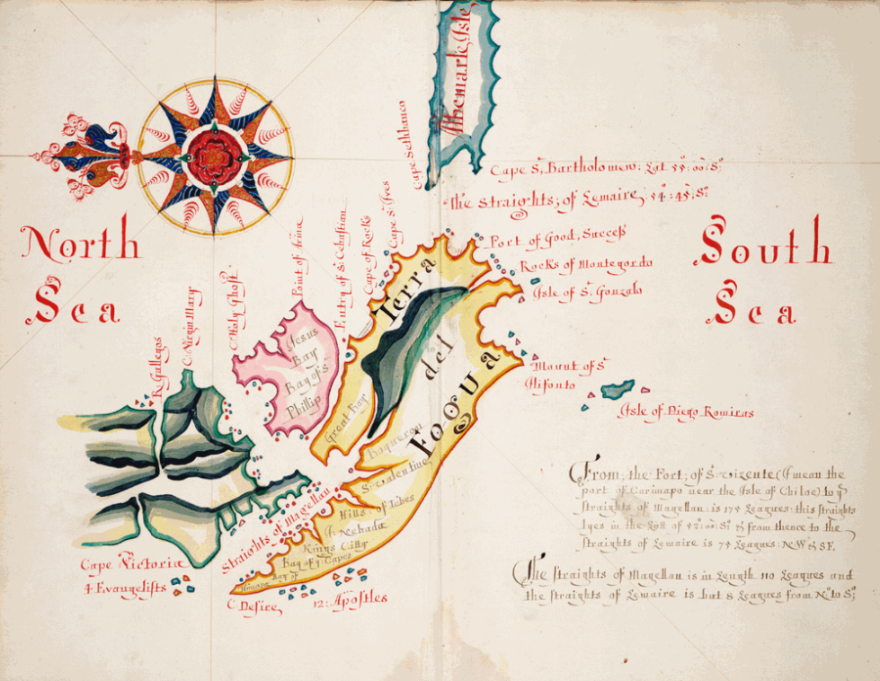
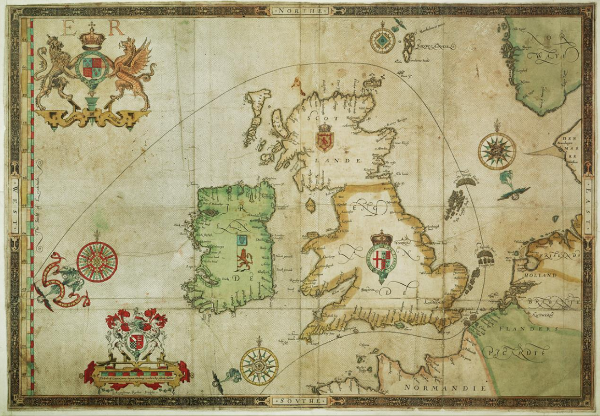

Notes from the presentation given by Megan Barford (cartography expert @ NMM) on the 23rd of Jan. 

You can view her slides [here](https://docs.google.com/presentation/d/1tEg72Z_1cyxSUN1VfkW8Oke9gOZtmok0DRQ3odi61_4/edit?usp=sharing). 

### Uses of maps

* Navigational tools
* Political propaganda
* Luxury objects
* Planning tools

### Context

16th century: huge changes in the understanding of the world for European.

Maps start to be made according to the seafarers and explorers' observations, not any more from *received wisdom* or ancient knowledge.

Tech advancements, mostly the printing press. Many maps could be made and printed as luxury objects for rich people. Eg: blue was a very expensive colour (see below).

People had a theory that there had to be the same amount of land mass in the southern and northern hemisphere (see above).

Portolan charts: developed in the Mediterranean in the 13th century, made of vellum (lamb's skin)

Amsterdam was the most prominent centre of map making and the Dutch were the most skilled cartographers. Because of:
* strong internal demand from the state and merchants. 
* lot of skilled engravers
* the development of the book trade
* there were advanced centres of maths learning, which applied their knowledge on map-making (calculating/estimating distances, understanding projections, how to represent a globe onto a flat surface).

Dutch map of the English Channel below 

Map of the Thames Estuary, made by Dutch cartographers for an English audience

Wapping was the centre of maritime London.

Navigational information was very important and nations tried to keep it secret. Maps were strongly connected with military activity.

The Spanish Armada was mostly defeated because of terrible weather. The British navy used maps as propaganda tools to tweak history and highlight their role in the war.

Seafarers would draw sketch maps, and write a lot of observations.

### How did they perceive their role in society? How were they perceived?

Cartographers saw themselves as both mathematicians and artists, there were no clear boundaries between subjects at the time.

### What was the map-making process?

Trigonometry: distances and angles to draw triangles and then draw details into them. Measure angles using compasses (not accurate) and measuring links. Ropes to sample depth and type of soil at the bottom. 

There was no systematic survey until end of 17th century

Sailors preferred hand-drawn maps (more updated) rather than printed maps (not based on the latest information).

### Who was meant to use the maps?

Maps tended to be the private property of captains, even the navy (not property of the Crown). They were *freelancers*. 