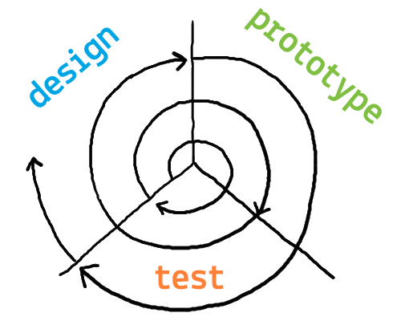

# Week 1

### Today, Monday 9th January 2017

1. [Welcome](#welcome) :)
* [What is User eXperience?](#what-is-ux)
* [How does one design user experiences?](#how-does-one-design-user-experiences?) The design-prototype-test loop
* [The first experiment](#the-first-experiment): customer discovery interviews

### Your [homework](#homework) and [blog](#blog)!

# Welcome

1. [What is this course about?](../../README.md)
* [What will you do?](../../README.md#projects)
* [What's the plan?](../../README.md#plan)   
* [Rules of the road](../../README.md#rules-of-the-road)

<!-- * [What can you learn?](../../README.md#learning-goals) -->

A few observations from the previous ~episode~ unit:
	
* Blog **regularly** as in week by week, not all in one lump. Capture your ideas whilst they're fresh!
* Publish on a blogging platform like Medium (not on Google Docs).
* When you reference an external resource (something you've seen, read or learned about somewhere else on the Web) always link to it.
* Use a spell-checker, like [Grammarly](https://www.grammarly.com) 
* Read your writing out loud. It'll help you spot mistakes and make your written thoughts flow. Use [Hemingway](http://beta.hemingwayapp.com/) to make your writing bolder and clearer.

# What is UX?

There are many ways of understanding **U**ser e**X**perience. 

### Your turn

In pairs, read [these UX definitions](http://www.allaboutux.org/ux-definitions) and pick your favourite one, or jot down your own definition / interpretation of UX, as you currently understand it. We'll then discuss them all together.

# How does one design user experiences?

It usually starts with the **spark of an idea**. 

It could come out of frustration using a product / system that doesn't satisfy you, it could be a random intuition that hits you while you're having a shower, it could be a commissioned request from a client...

Once you have a spark, what do you do?

### All ideas are *assumptions* that need to be tested 

The UX design method we will practice is about creating **small-scale experiments** and **validating** them as quickly as possible, in loops.

Key words:

* **Iteration** = repeat the design-prototype-test loop (not just once)
* **Validation** = experiments inform your design choices (keep it, tweak it or scrap it)

Aka the **build+measure+learn** approach popularised by the [Lean Startup](http://theleanstartup.com/).

# The first experiment

Before you design a **solution**, it may be sensible to test if people have the **problem** you're trying to solve. 

In other words, you want to observe and understand how people are currently tackling the problem you're trying to solve.

The biggest experts about your problem are the people you’re designing for. 

Every project starts from **research**, aka the *discovery* phase.

Your first experiment will be **customer discovery interviews**.

<!--
### Project

Let's [take a look at the brief](../../projects/nmmaps) first, to work out who you are designing for.

The [National Maritime Museum](http://www.rmg.co.uk/national-maritime-museum) (NMM) in Greenwich wants you to design the UX of an interactive exhibit about the Museum's vast **collection of maps and charts**. 
-->

### What makes a good interview?

Imagine you have an *idea*. You call your mum, explain the idea and then ask her what she thinks. What will she say? 

As pleasing as it may be to hear your mum praising your idea, it doesn't give you any real insight into the idea's value. Will actual customers want it or buy it?

The [Mom Test book](http://momtestbook.com) by [Rob Fitzpatrick](https://twitter.com/robfitz) argues that often people lie to us. Not because they're evil, but because they want to be nice to you. So the challenge for you is: when talking to (potential) customers, **how do you ask them questions that lead to truthful, insightful answers?**

#### Good or bad question?

1. Would you like an app to tell you where to go on holiday based on your budget? 
	 	
	- [ ] Good question 
	- [ ] Bad question 
	
	<!-- Bad question because it’s solution-oriented, closed (could be answered with a simple yes or no) and leading. You are leading people into an answer, implying that they may want a solution around budgeting holidays. -->
* Do you have a problem choosing where to go on holiday?
	 	
	- [ ] Good question 
	- [ ] Bad question 
	
	<!-- Better but still a bad question. It’s closed (could be answered with a simple yes or no) and leading. You are implying that people may have a problem when choosing where to go on holiday (they may not have a problem, or the problem may be elsewhere in the process).   -->
* Talk me through how you booked your last holiday.
	 	
	- [ ] Good question 
	- [ ] Bad question 
	
	<!-- This is a good question, because it’s open and unbiased. It may take you three seconds to ask, and several minutes for people to answer. Through that, you may uncover problems you had not thought of before.
Also, people are better at remembering what happened recently  (your last holiday) than reflecting on more abstract topics or imagine the future. -->	

#### Don’t talk about your idea.

#### Do let people talk about their experience and problems.

Customer discovery interviews are not about you, they are about your customers.

* Ask **open questions** that prompt them to tell *their* story and talk about *their* problems.
* Talk about **facts in the past**, not ideas for the future.
* Talk less, **listen** more.
* Work in pairs and **take notes**. 
* Focus on **interactions, pains & gains**.

### Your turn

In teams, discuss and prepare a **guide** for your customer discovery interviews at the [National Maritime Museum](http://www.rmg.co.uk/national-maritime-museum) (NMM) in Greenwich.

* `15 minutes` to **prepare the guide** (write it on GDoc and share the link with everyone on the Slack `#ux-design` channel)
* `30 minutes` to **test** it with other teams and **tweak** it

#### Test the test

Interview each others, in pairs.

One person conducts the interview, the other takes notes. Swap roles as you please.

After the interviews, consider:

* What were the most successful questions? Why did they work?
* How could you rephrase the less successful ones to get better answers?
* Have you thought of follow-up questions?

# Homework

### Customer discovery interviews 

Discuss with your team mate(s): what have you learned from interviewing visitors of the NMM?

Capture your notes and record your observations in a GDoc. 

Share the link with everyone on the Slack `#ux-design` channel.

### Competitor analysis

Visit an exhibition. 

* In London or elsewhere, [the current maps exhibition at the British Library](http://www.bl.uk/events/maps-and-the-20th-century-drawing-the-line) is highly recommended.

* Ideally you'll visit the exhibition with your team mate(s).

* If the exhibition is not free, we can reimburse the ticket for you. Bring evidence of payment (a receipt) next time.

Observe and analyse the following: 

* **Audience** 

	Who is the exhibition for? What are the visitor **goals**, ie why are they visiting the exhibition?

* **Narrative** 

	What stories does the exhibition tell? Through which media? 

* **Content**

	What kind of content(s) are visitors consuming, producing, and sharing on this exhibition?  

Now focus on interactive exhibits, ie any aspect of the exhibition that visitors can interact with (eg: touch screens, audio guides, responsive projections etc.)

* **Onboarding**

	What does the visitor see/experience on approaching the interactive exhibit

* **Interaction**

	How does the visitor interact with the exhibit? Is there a *reward* at the conclusion of the interaction?

* **Conclusion**

	How does the exhibit re-sets itself when a visitor walks away?
	
* **Content definitions**

 	What are *things* called?
		
	Is it `like` or `love` or `appreciate` or `agree` or `+1` or ... ? 

	In particular, consider the **calls to action** (eg: `Tap here`, `Swipe this` et.c), which are usually found in buttons.
		
* **Language** 

	How does the exhibit *talk* to visitors?

	Is the tone *formal* or *informal*, *plain* or *technical*, *sophisticated* or *unpretentious*, *active* or *passive*, etc.?

	In what person does the exhibit talk: `we`, `I`, `you`?

	What feelings do you think they are trying to trigger in the audience? 

* Jot down what **could be re-designed** or improved (any ideas).

### Blog
 
Read and blog about this article: [Interviewing humans](https://medium.com/research-things/interviewing-humans-fa198f809c40). 

Have you interviewed anyone before?   
  
If **yes**: 

* What worked? 
* What could have been better?
* Anything that surprised you?
* What did you do with the data collected during your interview(s)?