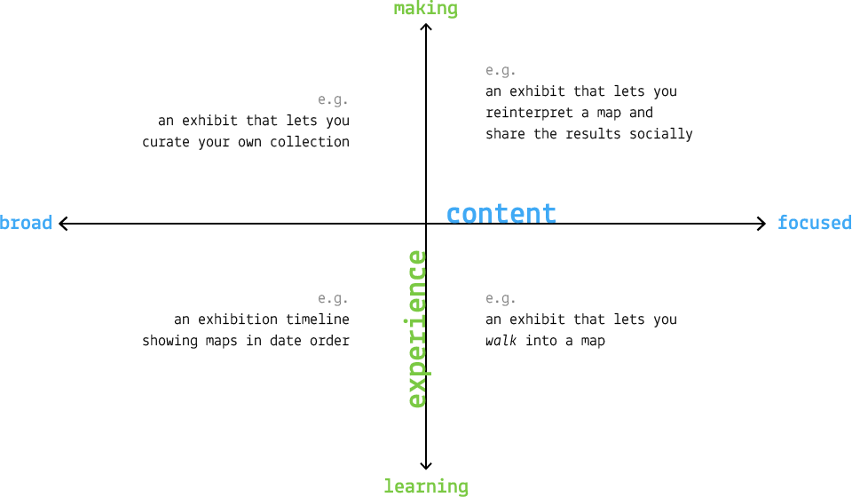

# Week 2

### Today, Monday 15th January 2018

* [NMM Hidden Histoires Project](../../projects/nmm_hidden_histories)
* [lightning talk](#lighting-talk) on digital projects in museums
* [Random idea generator](#ideation)
* [Elevator pitch](#elevator-pitch)
* [Concept one-pager](#concept-one-pager)

### Your [homework](#homework) and [blog](#blog)!

# NMM Hidden Histoires Project

The [Project Brief](../../projects/nmm_hidden_histories) is now live. Let's recap quickly. 

# Lighting talk

First off: a presentation featuring many interactive digital projects in various museums around the World.

Slides are available [here](https://docs.google.com/presentation/d/1vTxxRo03hyqhA3zjIf48S2npBAu4DEDTbVITadu7r9Y/edit?usp=sharing).

We've mapped each project on a *content/experience graph*:

* *Content*: does the project present a **broad** collection of archived materials, or a **focused** collection of particular objects (or anything in between)? 
* *Experience*: is the purpose of the project to get visitors to **learn** or **make** / **share** something?

After this we'll start the [*ideation*](#ideation) process for the [Maritime Museum NMM Hidden Histories brief](../../projects/nmm_hidden_histories). 

# Ideation

### How do I generate ideas?

If you want to have **good ideas** you must [have **many ideas**](https://medium.com/founder-stories/9bd554bedce0).

**Most** of them will not be *good*. Even bad ideas can be useful to spark good ones. See the [McDonald's theory](https://medium.com/@ienjoy/mcdonalds-theory-9216e1c9da7d).

> We’ve broken the ice with the worst possible idea, and now that the discussion has started, people suddenly get very creative. I call it the *McDonald’s Theory*: people are inspired to come up with good ideas to ward off bad ones.

This is why we're asking you to come up with at least 3, so that one may be half-decent :)

### Your turn

With your team mates <!--- use this custom-made [random idea generator](http://bit.ly/NMMaps) --->
and GDocs to jot down at least 3 ideas in response to the [Maritime Museum NMM Hidden Histories brief](../../projects/nmm_hidden_histories)!

* Write down as many ideas as possible 
* There is no such thing as a  *bad* idea 
* Put stray ideas to one side 
* Don’t stay too long on one idea
* Avoid multi-tasking (can you put your phone away for 30 minutes?)

Share your ideas (documents, photos of sketches etc.) on today's [Google Doc](https://docs.google.com/document/d/1Pk6vYGCK1c-syq9iox2l9OMT4KV-Wk1ewfjxi7VgxM0/edit?usp=sharing). 

# Elevator pitch

### What are the next steps?

You would think it's time to wireframe. Not quite!

First we need to define:

1. **What** is your idea?
* **Who** is it for?
* **Why** is it needed or wanted?

Some examples by your fellow students from 2017:

> A learning game for Key Stage 1 children to practice their spelling and addition. It harnesses children's creativity and love of Minecraft to convert some of playtime into learning time. 

Harry, Jonny and Tom

> CodeFriend is an app that teaches children between the ages of 7-11 the basics of HTML in a fun and interactive way.

Ade, Rana and Jack

> An adventure across the whole of London, in which you have to use skill and intelligence to discover fascinating facts about landmarks across this fantastic city. Play mini games and take quizzes against friends to see who will be the champion of London.

Ollie, Aidan, Ryder and Johan

### Your turn

Develop your answers to the 3 questions above into an *[elevator pitch](https://en.wikipedia.org/wiki/Elevator_pitch)*: a short and sharp communication that shouldn't take more than 30 seconds to tell!

Write your elevator pitch(es) in GDocs and share them in todays [Google Doc](https://docs.google.com/document/d/1Pk6vYGCK1c-syq9iox2l9OMT4KV-Wk1ewfjxi7VgxM0/edit?usp=sharing) under your team name. 

# Concept one-pager

A one page document summarising your idea visually, so that you can talk about it to *anyone*. 

It typically includes:

* a catchy title
* a strapline
* answers to your elevator pitch
* a visualisation of the idea (but not necessarily wireframes or mockups)

Some examples by your fellow students from 2017:

By Fransisco & Joe. 

By Afsara & Ajay.

By Ben & Dean

### Your turn

1. Individually, sketch out a concept one-pager (15 minutes).
* Discuss it  with your team mates (15 minutes).
* For next week's session, put together the best bits of your sketches into a team's concept one-pager.
* Share both your sketches and the team one-pager on today's [Google Doc](https://docs.google.com/document/d/1Pk6vYGCK1c-syq9iox2l9OMT4KV-Wk1ewfjxi7VgxM0/edit?usp=sharing) under your team name.

# Homework

### Interviews round 2

To validate your initial idea and *persevere / pivot / kill*...

Armed with your concept one-pager, **go to the Maritime Museum** and interview at least three visitors (the more the better).

Start with **open questions**, get them to talk about themselves and **their experience** at the museum.

Then, if they're still with you, you can **talk about your idea**. 

After each interview, note down the **5 key points** whilst they're all still fresh in your memory. **Compare** your notes with your team mates. Together, write a **summary** of your interview notes. Do this in a Google doc, which we'll review next week.

### Blog

Read [Learning to wireframe: 10 best practices](http://www.dtelepathy.com/blog/design/learning-to-wireframe-10-best-practices), then put it into practice by sketching your concept(s).

At this stage of the project it's useful that you **wireframe your initial ideas individually**, and then compare those with your teammates next week. This way you'll explore different possibilities, based on your own understanding of the user research.

Record your thoughts for these initial wireframes in a blog post.

