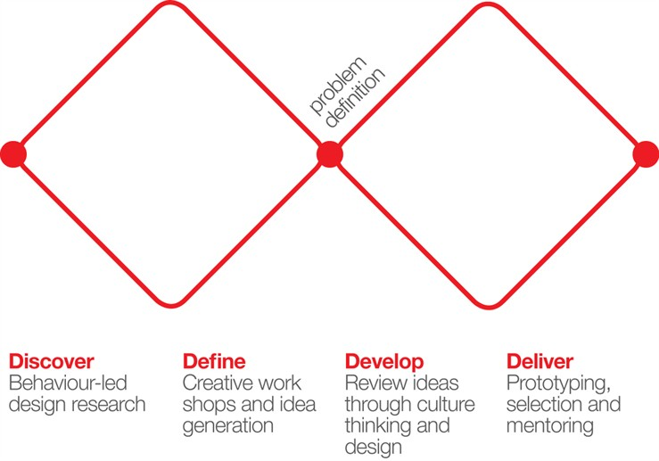

# Week 2

### Today, Thursday 14th January 2016

1. Special guest: [Itamar Ferrer](http://www.ifita.com/), service design consultant at [Engine](http://enginegroup.co.uk/team/)
* [UX research](#ux-research): how do you test an idea? 
* Preparing your [user interviews](#user-interviews)
* Fields research at a local primary schools 

### Your [homework](#homework) and [blog](#blog)!

# Service design

<!--# What is service design?-->

> Design is about making something **better** for someone. 

Better, as in more.. 

* useful
* usable
* desirable
* efficient
* effective
* meaningful
* valuable
* sustainable

Service types:

1. Customer service (help desk)
2. Software applications (BBC news, Facebook)
3. Software as a service (Google Drive)
4. Service as a product
5. Product/service systems

> **Service** is the act of helping someone to do something.

> **Service design** is the process of inventing or improving experiences that happen across multiple **touch points** over time.

[Touch point](http://en.wikipedia.org/wiki/Touchpoint): anything from a service that a customer gets to *touch*, ie interact with, eg: website, help desk, points of sale.

Advertising can be considered an *awareness touchpoint*.

### The process

First diamond:

* Discover the customer's **needs & values**.
* Understanding **patterns of behaviours & attitudes** between several people (aka *the users*).
* Identify **challenges & design opportunities**.

Research is part of the **discovery** phase.

# UX research

> Know your unknowns!

It boils down to spending (a lot of) time observing people and talking to them, to find out:

* **What** are they currently doing?
* **How** are they doing something?
* What **problems** and **challenges** do they face?
* What do they **want**?
* What do they **think** they want?
* What do **we** think they want?

We use user research **insight** to inform design and improve development.

### Is user-testing UX research?

Yes, it's part of it.

### When should we do UX research?

**At any stage** of a project.

<!--Depending on how far in the project we are, some methods are more appropriate than others.

A simplified table:

Stage	| Methods			
-----	| -------
Idea | Interviews  Surveys 
Concept / Wireframes | Interviews
Prototype | Card sort
MVP | Usability testing
Product | Analytics  Usability testing

[Learn more about UX research methods](http://www.nngroup.com/articles/which-ux-research-methods/). -->

#### Quantitative research

Observe and **measure**.

Useful to answer **what** and **how** (how much, how often..) types of questions.

**Surveys** and **analytics** are (mostly) quantitative methods.

#### Qualitative research

> Questions, answers, insights and explanations are limited by a researcher’s understanding of users’ behaviours. The only way to increase that understanding is by actually interacting with and investigating behaviours, beliefs, and assumptions outside of our own behaviours, beliefs, and assumptions. 

*From [Bill Selman, User Research Lead at Mozilla](http://blog.mozilla.org/ux/2014/10/why-do-we-conduct-qualitative-user-research/)*

Qualitative research is useful to answer **why** type of questions.

<!-- to get out of our *homophilic bubble(s)*. -->

**Interviews** are (mostly) qualitative methods.

# User interviews

<!--Interview 2 (or more) people about their use of social networks.

Today we plan and test, then you'll recruit and interview your participants.

Write your plan and findings in MarkDown, then push it to your fork of this project on GitHub (inside the `students > {yourName}` folder).-->

Goals:

* Get a general understanding of how kids use technology
* Gather feedback on your initial ideas with illustrative worksheets 

Your interviews will be split into two parts:

1. Getting to know the kids (3 key contextual questions)
* Key questions about your idea(s) / area(s) of interest (with drawings)

It may also help to observe the kids use one of your *competitor apps*.

### Good practices for user interviews

1. **Plan**: prepare a discussion guide, know what to ask, and who to ask.

	* **Guide not script**: let the conversation flow, steer it gently.

	* **Themes**: identify 4-6 themes around which to structure your session, questions or tasks
* **Test** your test (with family and friends).
* Recruit **strangers**. Because, [homophily](http://en.wikipedia.org/wiki/Homophily)?
* Go to **their place**, in a space where they're comfortable, best if the space where they use the product(s) you want to test / talk about. Let them show you around.
* Easier if you interview **pairs** of users: they'll be less anxious.
* **Listen**. Don't talk about yourself.
* Be comfortable with **silence**: give people time and space to answer your question.
* Be ready to **be challenged** and improvise.
* Ask the **how** (they do stuff) and **why** (they do stuff) questions.

	**Use examples** to help people understand the type of answer you are after.
	
	**Help participants tell their stories**, what happened before and after. And what would have happened if...

* Avoid **leading questions**. Try not to bias your interviewees.

	bad > `How much do you love using XYZ?`
	
	good > `Tell me about your most recent XYZ experience` (more concrete & memorable)
* Avoid **closed questions**.

	bad > `Do you order A, B or C?`
	
	good > `How do you choose food when going out?`
* Try **casual requests** instead of questions. For instance, instead of asking `How do you store your photos?` consider asking them to show you how they store photos.	
* Keep it simple. Explain what you're doing.
* You're interested in them as people, not just as users
* Be respectful
* Smile
* Have an incentive (eg: iTunes vouchers, cash, merchandise, a coffee)
* Have a media permissions sheet.

<!--### Discussion guides tips (from Itamar)

**Actions speak louder than words**: observation and gather evidence is key.

**Show not just tell**: ask them to show you things, not just blabber

**How**: ask how they do stuff

**Why**: ask why they do it

**Comparisons**

**Open questions** -->
	
### Your turn

**What do you want to find out from your interviewees?**

In teams, **jot down** a few questions. These questions will become the **script** for your interviews.

If you have a concept then it's better if you centre your interview questions around that.

<!--Otherwise, you can interview people about their use of social networks in general.-->

<!--Finally, if you're stuck, here's an interview topic you can practice with: `imagine you're designing a social app that helps groups of people organise their time out`. -->

<!--Question examples:

* How did you first learn about `insert your topic`?
* How were you motivated to become involved in `insert your topic`?
* Tell me more about that experience. What do you remember most about it?
* (if the user has started telling you about a relevant experience) What did you enjoy most? What didn't you enjoy about it?
* What kinds of problems do you or your community commonly see in your experience? Have you thought about how you would solve it?-->

##### Sketch your concept

To facilitate your interviews at the school, sketch out your concept on paper:

* Focus on the *selling* feature, doesn't have to be a wireframe.
* For example, it could be an illustration of a kid "talking" to their tablet.

### Test	

Interview each others, in pairs. 

One person conducts the interview, the other takes notes. Swap roles as you please.
	
After the interviews, consider:	
	
* What were the most successful questions? Why did they work?
* How could you rephrase the less successful ones to get better answers?
* Have you thought of follow-up questions?

Armed with a revised script, we'll go and interview primary school children (and a few teachers and parents).

<!--- [ ] Feedback sheets-->

# Homework

### Interviews debrief

1. Individually, jot down the **5 key points** for each round of interviews (we had 3) as early as possible, whilst it's all still fresh in your memory. 
* **Compare** your notes with your team mates.
* Together, write a **summary** of your interview notes. Do this in a Google doc, which we'll review next week.

### More interviews
 
Hopefully after your interviews at the primary school you'll have a better idea of how kids use technology, and feedback on your initial concept(s). Yet sometimes ideas click after you speak to potential users, so between now and next week it'll be very useful to track down another child or two and **do another round of interviews**.

For these interviews, you want to build on what you learned at the primary school, and dig deeper into your concept. 

Recruit a child: your little brother/sister, cousin, or your friend's little brother/sister etc.

You can conduct the interview via Skype/Facetime.

### Blog

Read [Learning to wireframe: 10 best practices](http://www.dtelepathy.com/blog/design/learning-to-wireframe-10-best-practices), then put it into practice by sketching your concept(s).

At this stage of the project it's useful that you **wireframe your initial ideas individually**, and then compare those with your teammates next week. This way you'll explore different possibilities, based on your own understanding of the user research.

Record your initial concept and wireframes in a blog post.

<!--[Moqups](https://app.moqups.com/) (make sure you use the new Moqups Beta).-->

 
