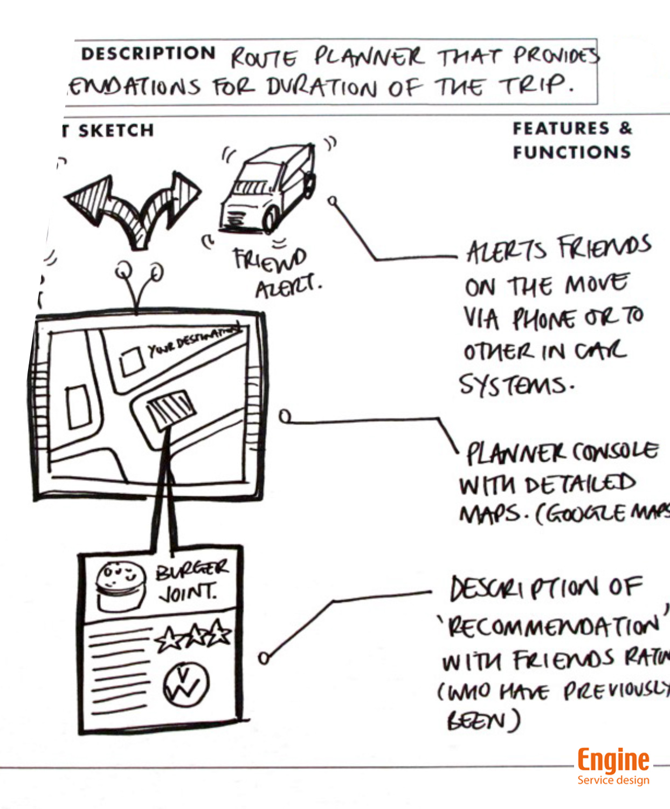

# Week 3

### Today, Thursday 21st January 2016

1. Special guest: [Itamar Ferrer](http://www.ifita.com/), service design consultant at [Engine](http://enginegroup.co.uk/team)
* [Define](#define)!
* [Elevator pitch](#elevator-pitch)
* [Concept one-pager](#concept-one-pager)
* [Wireframes](#wireframes)

### Your [homework](#homework) and [blog](#blog)!

# Define

After [last week's interviews](../02) (part of the *Discovery* phase) we are entering the **Define** stage.

Defining your idea is important to:

* be able to quickly present your idea
* communicate your idea is 30% of winning the work / getting someone on board
* define your **design principles**
* keep you on track when designing

### What are the next steps?

You would think it's time to wireframe. Not quite!

First we need to define:

1. **What** is your idea?
* **Who** is it for?
* **Why** is it needed or wanted?

### Elevator pitch

Develop your answers to the 3 questions above into an *[elevator pitch](https://en.wikipedia.org/wiki/Elevator_pitch)*: a short and sharp communication that shouldn't take more than 30 seconds to tell!

### Concept one-pager

A one page document summarising the primary features, benefits and requirements of a feature. 

It typically includes:

* a catchy title
* a strapline
* answers your elevator pitch
* a visualisation of the idea

Purpose:

1. To help you understand your idea better
* To give you a communication tool to talk about your idea to *anyone*

# Case study

Channel 4 recommendation system for the 4OD player.

Design principle: *Watch one more thing*!

1. Benchmarking other players (competitor analysis)
* Expert interviews (eg: executives, technicians) to understand the *world of Channel4*.
* Analysing user behaviours (when they watch, what they watch) to understand their *world*.
* Recruit viewers to talk about the viewing habits
* Initial testing: no wireframes, just ideas for features. Written feedback on a Google doc
* Second round of testing: rough sketches
* Defining the *Personalisation and recommendation engine* features, based on the key activities:

	* Watch and do
	* Collect and share
	* Prompt
	* Manage
	* Discover
	* Seek
* Wireframes	
* Build use cases, eg: how would this *search engine* work when *kids* are searching for a *place*? Visualise and explain
* Roadmap / delivery
* Specification of all features

# Testing and validating ideas

**Low-res** (paper wireframes) vs **high-res** (polished digital wireframes)

People like being asked for their opinions.

Low-res invites feedback more than high-res

### Wireframes

Wireframes are conversation-starters. Use them to guide your users through your concept and its features.

* Don't use colour.
* Be consistent with visual elements.
* Manage people's expectations (what stage of the dev you are at, what feedback you are expecting from them)
* Paper gets more interaction that digital (people are less afraid to touch it, move it around, scribble notes on it)

### Validation

Print out your wireframes, give people stickers to vote for features. Then ask all the *why* questions.

# Homework 

### Elevator pitch

Write down your elevator pitch in **no more than 2 sentences**, answering the questions:

1. **What** is your idea?
* **Who** is it for?
* **Why** is it needed or wanted? In other words, what is the *gap* your idea is filling, what *issue(s)* is it addressing?

### User-testing prep

Prepare what you are going to share during the user-testing session at the primary school next week:

1. Finish the **one-pager** (for anyone) you started today.
* Make a one-pager specifically **for kids** of your target age-group.
* Sketch out **3-5 wireframes** of your key features. We recommend paper, as it makes user-testing friendlier.
* Draft your testing material with a capture sheet (the questions you are going to ask kids).
 
### Blog

Watch *The secret life of 6 year olds* and **blog about it**.

[Episode 1](http://www.channel4.com/programmes/the-secret-life-of-4-5-and-6-year-olds/on-demand/61827-005)

[Episode 2](http://www.channel4.com/programmes/the-secret-life-of-4-5-and-6-year-olds/on-demand/61827-006)

<!--[Box of Broadcasts](http://bobnational.net) enables all staff and students to choose and record any broadcast programme from 60+ TV and radio channels! 

You can use it with your Ravensbourne username and password.-->
 

