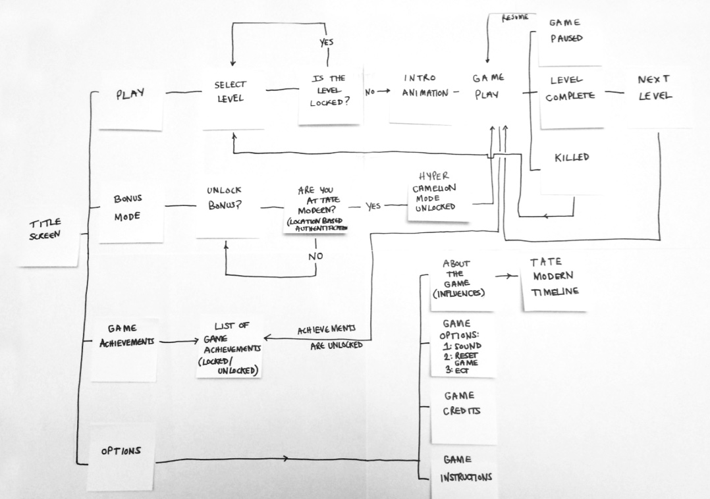

# Week 3

### Today, Monday 22nd January 2018

* Lightning talk: the [UX design process](#the-process) from *concept* to *experience map* to *digital prototype* 
* Content Briefing: [National Maritime Museum Hidden Histories](#national-maritime-museum-hidden-histories)
* Workshop: [experience map](#experience-map-on-post-its)
* Intro to [prototyping](#prototyping)

### Your [homework](#homework) and [blog](#blog)!

# The process

Let's look at some projects from Tate and Burberry. We will focus on the UX design process: 

- defining the *problem*, aka **research** 
- fleshing out the *solution* through **experience maps**
- **prototyping** physically and digitally 
- **user-testing**

You can view/download the lecture slides [here](assets/UX-design-prototyping-process.pdf).

# National Maritime Museum Hidden Histories

The NMM have now sent through the hidden history stories that will underpin our interactive interventions. 

Let's all take 10 mins to read through the info below, then we'll each take X stories and present them to the class on the main screen. That way we can cover them quickly. 

You'll then have 15 mins to discuss how you could present these stories within your interactive with your team mates. I will come around and trouble shoot if there are any clashes or problems with fitting these into the concepts we have from last week. 

You can view the NMM resoures[here](ADD NEW DOCUMENT HERE). 

# Workshop

### Experience map on post-its

Once you have a concept, and before you dive into the details of it, it's very useful to map out the **customer journey** (aka *experience map*).

You can do that with **post-its first** (and optionally turn your map digital, if it needs many iterations). 

1. **List** out each fundamental **step** in your experience.   
  
	A step could eventually become many screens, but in a customer journey map it can be condensed into one step.  
  
	Don't worry about interface for now. Focus on the **purpose** of each step.
* **Connect** the steps in a map.

# Prototyping 

### Why prototyping?

In an **iterative** UX design process, prototyping allows you to **quickly mock up** the *future state* of a system and **test** it with users, team mates and clients. 

Doing this **rapidly and iteratively** generates feedback early and often in the process, improving the final design and reducing the need for costly changes during development.

* A prototype **answers questions**. The more specific the better.

* A prototype stands between your **assumptions** and your users **behaviours**.

* A prototype should be **quick** (and cheap) to make, re-make and possibly discard.

* A prototype should be **close** to the real thing...

* ... but a prototype is **not the real thing**.

### Which prototyping tool should I use?

Start with paper, then go digital!

Each prototyping tool has its own feature set and strengths. Based on your needs and the requirements of your project, evaluate which tool is more appropriate:

1. How **easy** is it to learn and use the tool?
* Are there collections of **reusable templates** or widgets available?
* How easy is it to make changes on the fly or to **incorporate feedback**?
* Does it have any **collaboration features**, such as allowing multiple people to work on it at the same time?
* What are the licensing terms and **costs**?

#### Tools to consider

Name | Platform | Free?
---- | -------- | -----
[Moqups](https://moqups.com) | Web-based | Freemium
[Invision](http://www.invisionapp.com/) | Web-based | Yes
[Adobe Experience Design](http://www.adobe.com/uk/products/experience-design.html) | Mac and Win | In preview (they may charge you later)
[Sketch](http://www.bohemiancoding.com/sketch/) | Mac only | Free trial, then $49 (education price)
[Justinmind](http://www.justinmind.com) | Mac and Win | 30-days free trial, then $19/month 
[Balsamiq](https://balsamiq.com/products/mockups) | Mac and Win | 30-days free trial, then $89 
[Framer](http://framerjs.com) | Mac only | 30-days free trial, then $99 
[Atomic](https://atomic.io) | Web-based | 30-days free trial
[UXPin](https://www.uxpin.com) | Web-based | 7-days free trial

# Homework

<!---

### Prep formative

Next Monday (January the 30th) you will present your work-in-progress at the NMM. 

Remember, this is a **formative presentation**, which gives you a chance to **get feedback** from the museum experts and **ask questions** to them. 

Talk about your **research**: what you learned from interviewing museum visitors, and what you observed at NMM and/or other museums.

Explain how your concept relates to the interests and needs of your **audience**.

You can use your elevator pitch, concept one-pager, experience map and prototype(s) to describe and visualise your idea.

**Make sure you have some questions to ask to the museum experts**. They're not there to judge you, but to help you make design decision about your idea. Think about how you can you take advantage of their experience and knowledge. What could you ask them? What could they help you with?

--->

### Keep prototyping

**Prototype** two user flows:

1. The **onboarding** process: how does your experience **communicate to visitors** when they first interact with the product? How does it engage them with its content? What are the **calls to action?** 
	
* A **problematic scenario**. 

	For instance, what happens when your user makes a mistake, can't find what s/he is looking for, or generally when **something goes wrong**?

### Blog	

Pick your favourite digital museum experience from [last week's presentation](https://docs.google.com/presentation/d/1vTxxRo03hyqhA3zjIf48S2npBAu4DEDTbVITadu7r9Y/edit?usp=sharing) and blog about it.

Focus on these aspects (in no particular order):

* What do you think is the **goal** of the experience you chose?
* What **design challenges** may the people involved in your chosen project have faced? How did they solve them?
* **Why** did you pick this project? What intrigues you about it?
* **Where** does this project fit in the *content - experience* graph (in your opinion) and why?

	
