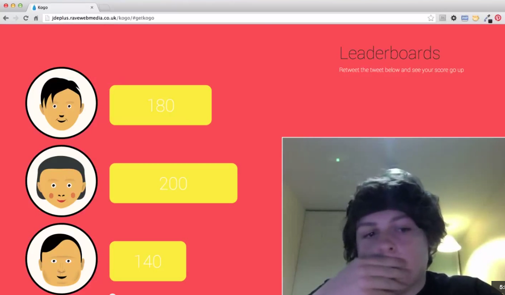

<!--

- [ ] Avoiding bias?
- [ ] User-testing debrief

-->

# Week 4

### Today, Thursday 28th January 2016

#### AM

1. Each team: **present** the key features and how you plan to user-test them with kids.
* [Prepare a **guide** and a **capture sheet**](#your-turn): how are you going to collect the user-testing feedback?

#### PM

1. At the primary school you'll **user-test** your features and collect feedback through *capture sheets*. 3 sessions of 30 minutes each, with 2-4 children per team.
* Jot down the **top 5 points** from the user-testing sessions (aka *debrief*).

<!-- Split kids into groups of 2 so you test more -->

Your [homework](#homework) and [blog](#blog)!

# User-testing preparation

1. How are you going to **user-test** this? 
* What **questions** will you seek to answer when testing your idea and wireframes? 
* What will be your **guidelines for feedback**?

### How (not) to user-test

Let's watch and discuss this user-testing video, from a former student

Can you spot a few issues in the way the *facilitator* conducted the test?

<!-- 

	* Explained testers what the app is about, instead of asking them
	* Think out loud if you can
	* What is the point of this test?
	* Facebook tab open before you show the actual thing
	* If there's something important in the bottom-right corner of your screen, it would be better if it wasn't hidden in the final video
	
 -->

#### Do's and dont's

You are the user-testing **facilitator**.

Your main job is to make your testers not feel stupid:

1. State clearly that you're testing the the *thing*, **not them**.
* Reassure them it's not their fault if what they do has an unexpected result.
* Encourage them to **think out loud**.
* **No hints**, instead encourage them to think what they'd do if you weren't there. Ask them what they are thinking or looking for but avoid words like `try`.
* Be kind and **patient**, don't sigh. 
* **Don't take it personally** if they don't get what you think it's obvious, but try and understand why.
* You should look out for **friction points**: those moments when the user stops concentrating on her tasks and starts thinking about the tool and how she is going to use it. Note questioning words, especially where testers question their own judgement, `why can't I find...`, `I expected to see...` etc. as this indicates that the workflow for the task may have broken down.
* **No orders**, but rather give some choice to your testers (eg: *What would you click first?*)
* Allow people to proceed in a task until you don't feel like it's producing any value or they becomes very frustrated.

> The best kind of user test is one where the subject is not influenced by too much direction, they are simply there to use what's in front of them to achieve a goal that you set out before the test began.

> From [The do's and dont's of UX testing](http://blog.oboxthemes.com/the-dos-and-donts-of-user-experience-testing/)

### Your turn

1. Prepare a **guide** for your user-testing session. You can take inspiration from this [sample](https://docs.google.com/document/d/17IuAMJojz0dlvBFh7QBDBgUWun2NyRZ6hlRwLdqYcH0/edit?usp=sharing) (*clone* it into a new Google doc).
* Prepare a **capture sheet**: this is based on the questions you'll ask your testers and the tasks they're going to perform. 

	It can either be *private* (just for yourself), or you could make some space in your testing material (wireframes etc.) to let your testers add their own comments and/or sketches. 
* Do a **practice run** with another team, and adjust your capture sheet accordingly. 

<!--
* Look around, what would you click first
* How do you find out more about ...
* Please sign up and go through profile-setting-up process
* 3 options: which one would you go for?
* Search for your favourite book / film / track etc   
-->

# Homework

<!--### User-testing debrief

Aggregating responses should take the form of simple tallies related to either task performance (success/failure) or sentiment (like/indifferent/dislike).

See usability test report template.-->

### Use case

Build a *use case*: how a particular person uses a particular feature in a particular scenario (min 5 steps).

Prepare a pitch presentation:

* **What** is your idea?
* **Who** is it for?
* **Why** is it needed?
* What are the **key features**?
* What is the **use case**? 

### Blog

Working with kids: what have you learned so far?
