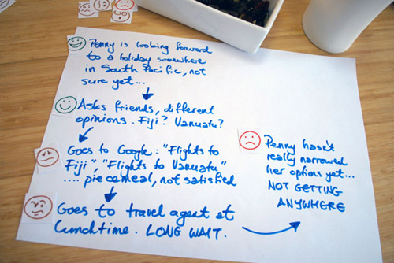

# Week 5

### Today, Monday 6th February 2017

1. Workshop: [where does it hurt?](#where-does-it-hurt)
* Lightning talk and workshop on [user-testing](#user-testing)
* [Tutorials](#tutorials): formative feedback evaluation & planning

Your [homework](#homework) and [blog](#blog)!

# Where does it hurt?

Imagine you're a person (or a *persona*) going through your experience map. 

1. Define a **goal** for your person(a). What does s/he want to achieve through the experience? 

	In other words, what is the *destination* s/he wants to reach in your experience map?
* Simulate the **experience flow**: go through each step with your team and discuss what happens to your person(a).
* For each step, identify potential **pain points**.  
  
	Add emoticons to each step, to visualise what's happening inside your person(a)'s head.

	

### The riskiest assumption

Going through the *experience flow* and identifying its *pain points* will allow you to uncover the **riskiest assumptions** in your idea. 

An assumption is a prediction for what you think will happen. Will users really behave as you predicted in your experience map?

Your riskiest assumption is both **core** to your idea and **most unknown**, meaning you have little data to prove it's valid. It's important to always test your **riskiest assumption first**.

Here are three examples:

:x: `NMM visitors want to see all the maps in the collection through an interactive touchscreen`

This is a solution-oriented assumption. Take a step back and ask, *why*?

:x: Because `there isn't enough space in the galleries to showcase all maps`

This is the business-perspective assumption. Not the customer's problem. Ask *why* again.
	
:heavy_check_mark: Because `visitors want to know where seafarers sailed and what navigation instruments they had available`  
  
This assumption is defined from the customer's perspective (and should be linked to something visitors told you during your interviews).

<!--
When you're testing a customer-perspective assumption, your riskiest assumption is one that supports the belief that your customer *has that problem*. 

In a problem-solution case, the riskiest assumption is that it's *the right solution* to solve the problem. 
-->

<!--
#### What makes a good experiment?

To prototype and test effectively, you need to **turn your assumptions into hypotheses** and then build an **experiment** to test the **riskiest** one.

A good experiment is:

1. cheap
* quick
* has the highest possible learning potential

You can create good experiments by building a *landing page* (remember [Buffer](#the-buffer-story)?) or by creating *prototypes* that simulate the aspects of your experience where the riskiest assumption lives.

Prototypes are likely the most appropriate tool for the kind of project we're working on this term ([DAX](../../projects/dax)).
-->

### Prototyping (to experiment)

Prototype, either on paper or digitally (or both, if your experience requires physical supports) the part of your experience where the riskiest assumption lies.

<!--
We're familiar with paper prototyping (here's a [great video-example](https://www.youtube.com/watch?v=_g4GGtJ8NCY).
-->

Over the next four weeks you'll iterate and test your prototypes with real visitors at NMM, several times!

A few tips:

* Use **realistic content**.

	As designers we're good at spotting *placeholder* text or images, however not everyone is familiar with them and sometimes people get hung up on details or ask `Why is that text in a foreign language?` (lorem ipsum).  
	
	Avoid *lorem ipsum* and stock photos like the plague! 
	
	You can find [real maps from the NMM collection here](https://docs.google.com/presentation/d/1tEg72Z_1cyxSUN1VfkW8Oke9gOZtmok0DRQ3odi61_4/edit?usp=sharing).

* How good is **good enough**?

	You want to strike a balance between the time it takes to build the prototype, and how close to the real thing you need it to be for your user-testing to be effective. 
	
	 When user-testing, it's crucial that you explain to people that this is **not a finished product** (even though it looks obvious to you) and that you are not testing colours, animations etc. 

* Avoid **linear click-throughs**. 

	Even if there's one single call to action per screen, your prototype should offer a couple of options to users.

* Create **reusable** styles and symbols.

	There are ways to do it in every prototyping tool. 
	
	If you catch yourself building the same button twice, that's an alarm bell: you should turn it into a *symbol* (or *smart object*, or whatever your tool of choice calls them).
	
*	Use **real devices** when testing. 

	If you're designing a mobile app, get the prototype on your mobile. If you're designing a touchscreen experience, get the prototype on a tablet.
	

# User-testing

Johnny Isaacs from [Campus Society](http://www.campussociety.com/) will tell you the whys and hows of user-testing. Then we'll put that into practice.

[Slides](https://drive.google.com/open?id=0B8pExRtNgFyRTXdNT1ZjdG02ODA) and [resources](https://drive.google.com/open?id=0B8pExRtNgFyRbjh0LUp4TjE4TWc) from his session.

# Tutorials 

Claim your team's tutorial slot on [this GDoc](https://docs.google.com/document/d/1ArfHiJFohSsvcbQ5Qtq0r6h3GZmiquCLoG7tvGKb2RQ/edit#heading=h.sri36ax4b1mo)!

One month till the **summative presentations on the 6th of March**!

Let's plan the next 4 weeks:

1. On post-its, write down everything that needs doing
* Together we'll discuss priorities (what needs to be done first) and assign tasks to people.   

# Homework

### User-test your prototype

Go to NMM and user-test your prototype with visitors. 

**Do at least two sessions over the next two weeks, and test at least four people per session!**

Take notes, write down your observations between one person and the next, record people (audio/video) if you can.

### Blog

Write your observations about user-testing at NMM. What did you learn **about your prototype** and what did you learn **about user-testing as a UX method**?
