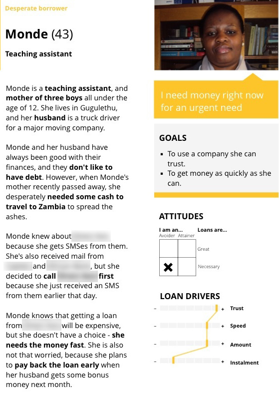

# Week 5

### Today, Thursday 4th February 2016

1. [Formative presentations](#formative-presentations)
* [User personas](#user-personas)

Your [homework](#homework) and [blog](#blog)!

# Formative presentations

Here's the [collaborative feedback Google doc](https://docs.google.com/a/rave.ac.uk/document/d/1m6RAJLOg_OVvi8cEsnsTrLjYW0j0WufOxhd1aALnmt0/edit?usp=sharing).

### WTF should we present?

Your progress on [*Kidesign*](../../projects/kidesign) so far:

1. **What** is your idea?
* **Who** is it for?
* **Why** is it needed?
* What are the **key features**?
* Describe a **use case** ([don't know what that means?](../04#use-case))

The points above are the bare minimum of what your presentation should include. You're very welcome to present them in a different order and include any other aspects (such as your *creative process*, what you discovered in your *user interviews* and *user testing*, etc.) which you consider relevant.

### How long should our presentation be?

Ideally **10 minutes** (max 15 minutes) with another 5 for Q&A.

### Tips for the presenters

1. Don't start with an **apology**.   
  
	Whatever you have is what you'll present. 
* **Don't read** a script, or read from your presentation.   
  
	We can read ourselves.
* Don't be **defensive**.   
  
	We're not attacking you. 
	
	Instead of putting up a defence wall, try to listen for the feedback that can make your ideas better. 
* Be **confident**.   
  
	You know your work inside out, so speak about it with confidence.   
	
	Stand up and get your hands out of your pockets.
* Tell us a **story**, not a features list.  
  
	<!---->
* Ask **specific questions**.   
  
	Not `What do you think?` or `Do you like it?`. 
* **Smile**.   
  
	It makes people pay more attention, and it makes you sound more engaging. Simple :smile:

Many more [**tips here**](https://www.toastmasters.org/About/90th-Anniversary/90-Tips)!

### Tips for everyone else

1. Be **kind**.   
  
	Your comments can be challenging, but make sure the creator of the work understands that your feedback is about their work, not about them.
* Be **constructive**.   
  
	Include *suggestions*, which the creator of the work can simply take away and use.   
  
	Also consider how you frame suggestions. Saying `Why didn't you make XYZ so and so?` may make the creator of the work feel like you think they're dumb or haven't done their work. Instead, try with `What do you think about making XYZ so and so?`
* Be **specific** and say **why**.   
  
	Rather than saying / writing `I don’t like XYZ` be specific about what you have an issue with, and why. Try saying / writing something like `I don’t think tXYZ reflects the user needs, because...`     
* **Focus on needs, not opinions**.
	
	Instead of a personal statement like `I hate the red button!` consider a user-focused question such as `Would users dislike the red button? It could be confused with an error message.`, which is much more effective, and also testable.
	

# User personas

### Once upon a time...

Personas started as a **marketing tool**, designed by Angus Jenkinson to categorise customers beyond the traditional **demographic segmentation**. You can [read his paper here](http://www.centreforintegratedmarketing.com/gfx/documents/beyond_segmentation.pdf): from *classes* or *clans* to individuals that flock together based on **common characteristics**. 

<!--Remember [homophily](http://en.wikipedia.org/wiki/Homophily)?-->

Alan Cooper introduced *user personas* as a methodology to solve the **elastic user problem**. He claimed that using *the user* as a design tool is a mistake. The **vagueness** of *the user* causes many design failures, as *the user* is too *elastic*. We therefore need something much more **specific**.

### What are user personas?

A persona represents a **cluster of users** who exhibit similar behavioural patterns in their purchasing decisions, use of technology or products, customer service preferences, lifestyle choices, etc. 

Personas are **fictional** characters. Even so, they should be based on **real data** from your user research.

#### What criteria are used to cluster users into a persona? 

1. **Behaviours**, what users do
* **Attitudes**, what users expect 
* **Motivations**, what users want / need 

#### What criteria are NOT used to cluster users into a persona? 

1. Age
* Gender
* Education
* Location and other typical *demographics* (quantifiable characteristics of a given population, such as nationality, religion and ethnicity)

<!--Personas are **archetypes** built to identify potential users: what they **need**, **want** and **expect** from what we are designing.

An *archetype* is a pattern of behaviours that help us s you better understand yourself and others.

http://www.16personalities.com/personality-types

In UCD the personas are created based in a previous research, but in Lean UX methods for example, personas are created originally based on assumptions (*proto-personas*) in a brainstorming session with the team, and further checked against actual real data (See  Gothelf, Jeff. Lean UX. Applying Lean Principles to Improve User Experience. 2013).

Personas must answers three basic questions: what are the user needs, wants and limitations.-->

### What are user personas NOT?

A persona is not a demographic profile, a market segment or a report of survey data. 

It is not taking what people tell you directly, it's looking at their behaviours in order to understand the *whys* and build around them. Observation is key, because what people do and say can be entirely different things. 

Homer thinks that *everyman* wants this car.

### Why do we need personas?

To set a **common understanding** of the user(s) we're designing for. 

When you work on a product, instead of talking about a generic *elastic user*, you can talk about *Chris* or *Danny*.

#### Personas as a design tool

As a **design tool** personas are used for answers key questions that will inform design decisions: 

* What would *Ali* do in this situation?
* What would she need now? 
* Does *Taylor* understand this?

In order to answer such questions usefully and help you make effective design decisions, your personas should be specific and based on real data (more on this below).

### Dos and Don'ts

#### Real data DO

`+` Do base your personas on **real data**: people that you know or have interviewed / surveyed.

#### Fiction DON'T 

`-` Don't make your personas entirely **fictional**. Your product is going to be used by real people, not fairytale characters that unquestioningly adopt it and happily use it ever after.

#### Delusion DON'T

`-` Don't make your personas perfectly match the *ideal user* of the product you're designing. I call these **delusional personas**. 

Personas should challenge your design decisions, not simply mirror them.

#### In your own image DON'T

`-` Don't create user personas in your *own image*. It's easy (and tempting) to create personas who are in their early 20s, living in London and studying design or working in a creative agency in Shoreditch... but there's life beyond our **homophilic bubbles**.

#### Simplistic DON'T

`-` Don't **oversimplify** your personas: real people are complex, not shallow and generic.

#### Extreme DO

`+` Do rather go for the **extreme cases**, and the middle will take care of itself. For example: design for children that can't read well yet, or for children that are not familiar with the internet, etc.

#### Needs and goals DO
 
`+` Do base your personas on **needs**, **goals**, and dimensions that have a direct impact on their interaction with the product you're designing.

#### Demographics DON'T
 
`-` Don't worry about demographic detail: just enough to help us get to know this persona. For example *Ben, 46, father of a girl and a primary school teacher*

#### Casuality DO

`+` Do focus on **causality**: what are the reasons your personas behave in a certain way? What drives them in their choices?

### How to build personas

The example above is a design persona for a short-term loan company. Its author [Ryan van der Merwe](http://www.elezea.com) writes:

> The key to these types of personas are the **dimensions**, or in this particular case, the **loan drivers**. Note that for Monde, the monthly instalment is not important. What's important is that she gets the amount she needs to pay for her travel. For the persona that just wants a TV or some new shoes, this is different. For that persona the amount is less important — what's most important is whether or not they can afford the monthly instalment.

> From [Elezea](http://www.elezea.com/2013/12/job-stories-and-personas-sitting-in-a-tree)

### Your turn

Create (at least) two user personas for your product, using the guidelines above.

Base your personas on the people you have interviewed.

How you structure your personas (in terms of contents and visual presentation) is up to you. 

If you desperately need a template, you could [use this as a starting point](http://www.ux-lady.com/diy-user-personas/) but don't just mindlessly copy it. Think of what **dimensions** will be useful in the design process.

# Homework

### User personas

Finalise your two (or more) user personas.

