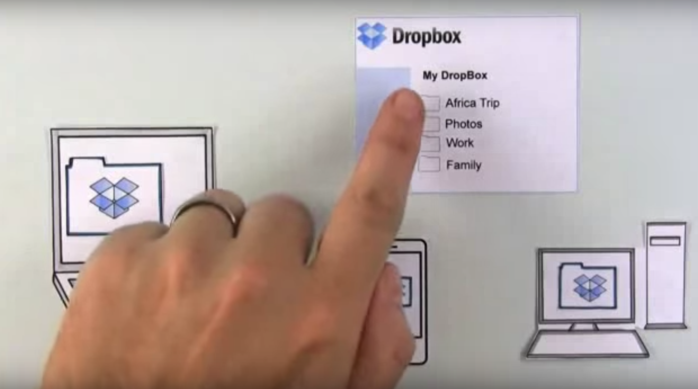

# Week 6

### Today, Monday 19th February 2018

* Reminder: Summative Hand Ins
* Formative Feedback / Action Plan Review
* Intro: Self Assessment for Summative. 
* Prototyping workshop 
* User-testing prep
* User-testing @ NMM 

Your [homework](#homework) and [blog](#blog)!

# Reminder: Summative [Hand Ins](https://github.com/RavensbourneWebMedia/UX-design/tree/2018#summertive-assessment-monday-march-5th--national-maritime-museum)

A moment to reveiw what we need to hand in for this unit. 

# Formative Feedback / Action Plan Review

In the last session we had formative presentations at the NMM. 

You were given a lot of valuable feedback and guidence on your projects by the in house team. This feeback can be found [here.](https://docs.google.com/document/d/1P_HZKHCFokdJ-BiGzdCjj6rkq-A4c8EpyxdXWY3ggcQ/edit) 

To follow on from this your homework was to: 

* Review the formative feedback your received.
* Individually jot down an action plan: list what you want to do in order to address that feedback. 
* Compare your action plan list with your team mates.

This morning I would like to review your action plans & what you have executed over reading week. 

If you do not have an action plan, make one in the session based on your [formative feedback.](https://docs.google.com/document/d/1P_HZKHCFokdJ-BiGzdCjj6rkq-A4c8EpyxdXWY3ggcQ/edit) 

Some general points from the presentations: 

1. Audience: Be clear on who you are designing for and make sure that this has come from the list given by the NMM. 
2. User testing: Sasha has offered to put us in contact with the audience groups. Would you like to reach out for this? 
3. Review the [brief](https://github.com/RavensbourneWebMedia/UX-design/tree/2018/projects/nmm_hidden_histories) Does your project address all of the point within this doc? 

# Intro: Self Assessment for Summative. 

At the beginning of term we talked through the [Marking Criteria](https://drive.google.com/file/d/1ue54a2OzIkeuDY0wKjW--96jjuNYNXcp/view?usp=sharing) for this course. 

Let's quickly look at this again. 

This term, you will be asked to self assess your own teams work using a marking template. This means that along with your summative hand in's you will submit a marking sheet and indication of where you place your own work in the marking criteria. 

Self assessmenet is a valuable tool in learning as it helps us guage where our own work and learning is against university standards and helps us identify areas of strength and areas for improvement. 

We will talk more about this next week when the assignment will be set along with  your summative hand in preparation. 

# Prototyping workshop 2 

Now that we have reviewed the feedback that you have been given and the action plans that you have made, it is time to think about whether you should stick, pivot or kill your previous prototypes? 

Ask yourself? 

* Does your core concept need to change based on the feedback your recieved? 
* Were the UX steps that you explained to the NMM understood easily? 
* Are your expereince maps clear and able to add value to the NMM? 

Now, let's reveiw your prototypes with your action plans in mind and work on modifying your screens & designs. 

# User-testing your prototype

### What have you learned so far about user-testing? 

Share some stories, discuss [tips](https://docs.google.com/document/d/1O0f50mVLfud9Y3fYCpPdtmcZ3scuJvaBq6nHGVjJrgs/edit#heading=h.mkklaycrp9q9).

I have would like for us to contact Sacha about running some user testing with focus groups from your target audience over this week / next week. Before we do this, I would like us to prepare a user tesing guide for your adjusted prototypes & these new sessions so that we are well prepared. 

### Prepare a user-testing guide

Let's spend the last 20 mins of class preparing a guide for a user-testing with NMM for this week / next week.

Write down:

* what assumptions do you want to test?
* how can you test them?
* what tasks will you ask testers to perform?
* what context questions will you ask them at the beginning?

[Here is an example user-testing guide](https://docs.google.com/document/d/1BFktaf9BfkCLFq1ONkfNRJ4tIUZNB6BvOTxzZkVeAso/edit?usp=sharing) from an industry contact. Can you use this as a basis for your own user testing template. 

# Homework

### Blog

In preparation for the summative presentation (and for your future career) read how to [use storytelling to effectively communicate your research](https://blog.intercom.com/get-the-most-out-of-your-research-storytelling/), then blog about:

1. Your 3 take-aways from the article 
* How could you tell the story of your project to NMM at summative? 

### Concept video

Concept videos allow you to tell a compelling story around your idea, even if you haven't built a prototype yet!

Did you know that Dropbox first MVP (*minimal viable product*) was [a concept video](https://techcrunch.com/2011/10/19/dropbox-minimal-viable-product/)? [Check it out](https://www.youtube.com/watch?v=w4eTR7tci6A).

You can capture interest with a vivid **problem description**, and convince people with a **backstory** or examples of how people will benefit from you concept.

Here are some more concept video examples:

* [Lily](https://www.lily.camera/) is a drone camera that follows you. It raised millions on [Kickstarter](https://www.kickstarter.com/) (another great source of concept video inspiration) with a concept video that ~faked~ simulated how the product would work. 
* [StartupVideos](http://startup-videos.com/) features loads of concept videos for you to get inspired

Using [Adobe Spark](https://spark.adobe.com) (free, online) **create a Minimum Viable Video for your NMMaps concept!**

We'll review it next week.

