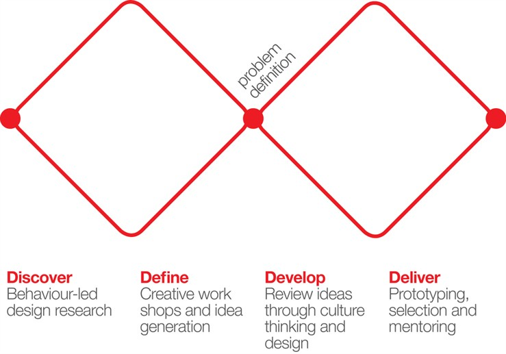
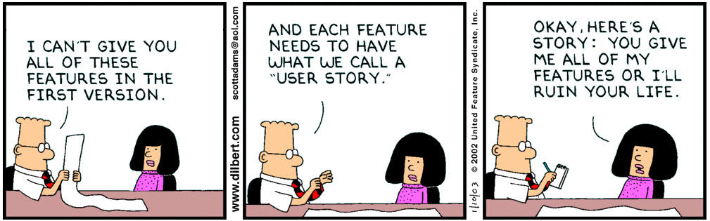

# Week 7

### Today, Monday 27th February 2017

1. [User personas](#user-personas) review
* [Workshop](#workshop): user stories
* [Tutorials](#tutorials) on Kidesign

Your [homework](#homework) and [blog](#blog)!

# User personas

### What are user personas?

A *user persona* is a UX design tool that allows you to visualise **users with common behavioural patterns** in their purchasing decisions, use of technology or products, customer service preferences, lifestyle choices, etc. 

Personas are **fictional** characters based on **real data** from user research.

### Why do we need personas?

To set a **common understanding** of the user(s) we're designing for. 

When you work on a product, instead of talking about a generic *elastic user* you can talk about *Chris* or *Danny*.

#### Personas as a design tool

As a **design tool** personas are used to answer key questions that will inform design decisions: 

* What would *Ali* do in this situation?
* What would she need now? 
* Does *Taylor* understand this?

You'll see how team discussions will be much more focused when you use personas, rather than a vague *elastic user*.

In order to be a **useful** design tool personas should **challenge** your design decisions, not simply validate them.

### Your turn

Each group: present your persona(s) to the class. We'll give you feedback (based on [personas dos and don'ts](../05#dos-and-donts)) and discuss how to use your personas in the next phase of your project.

# Workshop

### The design process

Remember the [**double diamond**](#http://www.designcouncil.org.uk/news-opinion/design-process-what-double-diamond)?

<!--
> In all creative processes a number of possible ideas are created (*divergent thinking*) before refining and narrowing down to the best idea (*convergent thinking*), and this can be represented by a diamond shape. 

We could split the **design process** in four stages. 
-->

### Where are you now?

<!-- At the start of the Develop phase -->

- [x] **Discover**
	
	* Competitor analysis	
	* User interviews
	
- [x] **Define**
	
	* Wireframes
	* User case(s)
	* User personas
	
- [ ] **Develop**
	
	* User stories
	* Prototype(s)
	
- [ ] **Deliver**
	
	...

### User stories

Not to be confused with [user cases / journeys](../04#use-case).

If a user case / journey is close to a comic, a user story fits more into a spreadsheet.

<!--
### Personas are not enough

Personas are useful to cluster different people into *archetypes* and summarise our user research.

Personas illustrate behaviours, attitudes, and motivations of people at a high level.

When **developing** our products we need **more detail** than what a persona tells us.
-->

### What are user stories then?

Plain English sentences that **describe the basic units of functionality** of your product.

Useful to:
 
* state **product features** without writing endless pages of documentation
* have a **checklist** for features development 
* get *everyone on the same page*
* not depended on the whims of a client / manager / focus group etc.	

This guy [:heart: user stories](http://www.usabilitycounts.com/2013/10/11/why-i-love-user-stories).

<!--
> Who are we?

> What do we want?

> When do we want it?

> Why?

-->

### As a `who?`, I want to `what?`, so that `why?` [`when`]

In just one sentence, a user story encapsulates

* **Who** is this functionality for?
* **What** does s/he want?
* **When** does s/he want it?  
* **Why** is it valuable to the her?

#### Examples

* As `an administrator`, I want to `search for my customers by their first and last names`, so that `I quickly find specific people to contact`.
* As `a user`, I want to `start the application with the last edit`.
* As `a user`, when `closing the application`, I want to `be prompted to save anything that has changed since the last save` so that `I don't lose work`.
* As `a student`, I want to `find my grades online` so that `I don't have to wait until the next day to know if I passed`.
* As `a book shopper`, I want to `read reviews of a selected book` to `help me decide whether to buy it`.
* As `an author`, I want `the spell checker to ignore words with numbers` so that `only truly misspelled words are indicated`.

### How do you write user stories?

1. Brainstorm and jot down **players** in the **system** (based on your personas), eg: visitor, potential customer, new customer, customer, system admin, content editor
* For each player, jot down **actions** s/he may want to do, eg: read about the service, get contact details, find info about opening times.. 
* For each action think about `before I do that, I need to` chains.
* Separate actions between **tasks** (intermediate in a chain) and **goals** (end of chain) 
* Map actions to players (one action could be assigned to more than one player)
* Write a user story for each action assigned to a player, from the player perspective.
* WHO and WHAT are required, WHY and WHEN are optional
* Organise actions that the system must / could / shouldn't allows players to do

### Your stories

1. Open [**this spreadsheet**](https://docs.google.com/spreadsheets/d/1f8hT4n4rKA_vfWv2CXFFczrlBMhAPsxecoMOBBNny-o/edit?usp=sharing).
2. Duplicate the `_blank` sheet and give it your team name.
3. Jot down stories following the steps above.

# Tutorials

### Kidesign

Let's review your action plan and user stories.

# Homework

### Rapid prototyping

In an iterative approach to UX design, rapid prototyping is the process of **quickly mocking up the future state of a system** and testing it with users, teammates and clients. 

Doing this **rapidly and iteratively** generates feedback early and often in the process, improving the final design and reducing the need for costly changes during development.

#### What is a prototype then?

A prototype **answers questions**. The more specific the better.

A prototype stands between your **assumptions** and your users **behaviours**.

A prototype should be **quick** (and cheap) to make, re-make and possibly discard.

A prototype should be **close** to the real thing.

A prototype is **not the real thing**.

#### Which prototyping tool should I use?

Each prototyping tool has its own feature set and strengths. Based on your needs and the requirements of your project, evaluate which tool is more appropriate:

1. How **easy** is it to learn and use the tool?
* Are there a repositories of **reusable templates** or widgets available?
* How easy is it to make changes on the fly or to **incorporate feedback**?
* Does it have any **collaboration features**, such as allowing multiple people to work on it at the same time?
* What are the licensing terms and **costs**?

##### Tools to consider

Name | Platform | Free?
---- | -------- | -----
[Macaw](http://macaw.co/) | Mac and Win | Yes
[Invision](http://www.invisionapp.com/) | Web-based | Yes
[Justinmind](http://www.justinmind.com) | Mac and Win | 30-days free trial, then $19/month 
[Sketch](http://www.bohemiancoding.com/sketch/) | Mac only | Free trial, then $49 (education price)
[Balsamiq](https://balsamiq.com/products/mockups) | Mac and Win | 30-days free trial, then $89 
[Adobe Muse](http://muse.adobe.com) | Mac and Win | Not clear
[Framer](http://framerjs.com) | Mac only | 30-days free trial, then $99 
[Atomic](https://atomic.io) | Web-based | 30-days free trial
[UXPin](https://www.uxpin.com) | Web-based | 7-days free trial

<!--
* [OmniGraffle](#https://www.omnigroup.com/omnigraffle) [Mac only]
* [Axure](http://www.axure.com) [Mac and Win]
* Photoshop and Illustrator [Mac and Win], check out [Web Zap](http://webzap.uiparade.com)
* [Blocs](http://blocsapp.com) [Mac only] interface builder for Bootstrap
* [Divshot](https://divshot.com/features), online interface builder for Bootstrap
-->

<!--
#### DO

1. **Work collaboratively** with users, teammates and *stakeholders* while rapid prototyping. Apart from giving valuable feedback, they also gain a sense of ownership of the final product.
* **Reuse, reuse, reuse**. For computer-based prototyping, this means saving reusable templates, stencils, patterns and widgets for future projects.
* When creating interactive high-fidelity prototypes and simulations, build in **realistic delays** (for instance, for screen refreshing or moving through steps of a transaction), so that users do not expect instant response times from the final product.
* Avoid *prototype creep* by **setting expectations** for the process, including ones affecting the purpose, fidelity, scope and duration. Remind everyone, including yourself, that rapid prototyping is a means to an end, not an end in itself.
* Begin every prototype review session with the disclaimer that **this is just a prototype**, a mock-up, not the actual solution. This reminds users that this is a work in progress, it encourages feedback, and in the case of high-fidelity prototypes, it prevents users from mistaking it for a working solution.

#### DON'T

1. **Don't be a perfectionist**. In most cases, rapid prototyping does not have to be 100% perfect, just **good enough** to give everyone a common understanding.
* **Don't prototype everything**. Most of the time, you shouldn't have to. A good rule of thumb is to focus on the **20% of the functionality that will be used 80% of the time**, key functionality that will be used most often. 
* Don't take every change or request that comes out of a prototype review as a new requirement. Rapid prototyping helps capture missed requirements, but these new requirements should be evaluated carefully. Some may be implemented, while others are pushed to a future release.
* Don't begin prototype review sessions without **clear guidelines for feedback**. Be very specific about the type of feedback you are looking for. (Are the steps logically arranged? Is the navigation clear and intuitive?) If not, be prepared for `I don't like the blue in the header` or `Can't we use this font instead?` or `Can you make this bigger, bolder, in red and flashing?`
-->

#### Your turn

**Prototype** two user flows:

1. The **onboarding** process: how does your app *welcome new users* and help them find their feet? How does your app tell users what they can do, where to find things, and encourage them to use its features? 

	You can find very detailed breakdowns of other app's onboarding at [UserOnboard](http://www.useronboard.com/).
* A **problematic scenario** (aka an *edge case* or *unhappy path*) of your choice. 

	For instance, what happens when your typical user makes a mistake, can't find what s/he is looking for, or generally when something goes wrong?

Produce prototypes that address [your user stories](#your-stories).

### Blog

[UX choreography](https://medium.freecodecamp.com/the-principles-of-ux-choreography-69c91c2cbc2a)

<!--

[**Make it like the PSD**](http://dangovan.com/make-it-like-the-psd)

Some questions that may guide your blog post (in no particular order):

* What are the disadvantages of presenting Photoshop documents, as opposed to other ways of communicating a design (according to the author)?
* If PSDs are so bad, why do so many people use them as *project deliverables*?
* What alternatives does the author propose to the *Photoshop-driven design process*?
* How do you feel about the *Photoshop-driven design process*? 

-->