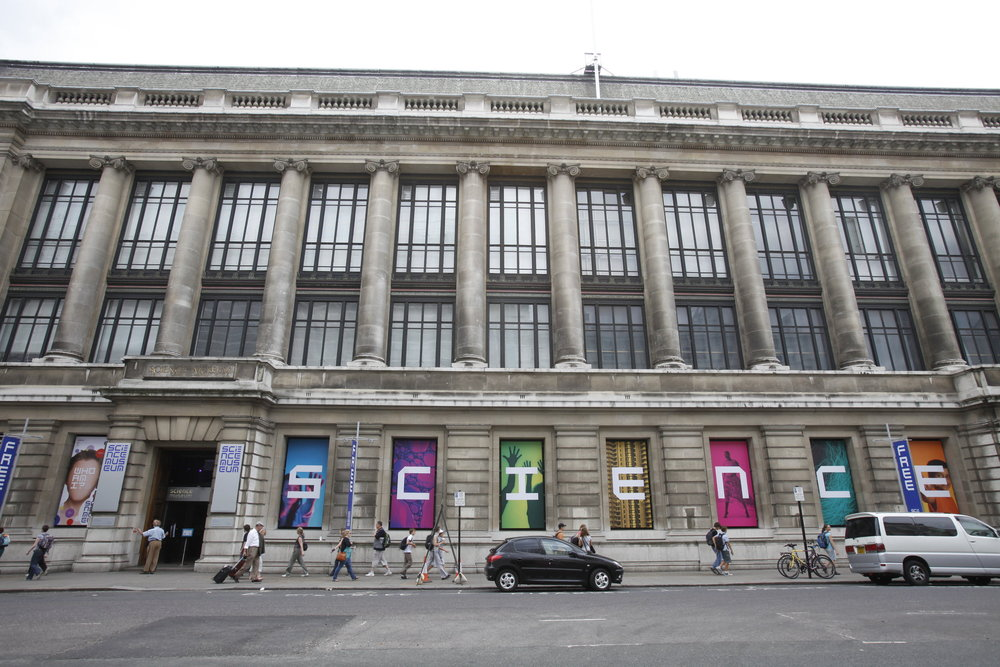

# Week 7

### Today, Monday 27th February 2017

* Concept video reveiw. 
* User-testing your prototype. 
* Prepare a user-testing guide.
* Afternoon Session: User-testing @ The Science Museum

Your [homework](#homework) and [blog](#blog)!

# Concept Video Review

Last week you were asked to make a concept video for your NMM Hidden histories project. 

This should have been in the form on an MVP, see last weeks Drop Box example [here](https://www.youtube.com/watch?v=w4eTR7tci6A): 

Now it's your turn. Let's share our concept videos with the class. 

# User-testing your prototype

### What have you learned so far about user-testing? 

In Week 4 you conducted user testing at the NMM and were asked to complete at least another two sessions over the next two weeks, with at least four people per session. 

Let's share what you did you found out from these last sessions and what's changed with your prototype since. 

Share some stories, discuss [tips](https://docs.google.com/document/d/1O0f50mVLfud9Y3fYCpPdtmcZ3scuJvaBq6nHGVjJrgs/edit#heading=h.mkklaycrp9q9).

You were asked to do this and record your sessions / results as you will need to hand in a user testing report as part of your hand in. The report template that you will be using can be found [here](https://docs.google.com/document/d/1XIrJQe4acdR1fNuu53qgHxd80F5V_cvm2Uh62OQ3i1M/edit?usp=sharing). Take 10 mins to review the template and then think about what you have already & what you would like to achieve this week. 

### Prepare a user-testing guide

Let's spend the last 20 mins of class preparing a guide for a user-testing that you will conduct at the science museum this afternoon.

Write down:

* what assumptions do you want to test?
* how can you test them?
* what tasks will you ask testers to perform?
* what context questions will you ask them at the beginning?

[Here is an example user-testing guide](https://docs.google.com/document/d/1BFktaf9BfkCLFq1ONkfNRJ4tIUZNB6BvOTxzZkVeAso/edit?usp=sharing) from an industry contact. Can you use this as a basis for your own user testing template. 

### Afternoon Session: User Testing at the Science Museum

This afternoon we will travel to the science museum for another round of user testing on your prototypes. 

Let's meet outside the main entrance at 2pm to regroup before you head off in your pairs to complete your user testing. 

We will then regoup at 3.50pm to share thoughts on your sessions before end of class. 

# Homework

### User-testing report!

An important and often overlooked part of user-testing is **collecting evidence** of your sessions, writing your **observations** and condensing them into a list of **actionable recommendations**.

<!-- Aggregating responses should take the form of simple tallies related to either task performance (success/failure) or sentiment (like/indifferent/dislike). -->

1. Open [this template GDoc](https://docs.google.com/document/d/1XIrJQe4acdR1fNuu53qgHxd80F5V_cvm2Uh62OQ3i1M/edit?usp=sharing). 
* `File` > `Make a copy...`
* Change the sharing settings for your copy so that `Anyone with the link can comment`.

	
* Share the link for your report with me via email. 
* Use this template as a guideline (not all sections in the template may apply to your project) to **write a report of your digital prototype user-testing**.

Bear in mind you'll be marked on this report (among other project materials, such as wireframes, presentations, prototypes etc). 

### Formative Assesment (round 2): Self Assessment 

We spoke last week about [self assessment](https://github.com/RavensbourneWebMedia/UX-design/tree/2018/sessions/06#intro-self-assessment-for-formative-on-5th-march-2018) and how this can benefit our understanding of how your learning will be measured. 

This week you will prepare a self assessment hand in as part of your formative 2 submission. 

Once you have finished your work, open this [self assessment sheet](https://docs.google.com/document/d/16Y_OBU9ZkwZ3rHbpN8OG3kOPcT8h4qmywpbDRA19WcU/edit?usp=sharing), make a copy and mark your name at the top of the sheet. 

Now open the [UAL marking criteria](https://drive.google.com/file/d/1ue54a2OzIkeuDY0wKjW--96jjuNYNXcp/view?usp=sharing). 

On the marking sheet work your way through the parts of the project that need to be marked for each of the marking criteria and assign a grade placement from the marking cirteria against your work. These will then combine to make your overall grade for each marking criteria. And then your final grade. 

Let's take a moment to work through an example together. 

### Formative Assessment (round 2): Presentation / Hand in Prep

Your final formative assessment for this unit will be next week on 5th March @NMM. Make sure that you have everything that you need finsihed for presentation and hand in next week. 

### Blog

Read [UX choreography](https://medium.freecodecamp.com/the-principles-of-ux-choreography-69c91c2cbc2a) and then blog about your 3 main take aways from this article. 