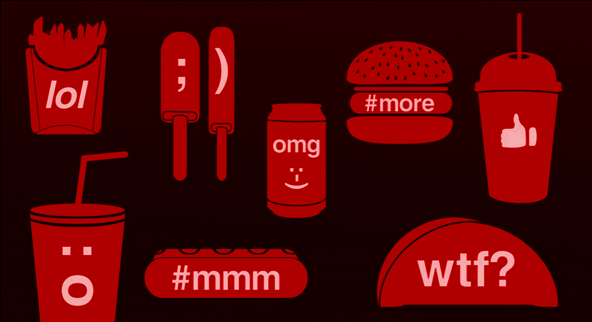
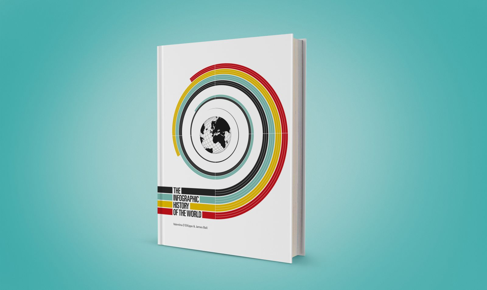

# Week 9: Welcome to Term 3

### Today, Wednesday 18th April 2017

1. [Holiday Project](#data-detox), Evaluation of the challenge. 
2. [Reflecting on last term](#once-upon-a-time), what are your learning goals for this term?
3. [This terms brief] (#this-term), an introduction to this terms project. 
3. [Workshop](#workshop): data visualisation
4. [Project kickstart](#project-kickstart): filter bubbles

Your [homework](#homework) and [blog](#blog)!

# Data Detox

Over the Easter holiday you were set the challenge of completing an [8 day data detox.](https://datadetox.myshadow.org/detox)

Then the [Cambridge Analytic](https://www.theguardian.com/news/series/cambridge-analytica-files) scandle broke exposing the fact that apps developed within facebook had been used to harvest the data of 87 million users and use it to spread pro Brexit advertising. 

* Did anyone follow the news as it unfolded? 
* Does anyone know whether they were effected by the data breach? 
* How did this news make you feel about your data security online?

Let's check in about your expereinces of doing the 8 day data detox challenge. Now that you have finished the full data detox: 

* How do you feel about your data detox?
* Was there anything that you thought was surprising about the data detox? 
* What do you think you'll take with you into the future? Are you likely to keep detoxing? 
* Do you think that you've picked up any new habits? 
* Is there anything that was missing from the detox pack? 

# Once upon a time...

It feels like last term was ages ago. 

Let's cast our minds back and refelct on last term. Grab some post-its and write down **what went well** and **what we could improve on**. Some aspects to consider:

* Collaborating with institutions like NMM
* Working in teams
* Workload
* UX design methods
* Blogging

### What went well

* Working on a live brief
* Designing for a specific context
* *Broad* brief
* Amin from Over the Arch workshop on user-testing
* NMM staff (and particularly Sacha) offered loads of insightful and frequent feedback
* Creating an interactive prototype
* Having access to real content for your projects
* Team work: more ideas, distribution of work, teams chosen by students
* Tutorials sessions

### Even better if...

* Design the UX for a digital physical object
* Attendance and communication: you have a responsibility to let teammates and tutors know if you're not attending
* Blogging regularly, recording your thoughts and creative process (however messy that may be) 
* Have a clearer idea of what our task was (from NMM)
* Practicing interviews
* More time for the project (felt rushed)
* More opportunities to discuss individual projects with NMM staff
* Start the user-testing report earlier
* More attention to time management
* Rotating project manager within the team
* Pick a target audience before you generate an idea
* Hard to find the right target audience to interview & test (needs more planning and more attempts)
* More wireframing and prototyping

## This term

We'll be moving onto a project where the broad theme is *digital citizenship* and we'll be focusing on **[filter bubbles](../../projects/filter-bubbles)**. Your **individual brief** for this term will be to design and prototype a *digital object* that helps people become aware of their filter bubbles and/or burst them. 

# Workshop

Today we will be thinking about how information designers like [Valentina D'Efilippo](http://www.valentinadefilippo.co.uk/), use data in interesting ways to tell stories and referencing books like [The Infographic History of the World](http://www.valentinadefilippo.co.uk/projects/the-infographic-history-of-the-world/) to see how data can be visualised in asthetic ways. 

We'll talk about different appraoches to making data understandable through design and then introduce you to **data visualisation** through practical exercises.

* *Data in your bag*  
* *Map your personal data* 

Find today's presentation on [data visualisation here.](https://github.com/RavensbourneWebMedia/UX-design/blob/2018/sessions/09/assets/Intro_To_Data_Visualisation.pdf)

# Project kickstart

Watch [this TED talk](https://www.ted.com/talks/eli_pariser_beware_online_filter_bubbles?language=en#t-53082) in which Eli Pariser introduces **filter bubbles** and explains the danger they pose.

**Start mapping your own filter bubbles**!

Then compare them with those of at least two of your classmates.

See an example from a couple of past students.

 

<!--
Individually, write about Filter Bubbles. Reflect on the concept and document your thought process. You can post pictures of scribbled notes, or jot down notes digitally. It doesn't need to be fleshed out and well written. The main goal here is to record your flow of ideas, not to make it beautiful!

Ideally we'd get a variety of responses, from projects that raise awareness about certain aspects of digital citizenship, to others that get people active in protecting their data or changing their data consumption habits.
-->

# Homework

1. Continue [mapping your filter bubbles](#project-kickstart).
2. Install [Data Selfie](http://dataselfie.it), an open-source Chrome browser extension that collects and analyses data about your behaviour on FB. Make sure you use FB on Chrome so that you can start harvesting data!

### Blog

Read and blog about [data selfies](https://policyreview.info/articles/news/speculative-data-selfies/449)

Some points for your reflection:

* How do you feel about the *persona* Data Selfie creates out of your FB activity? Do you identify with it? Is it accurate?
* What does Data Selfie *not* tell about yourself?
* How is your online identity *different* from your IRL (in-real-life) one?
* What is your *digital footprint*?