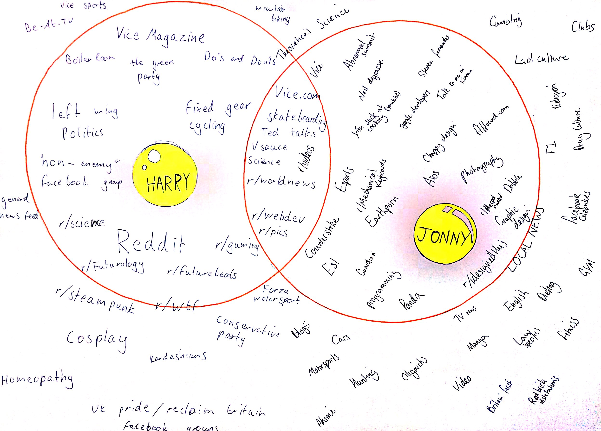

# Week 9

### Today, Friday 21st April 2017

1. [Reflecting on last term](#once-upon-a-time), what are your learning goals for this term?
2. [Workshop](#workshop): data visualisation
3. [Project kickstart](#project-kickstart): filter bubbles

Your [homework](#homework) and [blog](#blog)!

# Once upon a time...

It feels like last term was ages ago. 

Let's take 5 minutes to answer [3 quick questions about our collaboration with NMM](https://ravewebmedia.typeform.com/to/FvNgru).

Then grab some post-its and write down **what went well** and **what we could improve on**. Some aspects to consider:

* Collaborating with institutions like NMM
* Working in teams
* Workload
* UX design methods
* Blogging

### What went well

* Working on a live brief
* Designing for a specific context
* *Broad* brief
* Jonny from Campus Society workshop on user-testing
* NMM staff (and particularly Chris) offered loads of insightful and frequent feedback
* Creating an interactive prototype
* Having access to real users
* Team work: more ideas, distribution of work, teams chosen by students
* Weekly tutorials

### Even better if...

* Design the UX for an app or website
* Attendance and communication: you have a responsibility to let teammates and tutors know if you're not attending
* Blogging regularly, recording your thoughts and creative process (however messy that may be) 
* Have a clearer idea of what our task was (from NMM)
* Practicing interviews
* More time for the project (felt rushed)
* More opportunities to discuss individual projects with NMM staff
* Start the user-testing report earlier
* More attention to time management
* Rotating project manager within the team
* Pick a target audience before you generate an idea
* Hard to find the right target audience to interview & test (needs more planning and more attempts)
* More wireframing and prototyping

## This term

We'll be **collaborating** with [Stationers Crown Wood Academy](http://scwa.org.uk). 

The collaboration broad theme is *digital citizenship* and we'll be focusing on **[filter bubbles](../../projects/filter-bubbles)**. Your **individual brief** for this term will be to design and prototype a *digital object* that helps people become aware of their filter bubbles and/or burst them. 

Throughout the project you'll be interacting with minors (the SCWA students) so we need to do a very short training on dos and don'ts, led by Lucy Slater from the Outreach department. It's mostly common sense.

# Workshop

Our special guest for today is [Valentina D'Efilippo](http://www.valentinadefilippo.co.uk/), information designer, educator and author of [The Infographic History of the World](http://www.valentinadefilippo.co.uk/projects/the-infographic-history-of-the-world/)

Valentina will talk about her experience and introduce you to **data visualisation** through practical exercises.

* *Data in your bag* 1h 
* *Map your personal data* 1h

Throughout the day you'll have a chance to get to know the SCWA students.

# Project kickstart

Watch [this TED talk](https://www.ted.com/talks/eli_pariser_beware_online_filter_bubbles?language=en#t-53082) in which Eli Pariser introduces **filter bubbles** and explains the danger they pose.

**Start mapping your own filter bubbles**!

Then compare them with those of at least two of your classmates.

See an example from a couple of past students.

 

<!--
Individually, write about Filter Bubbles. Reflect on the concept and document your thought process. You can post pictures of scribbled notes, or jot down notes digitally. It doesn't need to be fleshed out and well written. The main goal here is to record your flow of ideas, not to make it beautiful!

Ideally we'd get a variety of responses, from projects that raise awareness about certain aspects of digital citizenship, to others that get people active in protecting their data or changing their data consumption habits.
-->

# Homework

1. Continue [mapping your filter bubbles](#project-kickstart).
2. If you haven't already, take 5 minutes to answer [3 quick questions about our collaboration with NMM](https://ravewebmedia.typeform.com/to/FvNgru).
* Install [Data Selfie](http://dataselfie.it), an open-source Chrome browser extension that collects and analyses data about your behaviour on FB. Make sure you use FB on Chrome so that you can start harvesting data!

### Blog

Read and blog about [data selfies](https://policyreview.info/articles/news/speculative-data-selfies/449)

Some points for your reflection:

* How do you feel about the *persona* Data Selfie creates out of your FB activity? Do you identify with it? Is it accurate?
* What does Data Selfie *not* tell about yourself?
* How is your online identity *different* from your IRL (in-real-life) one?
* What is your *digital footprint*?