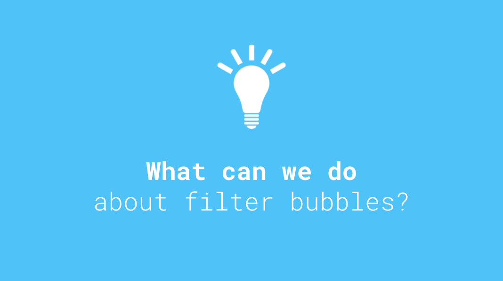

# Week 10

### Today, Friday 28th April 2017

Today's session will kick start your filter bubbles projects and start to shape your work for the term. We will cover: 

* **Digital data**: what is it, how do companies collect and use your data, and what can we do about it?
* **Algorithms**: we'll learn how to write and *decode* algorithms, in particular *filtering* algorithms.
* **Filter bubbles**: the effects of the invisible algorithmic filtering of the Web by companies like Facebook and Google. We'll draw and compare our filter bubbles. 
* **Ideation**: we'll come up with 10 ideas for a *digital object* (an app, a website, a bot, a browser plugin..) that tackles filter bubbles
* **Interviews**: we'll ask people (unbiased) questions to validate our idea(s) 

All the material for today is in [this presentation](https://docs.google.com/presentation/d/1aeS1devIv-9eVnUuvArntvLG1uvt9YcqsV6q35Pfz0w/edit?usp=sharing).

# Homework

### Blog

1. Read [this article](https://backchannel.com/facebook-published-a-big-new-study-on-the-filter-bubble-here-s-what-it-says-ef31a292da95) by Eli Pariser (author of *The Filter Bubble*), in which he analyses a study by Facebook data scientists on **filter bubbles vs individual choices**. Then blog about your views on this analysis. Include examples from your own experience of filter bubbles (eg: Did you ever get something offensive or off-putting from a friend/contact on social media? Or an advert that you found irrelevant? How did you feel?). 