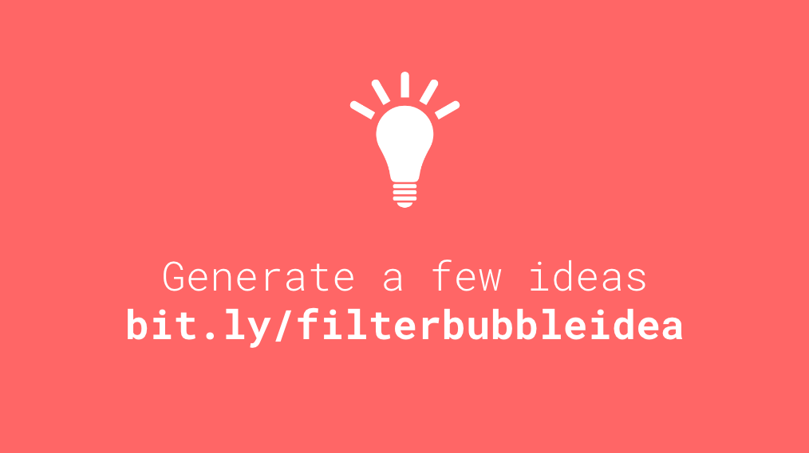

# Week 11

### Today, Tuesday 2nd May 2017

We'll continue working on your [*filter bubbles* brief](../../projects/filter-bubbles).

* Recap and **reflection**: pros and cons of *filtering algorithms* and *filter bubbles*.
* Random idea generator and **idea sheet**: what is your idea called, how does it work, and what do you want people to know/feel/do?
* **Paper-prototyping** and **user-testing** your idea

All the material for today is in [this presentation](https://docs.google.com/presentation/d/1DX5r14pEi_buGRiUF4Jr2mytMT90wb1Lx4jT1wwZIIk/edit?usp=sharing).

After the lecture / workshop session with we'll do [tutorials](https://docs.google.com/document/d/1ArfHiJFohSsvcbQ5Qtq0r6h3GZmiquCLoG7tvGKb2RQ/edit#heading=h.bo009u261hi5) on your first round of ideas.

# Homework

* Continue **prototyping** your project idea. 

* Create a [Typeform](https://www.typeform.com) **survey** to gather primary research about your idea. Start collecting results. Read [this article on how to create effective surveys](https://infoactive.co/data-design/ch04.html).

### Blog

1. Read [this article on how to create effective surveys](https://infoactive.co/data-design/ch04.html). Then blog about how you designed and built yours, and how you collected results.

