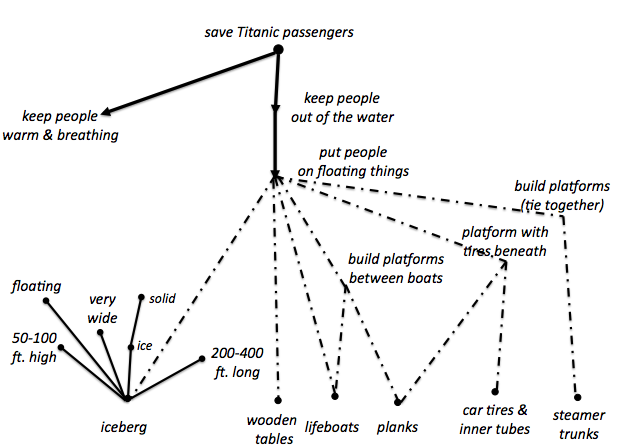

# Week 11

### Today, Thursday 14th April 2016

1. New term, new [project](#team-project).
* [What have you learned so far](#in-the-previous-episodes)?
* [Guest talk](#lighting-talk): digital projects in galleries and museums
* Workshop: [from brainstorming to brain**swarming**](#workshop)
* [Field **research**](#field-research) trip to the Maritime Museum in Greenwich

Your [homework](#homework) and [blog](#blog)!

# In the previous episodes

What the class learnt last time - tools and methods: personas, paper prototyping, we are concentrating on digital prototyping

<!-- 
- [ ] **Being professional**: if you say YES and then can't make it, you need to update me. Best if you do it in writing (by email), so that we don't forget. 

	When it's in your **calendar**, it means that you have a **commitment** to other people. The point is not whether we use this or that tool, the point is that you need to take **responsibility** for your commitments. 

	This stuff can make or break your **reputation**. It boils down to the question: *Can I trust him/her*? If I can't be sure that you will turn up, then the answer is no. 
	
	See Ramit's video about the invisible consequences of a bad reputation. 

-->

# Team project

New term, new project: [DAX](projects/dax), which stands for **d**igital **a**rchive e**x**perience.

* What makes a museum (intended as physical collection on display) experience unique? 
* Can you reproduce some of these qualities in a digital experience?
* Can a digital experience allow users to *play* with the artefacts within a collection? 
* How would such *digital manipulations* be useful / educational? 
* What are the most experimental things you could do with a collection? 

We're partnering with the [Maritime Museum](http://www.rmg.co.uk/national-maritime-museum) in Greenwich to design and prototype a digital experience that opens their archive up to the public.

Digital experiences can vary from presenting a **broad** collection of archived materials to a **focused** collection of particular objects, for the purpose of **learning** or **making**.

For example:

# Lighting talk

Our guest Amy Jackson-Bruce (Web Media alumna) will inspire you with a [pecha-kucha](http://www.pechakucha.org/) (20 slides, 20 seconds each) presentation on digital projects in galleries and museums.

After that we'll start <del>brainstorming</del> *brainswarming* ideas for the [DAX project](#team-project). 

# Workshop

You are probably familiar with *brainstorming*, but have you hear of [**brainswarming**](http://blogs.hbr.org/2014/03/why-you-should-stop-brainstorming/) before?

<!-- BSt: coming up with lots of ideas whilst withholding judgement, typically in a group session -->

> No study has proven that brainstorming works well, even though it has been the go-to method for **idea generation** since 1953.

In *brainstorming* you **talk** (and interrupt), whilst in *brainswarming* you **write**.

### Your turn

1. Form teams of 2-3 people (you don't have to be in the same teams for the rest of this project).
* Grab sharpies and post-its.
* Discuss what your app's **goal** could be, then write it down.
* Jot down also some **resources** that could help you achieve that goal.

You get 2 mins to write down your ideas, then pass it on to someone else, until your idea sheet returns to you after it's made a full round.

# Field research

We'll spend the afternoon hours at the [Maritime Museum](http://www.rmg.co.uk/national-maritime-museum) in Greenwich.

* Free entry.
* Open Monday - Sunday, 10am - 5pm.
* 30 minutes from Ravensbourne by bus on the 422 or 108 (see [trip on Citymapper](https://citymapper.com/trip/Tpdr49a))

We're going to explore the museum (a physical space) and analyse it as a **virtual space**. 

Put on your *UX designer hat*, observe and answer as many of the following questions as possible: 

* **Registration** How do you log in / out of the museum?
* What is the **navigation** like? Are there predictable *paths*? Do you know where you are, or are you likely to get *lost*? How are people moving around the space? 
* **Information architecture** What info does the museum provide? How is it organised? What info is missing? 
* Is the museum space and its information **accessible**?
* **UX** Has the space been designed to create an effect,
emotion or reaction? How do you *feel* in there?
* **Calls to action** What do they want you to do?
* **Incentives** Does the museum encourage you to visit a certain section, or perform a certain action?
* **Narratives** Is there an overarching theme to the space? Are there sub-themes?
* **Content** Who do you reckon curates the museum content? Does the museum feature any *user-generated content*? How often is the content updated?
 	
	
# Homework

form teams, create personas based on your observations

### Blog	