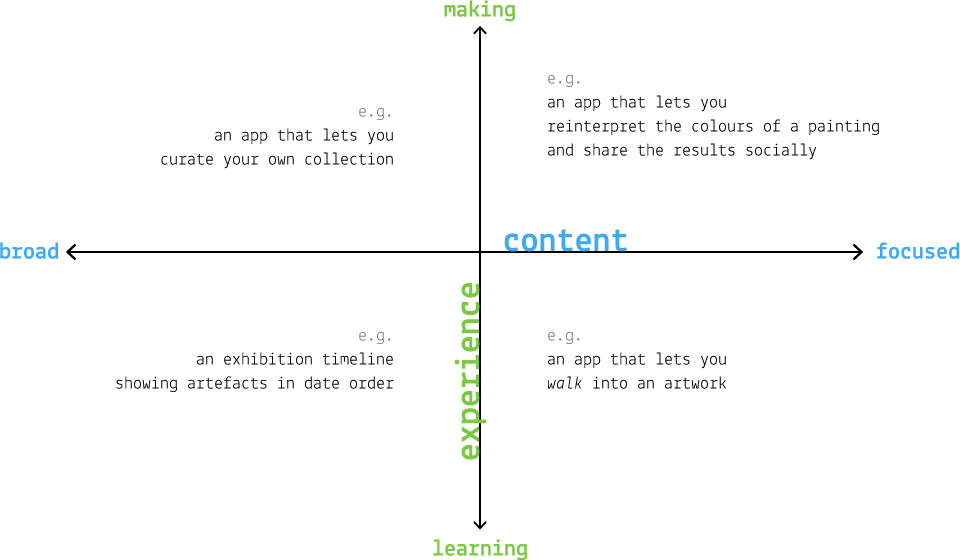

# Week 12

### Today, Thursday 21st April 2016

1. [Guest talk](#guest-talk): the design process of making art-based apps 
* [Workshop](#workshop): from post-its to digital prototypes

Your [homework](#homework) and [blog](#blog)!

# Guest talk

Our guest Amy Jackson-Bruce (Web Media alumna) will tell you how 3 Tate apps she worked on were designed. From defining the problem to prototyping (paper and digital) and user-testing.

<!--You can download her slides [here](assets/amy-jackson-bruce-presentation.pdf).-->

# Workshop

### Ideation on post-it notes

### Creating digital prototypes 

	
# Homework

### Keep prototyping

**Prototype** two user flows:

1. The **onboarding** process: how does your experience **attract new users**? How does it **engage** them with its content? 
	
	Chris at the Maritime Museum observed that 
	
	> ...typically the most played video in an interactive piece at the museum is *the first video*, no matter what its content is. We tested this hypothesis by randomising the order in which videos are presented to visitors, and the results speak clearly: the most popular videos are the ones that require less tapping / scrolling to get to. Which means most visitors may watch one video, then move on. So how do we make that experience better? How do we get them to watch another?
	
* A **problematic scenario** (aka an *edge case* or *unhappy path*) of your choice. 

	For instance, what happens when your typical user makes a mistake, can't find what s/he is looking for, or generally when **something goes wrong**?

### Blog	

Pick your favourite digital archive experience from [Amy's presentation last week](assets/amy-jackson-bruce-presentation.pdf) (links in the slides, and at the bottom of the [DAX](../../projects/dax) brief) and blog about it.

Focus on these aspects (in no particular order):

* What do you think is the **goal** of the experience you chose?
* What **design challenges** may the people involved in your chosen project have faced? How did they solve them?
* **Why** did you pick this project? What intrigues you about it?
* **Where** does this project fit in the *content - experience* graph, and why?

	

