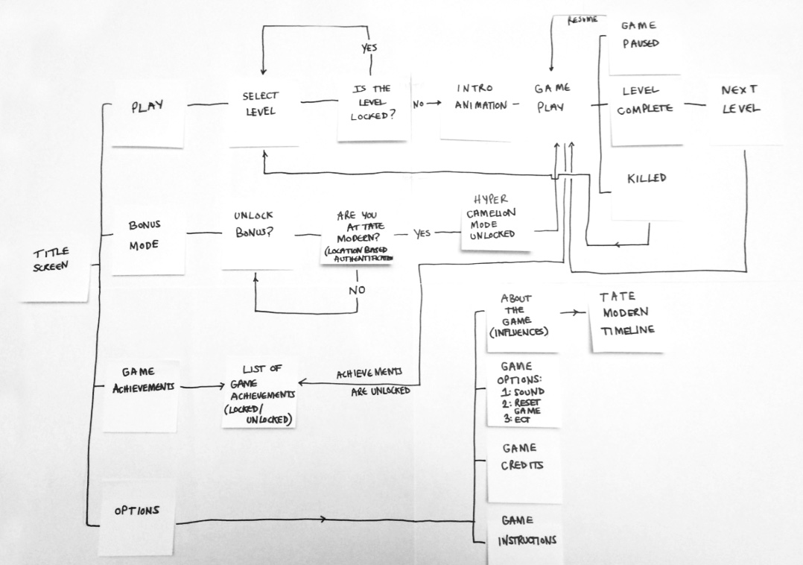
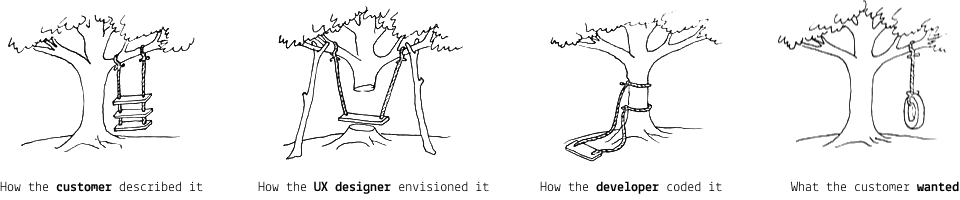

# Week 12

### Today, Thursday 21st April 2016

1. [Guest talk](#guest-talk): the design process of making art-based apps 
* [Workshop](#workshop): from *concept* to *experience map* to *digital prototype*

Your [homework](#homework) and [blog](#blog)!

# Guest talk

Our guest Amy Jackson-Bruce (Web Media alumna) will tell you how 3 Tate apps she worked on were designed. From defining the problem to prototyping (paper and digital) and user-testing.

You can download her slides [here](assets/amy-jackson-bruce-presentation.pdf).

# Workshop

### Concept one-pager

Can you **summarise** & **visualise** your idea, the primary features of your experience, and its benefits to your audience in one page?

A concept one-pager typically includes:

* a catchy **title**
* a **strapline** (one sentence)
* a **visualisation** of the idea

To answer these questions:

1. **What** is your idea?
* **Who** is it for?
* **Why** is it needed or wanted?

A good concept one-pager enables you to talk about your idea to *anyone*.

<!---->

### Experience map on post-its

Once you have a concept, and before you dive into the details of it, it's very useful to map out the **customer journey** (aka *experience map*).

You can do that with **post-its first** (and optionally turn your map digital, if it needs many iterations). 

1. **List** out each fundamental **step** in your experience.   
  
	A step could eventually become many screens, but in a customer journey map it can be condensed into one step.  
  
	Don't worry about interface for now. Focus on the **purpose** of each step.
* **Connect** the steps in a map.

### Digital prototype 

#### Why prototyping?

In an **iterative** approach to UX design, (rapid) prototyping is the process of **quickly mocking up** the *future state* of a system and **testing** it with users, teammates and clients. 

Doing this **rapidly and iteratively** generates feedback early and often in the process, improving the final design and reducing the need for costly changes during development.

* A prototype **answers questions**. The more specific the better.

* A prototype stands between your **assumptions** and your users **behaviours**.

* A prototype should be **quick** (and cheap) to make, re-make and possibly discard.

* A prototype should be **close** to the real thing...

* ... but a prototype is **not the real thing**.

#### Which prototyping tool should I use?

Each prototyping tool has its own feature set and strengths. Based on your needs and the requirements of your project, evaluate which tool is more appropriate:

1. How **easy** is it to learn and use the tool?
* Are there a repositories of **reusable templates** or widgets available?
* How easy is it to make changes on the fly or to **incorporate feedback**?
* Does it have any **collaboration features**, such as allowing multiple people to work on it at the same time?
* What are the licensing terms and **costs**?

##### Tools to consider

Name | Platform | Free?
---- | -------- | -----
[Moqups](https://moqups.com) | Web-based | Freemium
[Invision](http://www.invisionapp.com/) | Web-based | Yes
[Adobe Experience Design](http://www.adobe.com/uk/products/experience-design.html) | Mac and Win | In preview (they may charge you later)
[Sketch](http://www.bohemiancoding.com/sketch/) | Mac only | Free trial, then $49 (education price)
[Justinmind](http://www.justinmind.com) | Mac and Win | 30-days free trial, then $19/month 
[Balsamiq](https://balsamiq.com/products/mockups) | Mac and Win | 30-days free trial, then $89 
[Framer](http://framerjs.com) | Mac only | 30-days free trial, then $99 
[Atomic](https://atomic.io) | Web-based | 30-days free trial
[UXPin](https://www.uxpin.com) | Web-based | 7-days free trial
	
<!-- [Macaw](http://macaw.co/) | Mac and Win | Yes -->	
	
# Homework

### Keep prototyping

**Prototype** two user flows:

1. The **onboarding** process: how does your experience **attract new users**? How does it **engage** them with its content? 
	
	Chris at the Maritime Museum observed that 
	
	> ...typically the most played video in an interactive piece at the museum is *the first video*, no matter what its content is. We tested this hypothesis by randomising the order in which videos are presented to visitors, and the results speak clearly: the most popular videos are the ones that require less tapping / scrolling to get to. Which means most visitors may watch one video, then move on. So how do we make that experience better? How do we get them to watch another?
	
* A **problematic scenario** (aka an *edge case* or *unhappy path*) of your choice. 

	For instance, what happens when your typical user makes a mistake, can't find what s/he is looking for, or generally when **something goes wrong**?

### Blog	

Pick your favourite digital archive experience from [Amy's presentation last week](assets/amy-jackson-bruce-presentation.pdf) (links in the slides, and at the bottom of the [DAX](../../projects/dax) brief) and blog about it.

Focus on these aspects (in no particular order):

* What do you think is the **goal** of the experience you chose?
* What **design challenges** may the people involved in your chosen project have faced? How did they solve them?
* **Why** did you pick this project? What intrigues you about it?
* **Where** does this project fit in the *content - experience* graph, and why?

	

