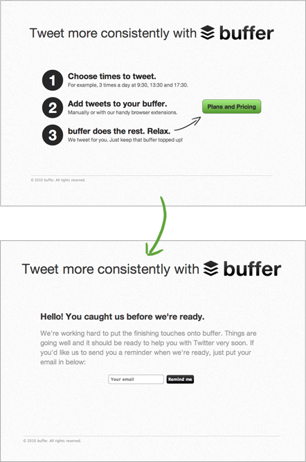

# Week 13

### Today, Thursday 28th April 2016

1. From [idea](#so-youve-got-an-idea) to [**prototype**](#prototyping): the [*experimental* (iterative & test-driven) design method](#introducing-the-spiral)
* Team tutorials 

Your [homework](#homework) and [blog](#blog)!

# So you've got an idea... 

Well then, let's start building it.

Or?

### Steve Jobs predicted what?

> [...] will be as big as the personal computer.

<!-- 

The Segway. It was a disaster. Expected to sell 10.000 units a month, it reached that figure in 3 years. It still is a sort of joke. 

Segway invested million$ without checking if people wanted it first.

-->

### The Buffer story

This is [how Buffer started](https://blog.bufferapp.com/idea-to-paying-customers-in-7-weeks-how-we-did-it)

> I wanted to take the scheduling feature of many Twitter clients and apps and make that single feature awesome. I believed that single feature was worthy of its own application. 

> I even started *coding* Buffer before I’d tested the viability of the business. As soon as I realised that, I stopped, took a deep breath and told myself: do it the right way this time. It was time to **test whether people wanted this product**.

### Introducing the *Spiral*

Aka the **build+test+learn** approach popularised by the [Lean Startup](http://theleanstartup.com/).

A solid design process is based on **iterations**: 

1. You come up with an **idea**
2. **Prototype** it 
3. **Test** it with a bunch of people
4. With the results from your test, go back to the *drawing board* and refine (or pivot) your idea. And **repeat**!

### All ideas are *hypotheses* that need to be tested 

This method is about creating **small-scale experiments** and then **validating** them as quickly as possible.

Key words:

* *Iterative* = repeatedly, not just once
* *Validation* = experiments inform your design choices (keep it, tweak it or scrap it)

## Your turn

1. [x] [Concept](../12/#concept-one-pager)
* [ ] [Experience map](#experience-map)
* [ ] [Riskiest hypothesis](#the-riskiest-hypothesis)
* [ ] [Prototype](#prototyping-to-experiment)
* [ ] Test (next week)  

### Experience map

Once you have a concept, and before you dive into the details of it, it's very useful to map out the **user journey** (aka *experience map*).

You can do that with **post-its** and optionally turn your map digital, if it needs several iterations. 

1. **List** out each fundamental **step** in your experience.   
  
	A step could eventually become many screens, but in a customer journey map it can be condensed into one step.  
  
	Don't worry about interface for now. Focus on the **purpose** of each step.
* **Connect** the steps in a map.

The example below is the experience map for the mobile game [Race against Time](http://www.tate.org.uk/context-comment/apps/race-against-time), from [Amy's presentation last week](../12/assets/amy-jackson-bruce-presentation.pdf):

### Where does it hurt?

Now imagine you're a person (or a *persona*) going through your experience map. 

1. Define a **goal** for your person(a). What does s/he want to achieve through the experience? 

	In other words, what is the *destination* s/he wants to reach in your experience map?
* Simulate the **experience flow**: go through each step with your team and discuss what happens to your person(a).
* For each step, identify potential **pain points**.  
  
	Add emoticons to each step, to visualise what's happening inside your person(a)'s head.

	

### The riskiest hypothesis

Going through the *experience flow* and identifying its *pain points* will allow you to uncover the **riskiest assumptions** in your idea. 

An assumption is a prediction for what you think will happen. Will users really behave as you predicted in your experience map?

Your riskiest assumption is both **core** to your product and **most unknown**, meaning you have little data to prove it's valid. It's important to always test your **riskiest assumption first**.

Here are three examples:

:x: `Museum visitors want to see a feed of recent activity by other visitors when entering the museum`

This is a solution-oriented assumption. Take a step back and ask, *why*?

:x: Because `visitors aren't spending enough time at the museum`

This is the business-perspective assumption. Not the customer's problem. Ask *why* again.
	
:heavy_check_mark: Because `visitors don't know where to find the stuff they want to see and get lost / frustrated after roaming around for a while`  
  
This hypothesis is defined from the customer's perspective (and should be generated from customer interviews).

<!--
When you're testing a customer-perspective assumption, your riskiest assumption is one that supports the belief that your customer *has that problem*. 

In a problem-solution case, the riskiest assumption is that it's *the right solution* to solve the problem. 
-->

#### What makes a good experiment?

To prototype and test effectively, you need to **turn your assumptions into hypotheses** and then build an **experiment** to test the **riskiest** one.

A good experiment is:

1. cheap
* quick
* has the highest possible learning potential

You can create good experiments by building a *landing page* (remember [Buffer](#the-buffer-story)?) or by creating *prototypes* that simulate the aspects of your experience where the riskiest assumption lives.

Prototypes are likely the most appropriate tool for the kind of project we're working on this term ([DAX](../../projects/dax)).

### Prototyping (to experiment)

Prototype, either on paper or digitally (or both, if your experience requires physical supports) the part of your experience where the riskiest assumption lies.

<!--
We're familiar with paper prototyping (here's a [great video-example](https://www.youtube.com/watch?v=_g4GGtJ8NCY).
-->

Next week we'll go to the Maritime Museum and test your prototypes with real visitors.

Here are a few tips:

* Decide **how lo-fi** the prototype will be. 

	As designers we're good at spotting *placeholder* text or images, however not everyone is familiar with them and sometimes people get hung up on details or ask `Why is that text in a foreign language?` (lorem ipsum).   
  
	When user-testing, it's crucial that you explain to people that this is **not a finished product** (even though it looks obvious to you) and that you are testing XYZ as opposed to colours, animations etc.

* How good is **good enough**?

	You want to strike a balance between the time it takes to build the prototype, and how close to the real thing you need it to be for your experiment next week.  

* Avoid **linear click-throughs**. 

	Even if there's one single call to action per screen, your prototype should offer a couple of options to users.

* Create **reusable** styles and symbols.

	There are ways to do it in every prototyping tool. 
	
	If you catch yourself building the same button twice, that's an alarm bell: you should turn it into a *symbol* (or *smart object*, or whatever your tool of choice calls them).

* Use **realistic content**.

	Avoid *lorem ipsum* and stock photos like the plague.
	
*	Use **real devices** when testing. 

	If you're designing a mobile app, get the prototype on your mobile.

<!--
# Team tutorials

[Insights](../../projects/dax/chris-king-insights.md) from Chris King @NMM
-->

# Homework

### User-testing prep 

Next week (Thursday 5th of May) we'll go to the Maritime Museum and test your prototypes in the Great Map area.

1. Continue prototyping.
* Prepare a user-testing guide (see [tips here](../04#dos-and-donts)). 

### Blog	

Read and blog this article on UI walkthroughs: [Are UI walkthroughs evil?](http://tapity.com/are-ui-walkthroughs-evil/)

* Are you thinking of using a UI walkthrough in your DAX project? Why?
* What's your experience with UI walkthroughs on other products?
* What could be a different / innovative way to *guide* new users through your *interface*? How are people doing it in other industries / media (eg: games, films, restaurants, airports) Think wild :)
