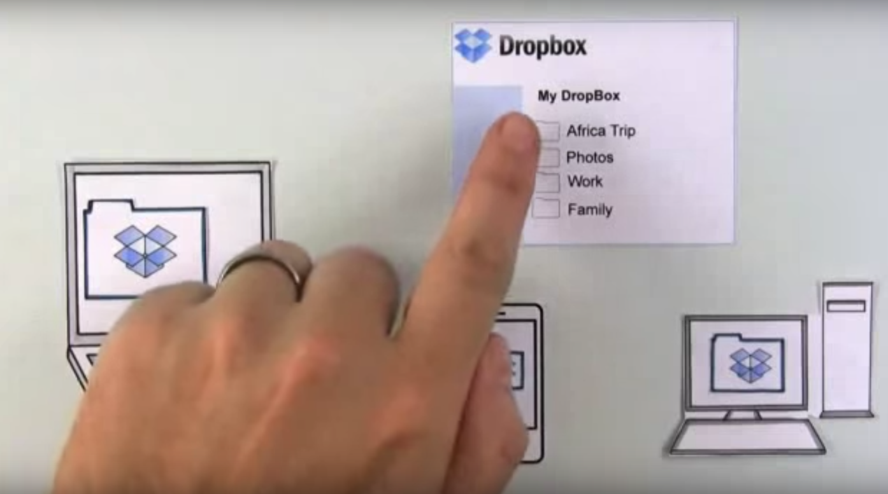
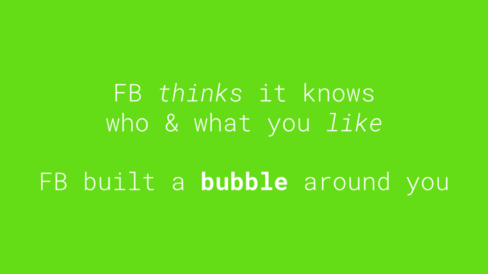

# Week 13

### Today, Wednesday 16th May 2018

We'll continue working on your [*filter bubbles* brief](../../projects/filter-bubbles).

* Intro: User Testing Methods & Approaches
* Morning Session: Formative Presentations (10mins each)
* Afternoon Session: **User Testing with Web Media Year 3**

# User Testing Methods & Approaches

Before we get started with your presentations let's have a quick session on User testing methods as this will be our focus for this afternoon when our group is joined with Year 3. 

The presentation for this **short** session is [here.](https://docs.google.com/presentation/d/1Via8NuLvXGamU84TSKYyNmNCNA7JSxkCkoMiyrZy4zk/edit?usp=sharing)

The User Testing Report template that you will need to copy and complete can be found [here.](https://github.com/RavensbourneWebMedia/UX-design/tree/2018/sessions/07#user-testing-your-prototype) **Please do not fill out the origianl copy. Always follow the instructions**

# Formative Presentations

For the rest of the morning we will have formative presentations to show the work that you have so far on your projects. 

**You will have 10mins only for your presentation**

This collaborative [google doc](https://docs.google.com/document/d/1OxjN01zcPA3SB-VnlBoNxISqL2fFysUN1jyk2m88a0w/edit?usp=sharing) will be for our collective feedback and for your self reflective blog post as part of the homework. 

# Afternnoon Session

**User Testing with Year 3**

Your [homework](#homework) and [blog](#blog)!

# Homework

### Concept video

Concept videos allow you to tell a compelling story around your idea, even if you haven't built a prototype yet!

Did you know that Dropbox first MVP (*minimal viable product*) was [a concept video](https://techcrunch.com/2011/10/19/dropbox-minimal-viable-product/)? [Check it out](https://www.youtube.com/watch?v=w4eTR7tci6A).

You can capture interest with a vivid **problem description**, and convince people with a **backstory** or examples of how people will benefit from you concept.

Here are some more concept video examples:
 
* [Nupinion raised money on Kickstarter](https://www.kickstarter.com/projects/benjamingibert/nupinion-the-smart-news-toolbox-for-digital-citize), with a concept video as the centre piece of its crowdfunding campaign. 
* Another filter-bubbles-related project which successfully raised money on Kickstart is [Read Across the Aisle](https://www.kickstarter.com/projects/72264020/read-across-the-aisle).
* [StartupVideos](http://startup-videos.com/) features loads of concept videos for you to get inspired, and [Kickstarter](https://www.kickstarter.com/) is another great source of concept video inspiration.

Using [Adobe Spark](https://spark.adobe.com) (free, online) **create a Minimum Viable Video for your Filter Bubbles concept!**

You may want your concept video to include some (or all) of these, in the order you feel is more appropriate:

- context
- problem
- solution
- features
- testimonials
- call to action

We'll review your MVV next week.

### Blog

Review your [formative feedback](https://docs.google.com/document/d/1OxjN01zcPA3SB-VnlBoNxISqL2fFysUN1jyk2m88a0w/edit?usp=sharing) and write a refelcitve blog post that includes: 

1. What went well. 
2. What you felt could have gone better (or what you could have done to imporove)
3. An action plan: list what you want to do in order to address that feedback over the coming weeks & what still needs to be done from the brief before summative hand in. 

<!---

Read [this guide](https://www.kickstarter.com/help/handbook/your_story) from Kickstarter on how to craft a compelling video (it starts with a compelling story). 

The blog about how you crafted your own concept video, and explain your choices (of story structure, imagery, tone, music etc.).

<!---

We'll continue working with the SCWA students on your [*filter bubbles* brief](../../projects/filter-bubbles).

All the material for today is in [this presentation](https://docs.google.com/presentation/d/1iIiXBQqVjyl_GTSB-cc6-6v0DtqJ5FdMqa0GxJo39f4/edit?usp=sharing).

The plan with approximate timings:

* 10:00 - 10:55 [**Tutorials**](https://docs.google.com/document/d/1ArfHiJFohSsvcbQ5Qtq0r6h3GZmiquCLoG7tvGKb2RQ/edit#heading=h.bo009u261hi5)
* 11:00 - 11:20 **User-testing**: what, why and how 
* 11:20 - 11:50 Exercise: **user-test your idea / prototype** with at least 3 people
* 11:50 - 12:30 Exercise: **review** the user-testing feedback and **iterate** your idea / prototype 
* 12:30 - 13:00 lunch ` `
* 13:00 - 13:45 Exercise *rinse & repeat*: **user-test your idea / prototype** with at least 3 people
* 13:45 - 14:00 Reflection (feedback + action plan)
* 14:00 - 16:00 [**Tutorials**](https://docs.google.com/document/d/1ArfHiJFohSsvcbQ5Qtq0r6h3GZmiquCLoG7tvGKb2RQ/edit#heading=h.bo009u261hi5)

Your [homework](#homework) and [blog](#blog)!

# Homework

### Concept video

Concept videos allow you to tell a compelling story around your idea, even if you haven't built a prototype yet!

Did you know that Dropbox first MVP (*minimal viable product*) was [a concept video](https://techcrunch.com/2011/10/19/dropbox-minimal-viable-product/)? [Check it out](https://www.youtube.com/watch?v=w4eTR7tci6A).

You can capture interest with a vivid **problem description**, and convince people with a **backstory** or examples of how people will benefit from you concept.

Here are some more concept video examples:
 
* [Nupinion raised money on Kickstarter](https://www.kickstarter.com/projects/benjamingibert/nupinion-the-smart-news-toolbox-for-digital-citize), with a concept video as the centre piece of its crowdfunding campaign. 
* Another filter-bubbles-related project which successfully raised money on Kickstart is [Read Across the Aisle](https://www.kickstarter.com/projects/72264020/read-across-the-aisle).
* [StartupVideos](http://startup-videos.com/) features loads of concept videos for you to get inspired, and [Kickstarter](https://www.kickstarter.com/) is another great source of concept video inspiration.

Using [Adobe Spark](https://spark.adobe.com) (free, online) **create a Minimum Viable Video for your Filter Bubbles concept!**

You may want your concept video to include some (or all) of these, in the order you feel is more appropriate:

- context
- problem
- solution
- features
- testimonials
- call to action

We'll review your MVV next week.

### Blog

Read [this guide](https://www.kickstarter.com/help/handbook/your_story) from Kickstarter on how to craft a compelling video (it starts with a compelling story). 

The blog about how you crafted your own concept video, and explain your choices (of story structure, imagery, tone, music etc.).