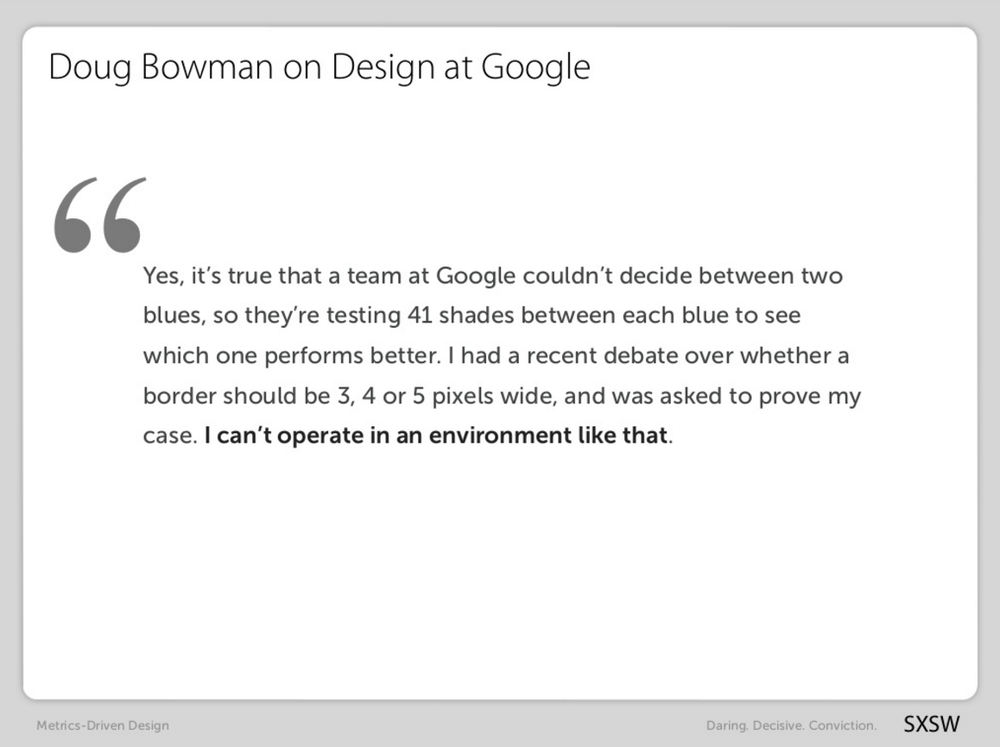
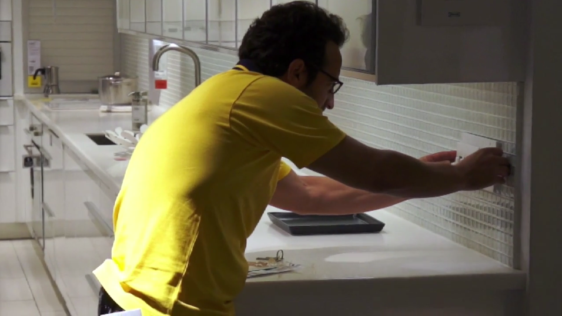

# Week 14

### Today, Thursday 5th May 2016

1. [User-testing prep](#user-testing-prep)
* User-testing (with humans) at the Maritime Museum

Your [homework](#homework) and [blog](#blog)!

* [ ] [uxlondon.com](http://2016.uxlondon.com/) 18-20 May: follow it on social media!
* [ ] **FREE** [talkwebdesign.co.uk](http://talkwebdesign.co.uk/) 26th of May @ Greenwich University: get your ticket if you haven't already!

# User-testing prep

1. What is the [**riskiest assumption**](../13/#the-riskiest-hypothesis) in your idea?
* How are you going to **user-test** it? 
* What **questions** will you seek to answer when testing your idea and prototype? 
* What will be your **guidelines for feedback**?

## A few examples

### A/B testing

A/B testing is a **randomised experiment with two variants**: A and B. 

Versions A and B are **identical except for one variation** that might affect users' behaviours. Don't make A and B too different, otherwise you won't be able to tell which variation is actually affecting how users interact with your prototype.

You can A/B test both digital and physical prototypes.

<!-- Click the image for a slide show on how Google tested millions of shades of blue to optimise their traffic and click through rate -->

At Google they're obsessive about A/B testing:

### 5 seconds test

You can use [fivesecondtest.com](http://fivesecondtest.com/) to upload your wireframes or prototype screenshots. Testers will be shown your design for 5 seconds and then will be asked a question about it.

Picking the right **question(s)** to ask after the 5 seconds impression is key.

Don't just use the default ones (like the horrible *Is the brand memorable?*). What do you actually want to learn from this test? 

When considering what to ask your testers, ask yourself:

> Will testers be **willing** and **able** to provide a truthful answer to my question?

> From [On surveys](https://medium.com/research-things/on-surveys-5a73dda5e9a0#.3vujbmw95), an excellent short article by Erika Hall, author of *Just enough Research* (available from the Rave library). 

You can use this type of test also for A/B testing.

### Pretend it's real

<!--Hack IKEA-->

Independent design studio Upwell went undercover to test the validity of their new product by using IKEA as their testing ground.

> IKEA is the perfect retail research lab. They have an ideal demographic and amazing consumer exposure for Upwells new product, Walhub. Upwell created IKEA-esque visuals - product tags and UPC barcodes as to not bias their experiment, and even went so far as to dress up as an IKEA employee in order to install Walhub without raising too much suspicion. They set up mics and cameras to record the experience and more importantly the consumer feedback.

[Watch the experiment on Vimeo](https://vimeo.com/79313674).

### Do's and dont's

You are the user-testing **facilitator**.

Your main job is to make your testers not feel stupid:

1. State clearly that you're testing the the *thing*, **not them**.
* Reassure them it's not their fault if what they do has an unexpected result.
* Encourage them to **think out loud**.
* **No hints**, instead encourage them to think what they'd do if you weren't there. Ask them what they are thinking or looking for but avoid words like `try`.
* Be kind and **patient**, don't sigh. 
* **Don't take it personally** if they don't get what you think it's obvious, but try and understand why.
* You should look out for **friction points**: those moments when the user stops concentrating on her tasks and starts thinking about the tool and how she is going to use it. Note questioning words, especially where testers question their own judgement, `why can't I find...`, `I expected to see...` etc. as this indicates that the workflow for the task may have broken down.
* **No orders**, but rather give some choice to your testers (eg: *What would you click first?*)
* Allow people to proceed in a task until you don't feel like it's producing any value or they becomes very frustrated.

> The best kind of user test is one where the subject is not influenced by too much direction, they are simply there to use what's in front of them to achieve a goal that you set out before the test began.

> From [The do's and dont's of UX testing](http://blog.oboxthemes.com/the-dos-and-donts-of-user-experience-testing/)

### Your turn

1. Prepare a **guide** for your user-testing session. You can take inspiration from this [sample](https://docs.google.com/document/d/17IuAMJojz0dlvBFh7QBDBgUWun2NyRZ6hlRwLdqYcH0/edit?usp=sharing) (*clone* it into a new Google doc).
* Prepare a **capture sheet**: this is based on the questions you'll ask your testers and the tasks they're going to perform. 

	It can either be *private* (just for yourself), or you could make some space in your testing material (wireframes etc.) to let your testers add their own comments and/or sketches. 
* Do a **practice run** with another team, and adjust your capture sheet accordingly. 

<!-- -->
- [ ] Does anyone need stuff printed?

# Homework

### Formative

Next week is formative day. You'll present your work-in-progress to me, Amy and Chris (from the Maritime Museum).

Prepare a pitch presentation:

* **What** is your idea?
* **Who** is it for?
* **Why** is it needed? What challenges (from a Museum's perspective) does it address?
* **How** does it work?
* What is your **plan** to develop it further?

The points above are the bare minimum of what your presentation should include. You're very welcome to present them in a different order and include any other aspects (such as your *inspirations*, your *creative process*, what you discovered in your *user testing*, etc.) which you consider relevant.

#### How long should the presentation be?

Ideally **10 minutes** (max 15 minutes) with another 5 for feedback and Q&A.