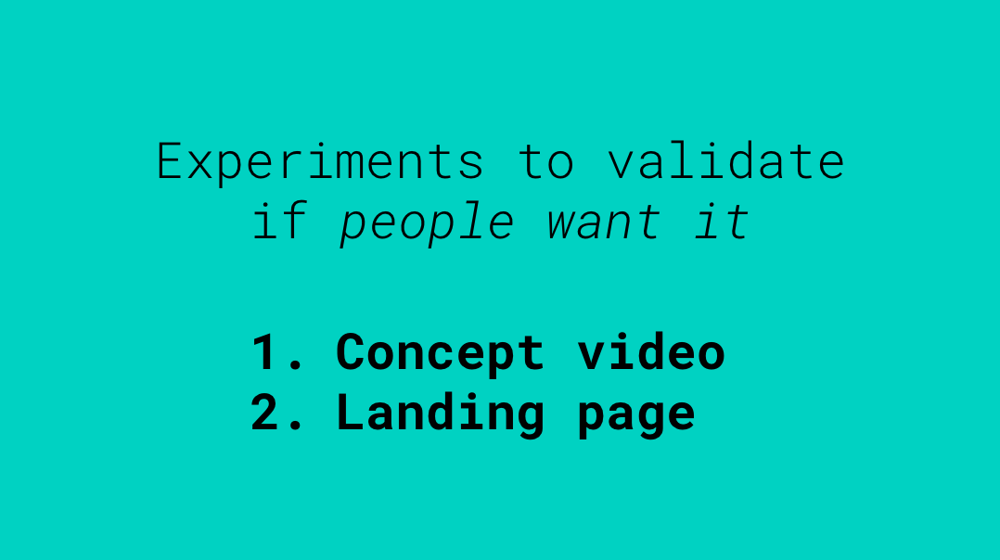

# Week 14

### Today, Wednesday 23rd May 2018

* Homework review **MVP videos/concept video** 
* How to use **storytelling** to communicate your idea
* Iteration on your **concept video**
* Build a **landing page** experiment 
* **5-second-test** your first landing page

All the material for today is in [this presentation](https://docs.google.com/presentation/d/1_Hf0szhOARy11sv2Wl21BUjUEFUekk2MS6ewkdvWkpg/edit?usp=sharing).

# Homework

5-second-test your landing page(s) on [UsabilityHub](https://usabilityhub.com/five-second-test).

### Blog

Write about:

1. The decisions you took when designing and building your landing page (eg: choice of copy, images, call-to-actions). 
2. How you drove traffic to your landing page 5-second-test: did you spam friends on social media, begged them in real life, or used some other tricks... and how did it go?
3. The feedback and insights you gained from testing your landing page.