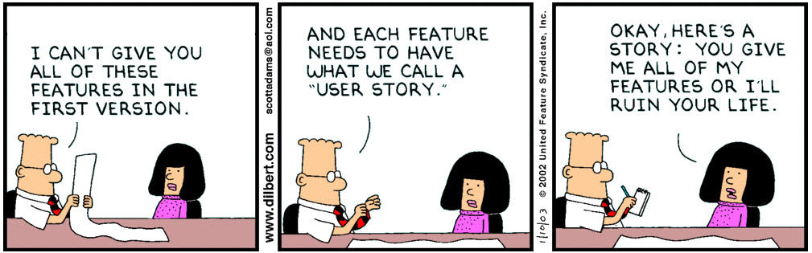

- [ ] design principles exercise?
- [x] user stories method
- [x] spreadsheet clone from GC
- [ ] identifying gaps for prototyping
- [ ] prototyping: how do you do it? discussion
- [ ] semi-tutorials
- [ ] flesh out assignments

# Session 13	

### Today, Tuesday 5th May 2015

1. [Where are you?](#where-are-you)
* [User stories](#user-stories)
* [Rapid prototyping](#rapid-prototyping)
* [Your prototype](#invision)

Your [homework](#assignment)!

<!--* User-testing: A/B testing and analytics-->

<!--Check out [UX Checklist](http://uxchecklist.github.io)-->

# Where are you?

> In all creative processes a number of possible ideas are created (*divergent thinking*) before refining and narrowing down to the best idea (*convergent thinking*), and this can be represented by a diamond shape. 

We could split the **design process** in four stages. 

The Design Council visualises them as a [*double diamond*](#http://www.designcouncil.org.uk/news-opinion/design-process-what-double-diamond).

### Where are you now?

<!-- At the start of the Develop phase -->

- [x] **Discover**
	
	* Competitor analysis	
	* User research
	
- [x] **Define**
	
	* User personas
	* Wireframes
	* User journeys
	* Design principles
	
- [ ] **Develop**
	
	* Content strategy
	* Community planning
	* User stories
	* Prototype(s)
	
- [ ] **Deliver**
	
	...
	
### Only four?	
	
The double diamond is a *conceptual model*. IRL there are more than four steps.

The design process is **iterative**. 

      
	

# User stories

Not to be confused with [user journeys](session-06.md#user-journeys).

If a user journey is close to a comic, a user story fits more into a spreadsheet.

### Personas are not enough

Personas are useful to cluster different people into types (or *archetypes*) and summarise our user research.

Personas illustrate behaviours, attitudes, and motivations of people at a high level.

<!-- add image of persona here -->

When **developing** our products we need **more detail** than what a persona tells us.

<!--Also, sometimes personas are at risk of being *too* imaginary, wishful characters that perfectly fit into your dream customer. -->

### What are user stories?

Plain English sentences that **describe the basic units of functionality** of your product.

Useful to:

* state **product requirements** without writing endless pages of documentation
* have a **checklist** for software development 
* not depended on the whims of a stakeholder 
* get *everyone on the same page*

This guy [:heart: user stories](http://www.usabilitycounts.com/2013/10/11/why-i-love-user-stories).

In one sentence, a user story encapsulates

* **Who** is this functionality for?
* **What** does s/he want?
* **When** does s/he want it?  
* **Why** is it valuable to the her?

<!-- https://imgflip.com/memegenerator/What-Do-We-Want-3 -->

> Who are we?

> What do we want?

> When do we want it?

> Why?

### The actual format

As a `who?`, I want to `what?`, so that `why?` [`when`]

#### Examples

* As `an administrator`, I want to `search for my customers by their first and last names`, so that `I quickly find specific people to contact`.
* As `a user`, I want to `start the application with the last edit`.
* As `a user`, when `closing the application`, I want to `be prompted to save anything that has changed since the last save` so that `I don't lose work`.
* As `a student`, I want to `find my grades online` so that `I don't have to wait until the next day to know whether I passed`.
* As `a book shopper`, I want to `read reviews of a selected book` to `help me decide whether to buy it`.
* As `an author`, I want `the spell checker to ignore words with numbers` so that `only truly misspelled words are indicated`.

### How do you write user stories?

1. Brainstorm and jot down **players** in the **system** (based on your personas), eg: visitor, potential customer, new customer, customer, system admin, developer, content editor
* For each player, jot down **actions** s/he may want to do, eg: read about the service, get contact details, find info about opening times.. 
* For each action think about `before I do that, I need to` chains.
* Separate actions between **tasks** (intermediate in a chain) and **goals** (end of chain) 
* Map actions to players (one action could be assigned to more than one player)
* Write a user story for each action assigned to a player, from the player perspective.
* WHO and WHAT are required, WHY and WHEN are optional
* Organise actions that the system must / could / shouldn't allows players to do

### Your turn

1. Open [this spreadsheet](https://docs.google.com/a/rave.ac.uk/spreadsheets/d/1JDf-xhG0sT9GIfxyyfNSad3gAw3rWxgcVcE8BGo4t4A/edit?usp=sharing)
2. Duplicate the `_blank` sheet and give it your name
3. Jot down stories following the steps above

<!-- and [acceptance criteria](http://www.agilelearninglabs.com/2013/04/user-story-splitting-three/)
- [ ] [Splitting user stories](http://www.agilelearninglabs.com/2013/05/new-quick-reference-guide-for-splitting-user-stories)
- [ ] [Examples and counter-examples](http://blogs.collab.net/agile/user-story-examples-and-counterexamples)
- [ ] [More examples from Wikipedia](http://en.wikipedia.org/wiki/User_story#Examples)
- [ ] [How to Tell the User’s Story](https://www.newfangled.com/how-to-tell-the-users-story/)-->

# Rapid prototyping

What is a prototype? How do we get there?
Prototypes answer questions (the more specific the better).
Prototypes stand between your ideas (assumptions) and your users (behaviours)
Prototypes should be quick (and cheap) to make, re-make and possibly discard.
Prototype should be close to the real thing

Answering **specific questions** (design, usability, technical).

Produce prototypes that address your user stories

# Invision

Using [Invision](http://blog.invisionapp.com/6-ways-to-save-time-in-rapid-prototyping), let’s start prototyping two user flows:

* onboarding process

* a problematic scenario (of your choice)

# Assignment

1. Blog: [Are UI walkthroughs evil?](http://tapity.com/are-ui-walkthroughs-evil) 
2. More prototyping