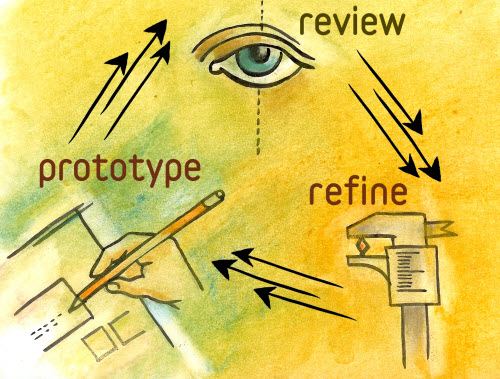
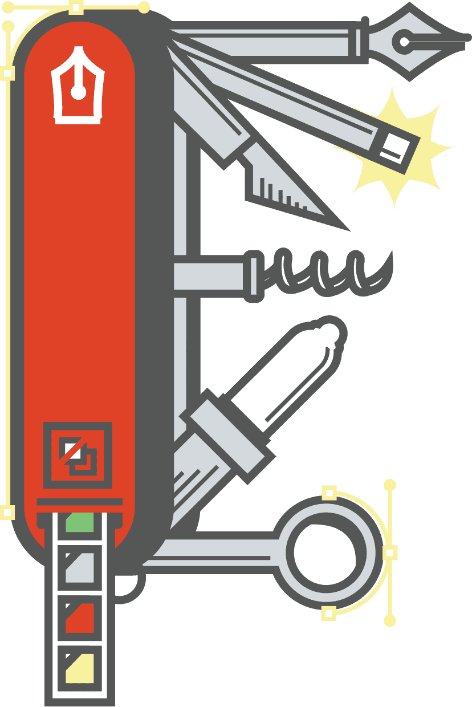

<!--- [ ] design principles exercise?
- [x] user stories method
- [x] spreadsheet clone from GC
- [x] identifying gaps for prototyping
- [x] prototyping: how do you do it? discussion
- [ ] semi-tutorials
- [ ] flesh out assignments
-->

# Session 13	

### Today, Tuesday 5th May 2015

1. [Where are you?](#where-are-you)
* [User stories](#user-stories)
* [Your (user) stories](#your-stories)
* [Rapid prototyping](#rapid-prototyping)
* [Your prototype](#your-turn)

Your [homework](#assignment)!

<!--* User-testing: A/B testing and analytics-->

<!--Check out [UX Checklist](http://uxchecklist.github.io)-->

# Where are you?

> In all creative processes a number of possible ideas are created (*divergent thinking*) before refining and narrowing down to the best idea (*convergent thinking*), and this can be represented by a diamond shape. 

We could split the **design process** in four stages. 

The Design Council visualises them as a [*double diamond*](#http://www.designcouncil.org.uk/news-opinion/design-process-what-double-diamond).

### Where are you now?

<!-- At the start of the Develop phase -->

- [x] **Discover**
	
	* Competitor analysis	
	* User research
	
- [x] **Define**
	
	* User personas
	* Wireframes
	* User journeys
	* Design principles
	
- [ ] **Develop**
	
	* Content strategy
	* Community planning
	* User stories
	* Prototype(s)
	
- [ ] **Deliver**
	
	...
	
### Only four?	
	
The double diamond is a *conceptual model*. IRL there are more than four steps.

The design process is **iterative**. 

      
	

# User stories

Not to be confused with [user journeys](session-06.md#user-journeys).

If a user journey is close to a comic, a user story fits more into a spreadsheet.

### Personas are not enough

Personas are useful to cluster different people into types (or *archetypes*) and summarise our user research.

Personas illustrate behaviours, attitudes, and motivations of people at a high level.

<!-- add image of persona here -->

When **developing** our products we need **more detail** than what a persona tells us.

<!--Also, sometimes personas are at risk of being *too* imaginary, wishful characters that perfectly fit into your dream customer. -->

### What are user stories?

Plain English sentences that **describe the basic units of functionality** of your product.

Useful to:

* state **product requirements** without writing endless pages of documentation
* have a **checklist** for software development 
* not depended on the whims of a stakeholder 
* get *everyone on the same page*

This guy [:heart: user stories](http://www.usabilitycounts.com/2013/10/11/why-i-love-user-stories).

In one sentence, a user story encapsulates

* **Who** is this functionality for?
* **What** does s/he want?
* **When** does s/he want it?  
* **Why** is it valuable to the her?

<!-- https://imgflip.com/memegenerator/What-Do-We-Want-3 -->

> Who are we?

> What do we want?

> When do we want it?

> Why?

### The actual format

As a `who?`, I want to `what?`, so that `why?` [`when`]

#### Examples

* As `an administrator`, I want to `search for my customers by their first and last names`, so that `I quickly find specific people to contact`.
* As `a user`, I want to `start the application with the last edit`.
* As `a user`, when `closing the application`, I want to `be prompted to save anything that has changed since the last save` so that `I don't lose work`.
* As `a student`, I want to `find my grades online` so that `I don't have to wait until the next day to know whether I passed`.
* As `a book shopper`, I want to `read reviews of a selected book` to `help me decide whether to buy it`.
* As `an author`, I want `the spell checker to ignore words with numbers` so that `only truly misspelled words are indicated`.

### How do you write user stories?

1. Brainstorm and jot down **players** in the **system** (based on your personas), eg: visitor, potential customer, new customer, customer, system admin, developer, content editor
* For each player, jot down **actions** s/he may want to do, eg: read about the service, get contact details, find info about opening times.. 
* For each action think about `before I do that, I need to` chains.
* Separate actions between **tasks** (intermediate in a chain) and **goals** (end of chain) 
* Map actions to players (one action could be assigned to more than one player)
* Write a user story for each action assigned to a player, from the player perspective.
* WHO and WHAT are required, WHY and WHEN are optional
* Organise actions that the system must / could / shouldn't allows players to do

### Your stories

1. Open [this spreadsheet](https://docs.google.com/a/rave.ac.uk/spreadsheets/d/1JDf-xhG0sT9GIfxyyfNSad3gAw3rWxgcVcE8BGo4t4A/edit?usp=sharing)
2. Duplicate the `_blank` sheet and give it your name
3. Jot down stories following the steps above

<!-- and [acceptance criteria](http://www.agilelearninglabs.com/2013/04/user-story-splitting-three/)
- [ ] [Splitting user stories](http://www.agilelearninglabs.com/2013/05/new-quick-reference-guide-for-splitting-user-stories)
- [ ] [Examples and counter-examples](http://blogs.collab.net/agile/user-story-examples-and-counterexamples)
- [ ] [More examples from Wikipedia](http://en.wikipedia.org/wiki/User_story#Examples)
- [ ] [How to Tell the User's Story](https://www.newfangled.com/how-to-tell-the-users-story/)-->

# Rapid prototyping

In an iterative approach to UX design, rapid prototyping is the process of **quickly mocking up the future state of a system** and validating it with users, stakeholders, developers and designers. 

Doing this **rapidly and iteratively** generates feedback early and often in the process, improving the final design and reducing the need for changes during development.

The goal of rapid prototyping is to gain feedback that guides the final design.

<!--Rapid prototypes help ensure that you're moving in the right direction, and let you quickly share that direction with teammates, customers, and prospects — without investing in the actual development.-->

### What is a prototype?

Prototypes **answer questions** (the more specific the better). Establish a **clear purpose** for each prototype you make.

* Gathering customer feedback
* Getting executive buy-in
* Sharing new ideas with prospects or potential customers.

Prototypes stand between your ideas (**assumptions**) and your users (**behaviours**).

Prototypes should be **quick** (and cheap) to make, re-make and possibly discard.

Prototypes should be **close** to the real thing. 

<!--### How much should we prototype?

A good rule of thumb is to focus on the **20% of the functionality that will be used 80% of the time**, key functionality that will be used most often. 

Remember, the point of rapid prototyping is to showcase how something will work or, in later stages, what the design will look like, without prototyping the entire product.-->

### DO

* **Work collaboratively** with users, teammates and stakeholders while rapid prototyping. Apart from giving valuable feedback, they also gain a sense of ownership of the final product.
* Avoid *prototype creep* by **setting expectations** for the process, including ones affecting the purpose, fidelity, scope and duration. Remind everyone, including yourself, that rapid prototyping is a means to an end, not an end in itself.
* When creating interactive high-fidelity prototypes and simulations, build in **realistic delays** (for instance, for screen refreshing or moving through steps of a transaction), so that users do not expect instant response times from the final product.
* **Reuse, reuse, reuse**. For computer-based prototyping, this means saving reusable templates, stencils, patterns and widgets for future projects.
* Begin every prototype review session with the disclaimer that **this is just a prototype**, a mock-up, not the actual solution. This reminds users that this is a work in progress, it encourages feedback, and in the case of high-fidelity prototypes, it prevents users from mistaking it for a working solution.

### DON'T

* Don't prototype features or functionality that cannot be implemented. When in doubt, confirm with developers before starting.
* Don't take every change or request that comes out of a prototype review as a new requirement. Rapid prototyping helps capture missed requirements, but these new requirements should be evaluated carefully. Some may be implemented, while others are pushed to a future release.
* Don't begin prototype review sessions without **clear guidelines for feedback**. Be very specific about the type of feedback you are looking for. (Are the steps logically arranged? Is the navigation clear and intuitive?) If not, be prepared for `I don't like the blue in the header` or `Can't we use this font instead?` or `Can you make this bigger, bolder, in red and flashing?`
* **Don't be a perfectionist**. In most cases, rapid prototyping does not have to be 100% perfect, just **good enough** to give everyone a common understanding.
* **Don't prototype everything**. Most of the time, you shouldn't have to. A good rule of thumb is to focus on the **20% of the functionality that will be used 80% of the time**, key functionality that will be used most often. 

### Which tools?

Each prototyping tool has its own feature set and strengths. Based on your needs and the requirements of your project(s), evaluate which tool would be most appropriate:

1. How **easy** is it to learn and use the tool?
* Are there a repositories of **reusable templates** or widgets available?
* How easy is it to make changes on the fly or to **incorporate feedback**?
* Does it have any **collaboration features**, such as allowing multiple people to work on it at the same time?
* What are the licensing terms and **costs**?

##### Tools to consider

* [Sketch](http://www.bohemiancoding.com/sketch/) [Mac only]
* [OmniGraffle](#https://www.omnigroup.com/omnigraffle) [Mac only]
* [Axure](http://www.axure.com) [Mac and Win]
* [Balsamiq](https://balsamiq.com/products/mockups) [Mac and Win]
* [Prott](https://prottapp.com) [Mac only]
* Photoshop and Illustrator [Mac and Win], check out [Web Zap](http://webzap.uiparade.com)
* [Framer](http://framerjs.com)  [Mac only] for slick animations
* [Blocs](http://blocsapp.com) [Mac only] interface builder for Bootstrap
* [Divshot](https://divshot.com/features), online interface builder for Bootstrap

<!--http://blog.invisionapp.com/10-tips-on-prototyping-uis-with-sketch/
http://blog.invisionapp.com/11-tips-for-prototyping-with-sketch/-->

### Your turn

Using [Invision](http://blog.invisionapp.com/6-ways-to-save-time-in-rapid-prototyping), let's start prototyping two user flows:

* *onboarding* process (everybody should have that)
* a problematic scenario, aka *edge case* or *unhappy path* (of your choice, depending on gaps you have identified in your user stories)

Produce prototypes that address [your user stories](#your-stories).

# Assignment

1. Blog: [Are UI walkthroughs evil?](http://tapity.com/are-ui-walkthroughs-evil) 
2. More prototyping