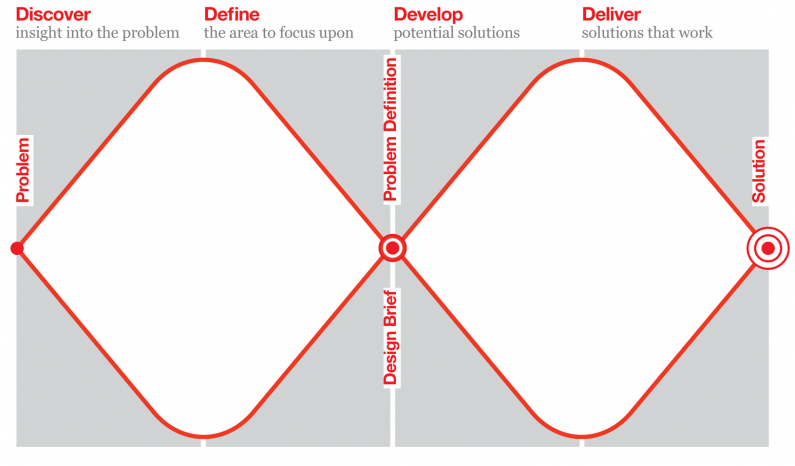

# Session 13	

### Today, Tuesday 5th May 2015

1. [Where are you?](#where-are-you)
* [User stories](#user-stories)
* [Rapid prototyping](#rapid-prototyping)
* [Your prototype](#invision)

Your [homework](#assignment)!

<!--* User-testing: A/B testing and analytics-->

Check out [UX Checklist](http://uxchecklist.github.io)

# Where are you?

> In all creative processes a number of possible ideas are created (*divergent thinking*) before refining and narrowing down to the best idea (*convergent thinking*), and this can be represented by a diamond shape. 

We could split the **design process** in four stages. 

The Design Council visualises them as a [*double diamond*](#http://www.designcouncil.org.uk/news-opinion/design-process-what-double-diamond).

Where are you now?

<!-- At the start of the Develop phase -->

- [x] Discover
	
	* User research
	* Competitor analysis
	
- [x] Define
	
	* Personas
	* Wireframes
	* User journeys
	
- [ ] Develop
	
	* User stories
	* Prototype(s)
	
- [ ] Deliver
	
	...
	
The double diamond is a conceptual model. IRL there are more than four steps...

The design process is **iterative**. 

   
	

# User stories

### Personas are not enough

Useful to describe and break down the basic units of functionality of your product.

More on [user stories](http://www.usabilitycounts.com/2013/10/11/why-i-love-user-stories) and [acceptance criteria](http://www.agilelearninglabs.com/2013/04/user-story-splitting-three/)

- [ ] spreadsheet

- [ ] [Spliting user stories](http://www.agilelearninglabs.com/2013/05/new-quick-reference-guide-for-splitting-user-stories)
- [ ] [Examples and counter-examples](http://blogs.collab.net/agile/user-story-examples-and-counterexamples)
- [ ] [More examples from Wikipedia](http://en.wikipedia.org/wiki/User_story#Examples)
- [ ] [How to Tell the User’s Story](https://www.newfangled.com/how-to-tell-the-users-story/)

A less contrived method could be

1. brainstorm and jot down **players** in the **system** (could be based on your personas), eg: visitor, potential customer, new customer, customer, system admin, developer, content editor
* for each player, jot down **actions** s/he may want to do, eg: read about the service, get contact details, find info about opening times.. 
* for each action think about `before i do that, i need to` chains.. or in a gaming frame `in order to unlock this action/skill, i need to`
* separate actions between **tasks** (intermediate in a chain) and **goals** (end of chain) 
* map actions to players (one action could be assigned to more than one player)
* organise actions that the system must / could / shoudn't allows players to do

We could use Trello for this, amirite? players > lists, actions > cards.. what about chains? what about "duplicate" actions?

[Job stories](http://insideintercom.io/using-job-stories-design-features-ui-ux/) are a simple and effective way to describe and break down the **basic units of functionality** of a system, focusing on **causality**, **anxieties** and **motivations**.

The basic idea behind job stories is that _people hire products/services to do jobs for them._

The format of a job story is:

<undefined>*   **when _, I want __, so that I can ___.***   **situation → motivation → outcome**</undefined>

Keep in mind that job stories describe jobs to be done, **not solutions**.

1.  Start with a high level job.
2.  Identify a smaller job or jobs which help resolve the higher level job.
3.  Observe [how people solve the problem now](http://insideintercom.io/making-things-people-want/) (which job do they currently use).
4.  Come up with a job story, or job stories, that investigate the causality, anxieties, and motivations of what they do now.
5.  Finally,  think of a solution (usually in the form of a website new feature or  changes to an existing feature) which addresses that job story.

Eg: let’s consider the scenario of a customer that wants to get in touch to the website owner.

1.  Typical first attempt: _When  a customer wants to get in touch with the website owner, s/he wants  to... get in touch with the website owner, so that s/he can... get in  touch with the website owner._ Obviously this is not a good job story. Why?
2.  Let’s address the outcome (_so that..._).  Ask yourself: why does the customer want to get in touch with the  website owner? What does she want from the website owner? What job does  she want the site to do for her?

*   _When  a customer wants to get in touch with the website owner, s/he wants  to... get in touch with the website owner, so that s/he can book her  tickets to the next event_ (for instance) 

1.  Let’s address the situation (_when_).  Ask yourself: where is the customer when she is trying to get in touch  with the website owner? Is she in a rush? Is she on the move? Is she  anxious or frustrated about something?

*   _When a customer is checking the availability of tickets for the next event, she’s on her phone, on the bus_ (for instance)_,  anxious that they may have sold out and can’t find out a straight  answer, s/he wants to get in touch with the website owner, so that s/he  can book her tickets to the next event._

*   List down all of the features of your site, even the most obvious ones
*   The same story can be written from different perspectives (eg: the seller vs the buyer)
*   Sometimes a top-level, generic story must be broken down into multiple, more specific stories

Collaborative job stories playground on [http://bit.ly/job-stories](http://bit.ly/job-stories)

# Rapid prototyping

What is a prototype? How do we get there?
Prototypes answer questions (the more specific the better).
Prototypes stand between your ideas (assumptions) and your users (behaviours)
Prototypes should be quick (and cheap) to make, re-make and possibly discard.
Prototype should be close to the real thing

Answering **specific questions** (design, usability, technical).

# Invision

Using [Invision](http://blog.invisionapp.com/6-ways-to-save-time-in-rapid-prototyping), let’s start prototyping two user flows:

* onboarding process

* a problematic scenario (of your choice)

# Assignment

1. Blog: [Are UI walkthroughs evil?](http://tapity.com/are-ui-walkthroughs-evil) 