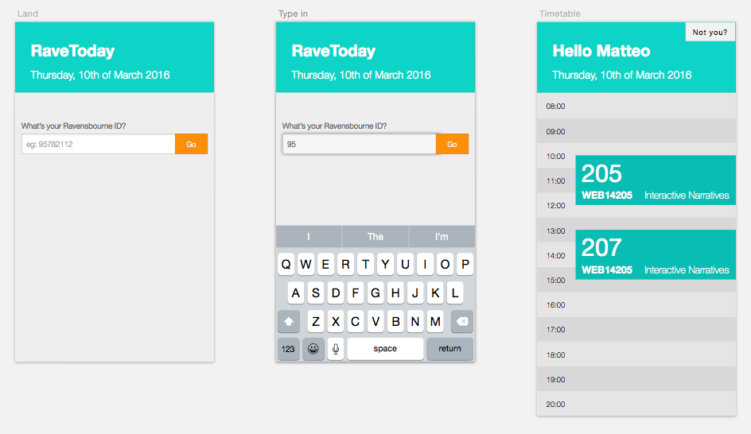
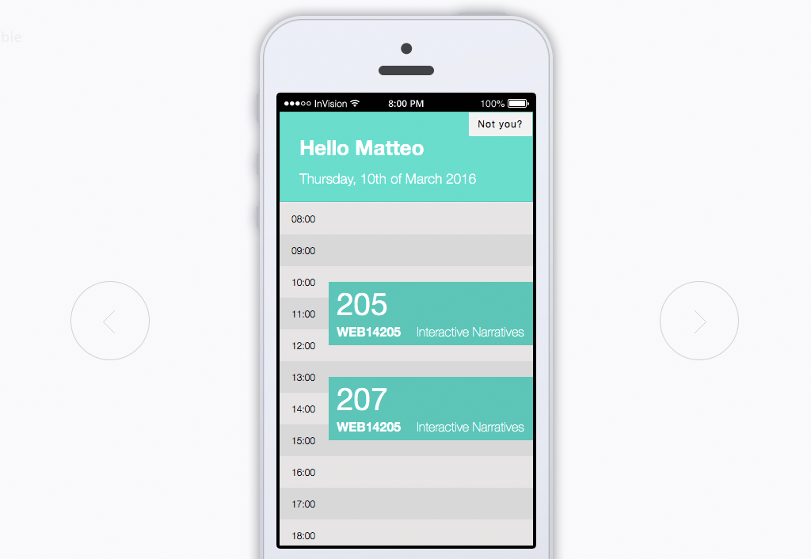
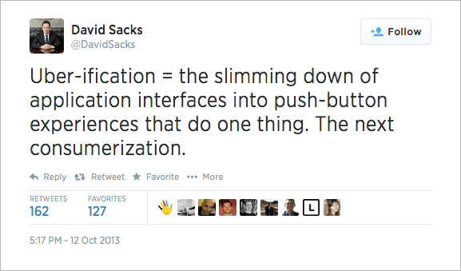

# Session 14

### Today, Tuesday 12th May 2015	

1. [Blog posts review](#blogz)
* [Prototypes critique](#prototypes-critique)
* [Designing behaviours](#designing-behaviours)

Your [homework](#homework) and [blog](#blog)!

# Blogz

* **25%** of your [final grade for this unit will be based](../README.md#assessment-criteria) on your blog.

* Blogging is not an exercise to *tick the box* and fill your time. It's an important and effective tool to **document** and **reinforce** your learning. 

* **Documenting** your work is the first step to *productify* your time. Something well-documented can be delegated to someone else (collaborator, employee, client etc). Be smart :)

* Don't limit yourself to the blog posts we assign you to write. **Blog independently**. Include work-in-progress screenshots, hyperlinks, research, inspirations, tweets.. we'll consider these too for your final grade.

* Here's the [list of blog topics](../README.md#blog) so far

Some [blogging tips](https://github.com/RavensbourneWebMedia/blogging#some-tips).

# Prototypes critique

Each one of you should have (at least) 10 screens linked up in [Invision](http://www.invisionapp.com).

<!---->

1. Open your prototype in Invision
2. Click on the `LiveShare` button 
 
	
3. Share the link with us on FB

	It should look like [invis.io/p/CY2YEHUU3](http://invis.io/p/CY2YEHUU3)
4. Let the critique begin

### Questions

* What **principles** guided your design choices?
	
	> For example, I wanted *minimum input* and *just enough information* at any stage.

* What **problem** is this screen addressing?

* What is the **goal** of the interaction on this screen?

* How does this link to your **user stories**?
 
* Which [tools](session-13.md#tools-to-consider) did you use?
* Any **tips&tricks** to share? Cool tricks you discovered or learned?
	
	> For example, I downloaded the [Foundation toolkit for Sketch](http://www.sketchappsources.com/free-source/484-sketch-foundation-kit.html) and learned that you can *hide* screens from Invision by simply [adding a **-** to their names](http://blog.invisionapp.com/sketch-meet-rapid-hi-fi-prototyping/)
* What **challenges** did you encounter?

* How are you going to **test** this? 

* What **questions** will you seek to answer when testing your prototype? 

* What will be your **guidelines for feedback**?

<!---->

[How to give designers better feedback](http://blog.invisionapp.com/how-to-give-designers-better-feedback/)

# Designing behaviours

This activity links to [Design Patterns from Session 5](session-05.md#webdesign-patterns). 

1. Pick an effect from [CogLode](http://coglode.com) 
2. Research it. 

	Share your research on this [Google document](https://docs.google.com/document/d/1cHS1-0RFSgUBUaL4I4r-caq3V8BjCffkTcsvThR2-Ok/edit?usp=sharing). 
3. Present it to the class.

	Discuss how the effect you presented could be **applied to your project**, or to **your classmates' projects**. 

### Matt	 ☞ [Optimism Bias](http://coglode.com/gems/optimism-bias) 

When looking to our future, we tend to inflate the good stuff and downplay the bad.

### Margot	☞ [Fresh Start Effect](http://coglode.com/gems/fresh-start-effect)

We'll more likely achieve goals set at the start of a new time period.

### Kimberly ☞ [Nostalgia Effect](http://coglode.com/gems/nostalgia-effect)

Thinking about the past makes us want to pay more now.

### Simeron ☞ [Cashless Effect](http://coglode.com/gems/cashless-effect)

We pay more when we can't actually see the money.
 
### Innocent ☞ [Endowment Effect](http://coglode.com/gems/endowment-effect)

We value something more once we feel we own it.

### Cal ☞ [IKEA Effect](http://coglode.com/gems/ikea-effect)

We place disproportionately-high value on self-made products.

### Liam ☞ [Bye-Now Effect](http://coglode.com/gems/bye-now-effect)

Reading the word `bye` makes us more likely to buy.

### Burak ☞ [Top Ten Effect](http://coglode.com/gems/top-ten-effect)

We break down ordered lists into smaller ones ending in 0 or 5.

### Harry ☞ [Hedonic Adaptation](http://coglode.com/gems/hedonic-adaptation) 

Restricting pleasure increases pleasure.

<!--
[Anchoring Bias](http://coglode.com/gems/anchoring-bias) 
We tend to rely too heavily on the first piece of information seen.

[Present Bias](http://coglode.com/gems/present-bias)
What we want now is not what we aspire to in the future

-->

# Homework

### Prototypes

Keep working on your prototypes. You should have ~30 screens by the end of this unit.

### Recruit user-testers 

And bring them to Ravensbourne next week for a collective user-testing session in the afternoon of Tuesday 19th of May.

See [discussion on the FB group](https://www.facebook.com/groups/663534170338338/permalink/1010947418930343/) 

<!--See [here](sessions/session-12.md#2-plan-interviews-and-testing) for mode details.-->

### Blog 

Write about [magical software](http://blog.intercom.io/on-magical-software/)

* Do you agree with the author? Why?
* Can any of the trends he writes about be useful to your project? Why?

