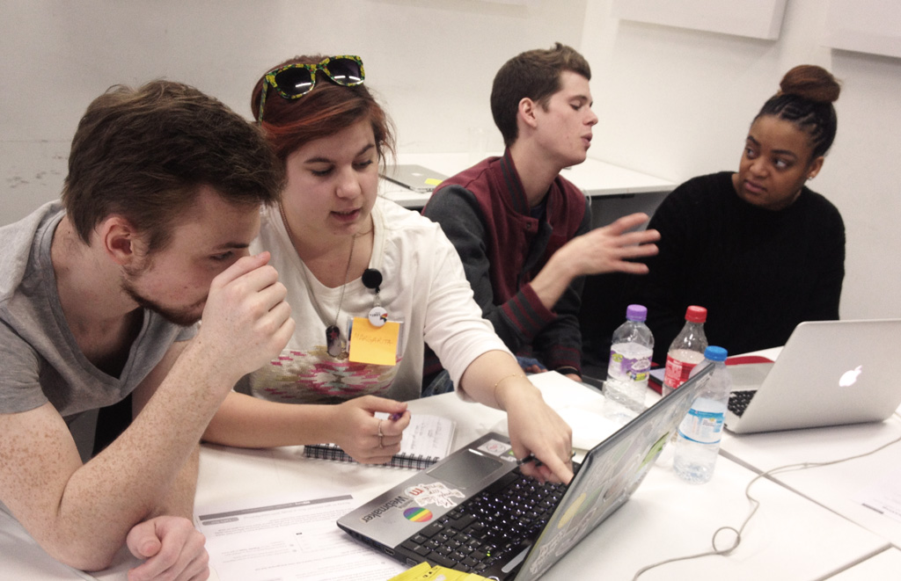
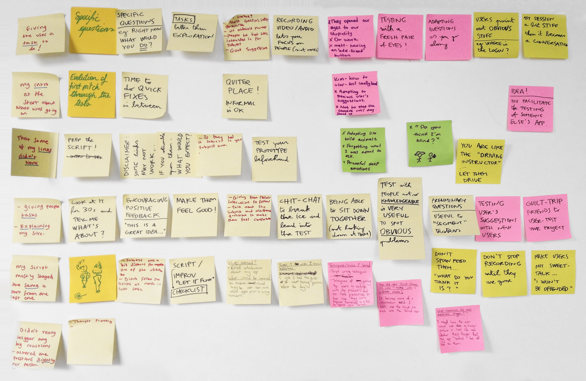

# Session 16	

### Today, Tuesday 26th May 2015

1. [User-testing debate](#user-testing-debate)
* [Reality check](#reality-check)
 
<!--* Prototypes critique-->

Your [homework](#homework): [blog](#blog)!

# User-testing debate

Aka **debrief**. 

First in small groups (2-3 people) and then all together.

Thinking about last week's user-testing session:
 
* What **worked**?
* What could be **improved**? What would you change if you were to go back in time?
* Things you **wish** you would have done during, before or after the session
* **Tricks** you learned (and are going to use in your next user-testing session)
* How did use your **script** as you tested with different people? Did you *improvise*?
* What **reactions** did your questions trigger? Did you try different ways of asking the same question? Did you ask people *preliminary* questions (at the beginning of the session)?
* What role did **video-recording** the session play for you? How did people react to being filmed?  
* Did you take **notes**? Why?

Write down you group observations on post-its and we'll then discuss them all together.

# Reality check 

Thinking about the feedback you received in your user-testing:

* What **patterns** emerged? Were there parts of your *interface* or *communication* which more than one person found problematic?
* What **changes** are you going to make to your project as a result of user-testing?

### Getting things done

1. Sign up to [Trello](https://trello.com/) with your `@students.rave.ac.uk` email address
* Join the [trello.com/ravewebmedia](https://trello.com/ravewebmedia) organisation 
* Write down a list of everything that needs doing. 
* Project **deadline is next week** (4th of June).
* Blogs deadline is the following week (9th of June).
* Good luck :)

Learn how to use Trello with this [quick guide](https://trello.com/guide/board_basics.html).

# Homework

### Blog

Write about this article: [Invisible design](http://blog.intercom.io/invisible-design).
