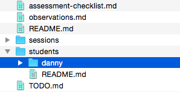

*This* is the `students` folder.

1. On your computer, open the **working copy** of *this* folder.
2. Inside *this* folder, create a **new folder** and call it with **your name** (eg `danny`)
3. From now on, **put all your project files** in the folder called after your name

